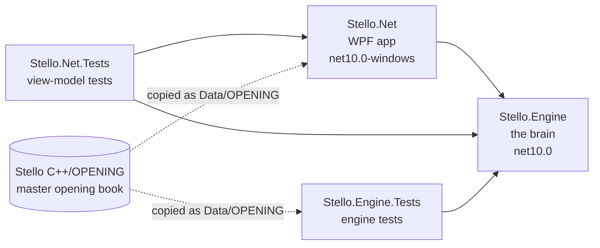
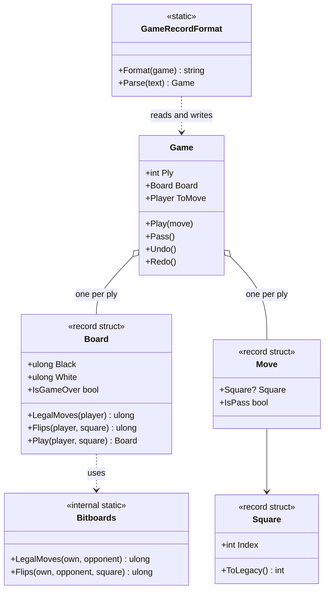
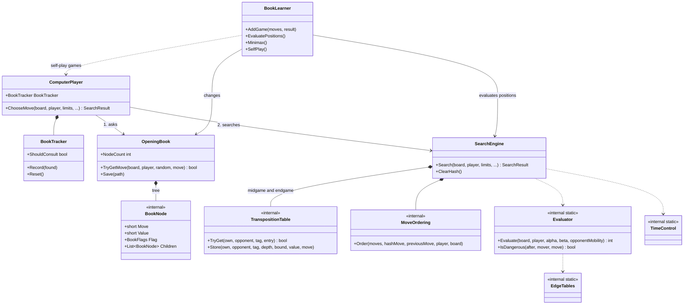
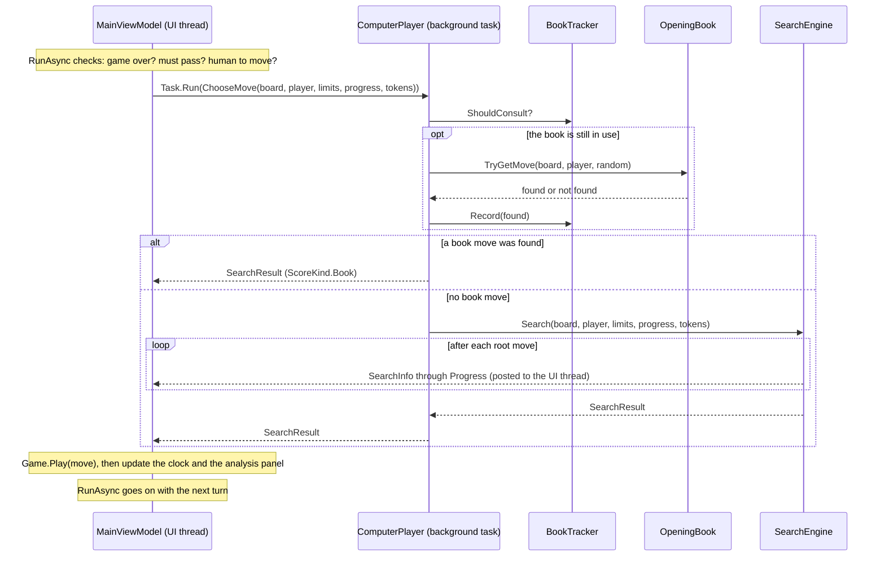

# 01 – Overview

[Back to the index](README.md)

This chapter shows the big picture: the projects, the main types, and what happens when the computer makes one move. The later chapters go into each part.

## The projects

The solution [Stello.Net.slnx](../../Stello.Net/Stello.Net.slnx) has four projects. The arrows show which project uses which.

| Project | Contents |
|---|---|
| [Stello.Engine](../../Stello.Net/Stello.Engine) | Rules, game record, evaluation, search, opening book, book learning. No UI code and no dependencies outside .NET. |
| [Stello.Net](../../Stello.Net/Stello.Net) | The WPF user interface, built with MVVM ([CommunityToolkit.Mvvm](https://learn.microsoft.com/dotnet/communitytoolkit/mvvm/)). It runs the engine on a background task. |
| [Stello.Engine.Tests](../../Stello.Net/Stello.Engine.Tests) | xUnit tests of the engine: perft, evaluation, search, endgame (FFO positions), book, book learning. |
| [Stello.Net.Tests](../../Stello.Net/Stello.Net.Tests) | xUnit tests of the view models, with fake dialogs, settings and book storage. |

The opening book file is not copied into the repository twice: both projects link to the master file [Stello C++/OPENING](../../Stello%20C++/OPENING) and copy it to their output folder as `Data/OPENING`.

## The engine at a glance

The engine types fall into five groups. "Internal" types are only visible inside the engine and its tests.

| Group | Type | Visibility | Role |
|---|---|---|---|
| Board and rules | [`Board`](../../Stello.Net/Stello.Engine/Board.cs) | public | An immutable position: two 64-bit bitboards, one per colour. |
| | [`Square`](../../Stello.Net/Stello.Engine/Square.cs) | public | A square 0–63 (a1 = 0, h8 = 63), with text ("f5") and legacy conversions. |
| | [`Player`](../../Stello.Net/Stello.Engine/Player.cs) | public | `Black` or `White`. |
| | [`Bitboards`](../../Stello.Net/Stello.Engine/Bitboards.cs) | internal | Legal moves, flips and potential mobility on raw 64-bit masks. |
| Game record | [`Move`](../../Stello.Net/Stello.Engine/Move.cs) | public | A square or a pass. |
| | [`Game`](../../Stello.Net/Stello.Engine/Game.cs) | public | The moves and positions of a game, with undo and redo. |
| | [`GameRecordFormat`](../../Stello.Net/Stello.Engine/GameRecordFormat.cs) | public | Reads and writes a game as a text move list. |
| Evaluation | [`Evaluator`](../../Stello.Net/Stello.Engine/Evaluation/Evaluator.cs) | internal | Scores a position: edges, corners, stability, mobility. |
| | [`EdgeTables`](../../Stello.Net/Stello.Engine/Evaluation/EdgeTables.cs) | internal | Eight precomputed tables of 6561 values, one entry per possible edge. |
| Search | [`SearchEngine`](../../Stello.Net/Stello.Engine/SearchEngine.cs) | public | Iterative deepening alpha-beta search and the endgame solver. |
| | [`MoveOrdering`](../../Stello.Net/Stello.Engine/Search/MoveOrdering.cs) | internal | Sorts moves so the best ones are searched first. |
| | [`TranspositionTable`](../../Stello.Net/Stello.Engine/Search/TranspositionTable.cs) | internal | Remembers results for positions already searched. |
| | [`TimeControl`](../../Stello.Net/Stello.Engine/Search/TimeControl.cs) | internal | Turns the time settings into a soft and a hard time limit. |
| | [`SearchLimits`](../../Stello.Net/Stello.Engine/SearchLimits.cs) | public | Fixed depth, time per move, time per game, or solve. |
| | [`SearchResult`, `SearchInfo`, `ScoreKind`](../../Stello.Net/Stello.Engine/SearchResult.cs) | public | The result of a search, progress reports, and what kind of score it is. |
| Opening book | [`OpeningBook`](../../Stello.Net/Stello.Engine/OpeningBook.cs) | public | Loads, saves and looks up the book. |
| | [`BookNode`, `BookFlags`](../../Stello.Net/Stello.Engine/BookNode.cs) | internal | One move in the book tree, with its value and flags. |
| | [`BookTracker`](../../Stello.Net/Stello.Engine/BookTracker.cs) | public | Decides when to stop asking the book. |
| | [`ComputerPlayer`](../../Stello.Net/Stello.Engine/ComputerPlayer.cs) | public | Chooses the computer's move: the book first, then the search. |
| | [`BookLearner`](../../Stello.Net/Stello.Engine/BookLearner.cs) | public | Adds games to the book, evaluates it, and plays self-play games. |

### Board and game types

A `Board` is only 16 bytes, so a game simply keeps a copy of the board after every move. `Board` uses `Bitboards` for the rules.

### The brain types

`ComputerPlayer` is the entry point for choosing a move. It asks the book first and searches if the book has no move. `BookLearner` uses the same parts to improve the book.

## The life of one computer move

This sequence shows what happens from the moment it is the computer's turn until its move is on the board. The view model runs on the UI thread; `ComputerPlayer` and `SearchEngine` run on a background task, so the window stays responsive while the computer thinks.

The code for this is `MainViewModel.RunAsync` and `MainViewModel.ComputerMoveAsync` in [MainViewModel.cs](../../Stello.Net/Stello.Net/ViewModels/MainViewModel.cs), [`ComputerPlayer.ChooseMove`](../../Stello.Net/Stello.Engine/ComputerPlayer.cs) and [`SearchEngine.Search`](../../Stello.Net/Stello.Engine/SearchEngine.cs).

Two tokens control a running search:

- **cancel**: used by New Game, Open, Back and the other commands that change the game. The search stops and nothing is played.
- **move now**: used by the "Move Now" command. The search stops and the best move found so far is played.

## Design principles

- **Immutable boards.** `Board` is a 16-byte value. Making a move returns a new board, so the search needs no "undo move" code and the game record can store every position.
- **Bitboards.** Each colour is one 64-bit number with one bit per square. Legal moves and flips are computed for all squares at once with shifts and masks.
- **No global state.** All state is in objects: the search engine owns its hash tables and move-ordering tables, the book owns its tree. Several engines could run side by side.
- **The engine does not know the UI.** It reports progress through `IProgress<SearchInfo>` and is stopped with cancellation tokens. This is why it can be tested without a window.
- **A synchronous engine.** `SearchEngine.Search` runs to the end on the calling thread. The app decides where it runs (a background task); the tests call it directly.
- **Faithful where it matters.** The evaluation, the selective search and the book format are ported from the C++ original so the program plays in the same style. Data structures and the endgame solver were modernised. The details are in [Stello porting documentation.md](../../Stello%20porting%20documentation.md).

## Some numbers

| Item | Value |
|---|---|
| Size of a `Board` | 16 bytes (two `ulong`) |
| Edge tables | 8 tables of $3^8 = 6561$ values |
| Hash tables | 2 tables (midgame, endgame), each $2^{19}$ slots of 2 entries of 24 bytes, so 24 MiB each |
| Master opening book | 23 389 nodes |
| Engine tests / app tests | 158 / 58 |

---

Previous: [Index](README.md) · Next: 02 Board and squares (to be written)
