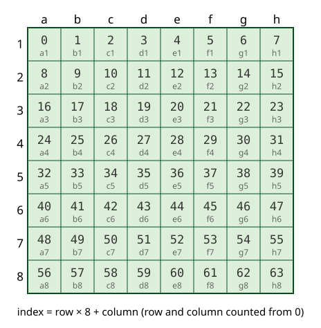
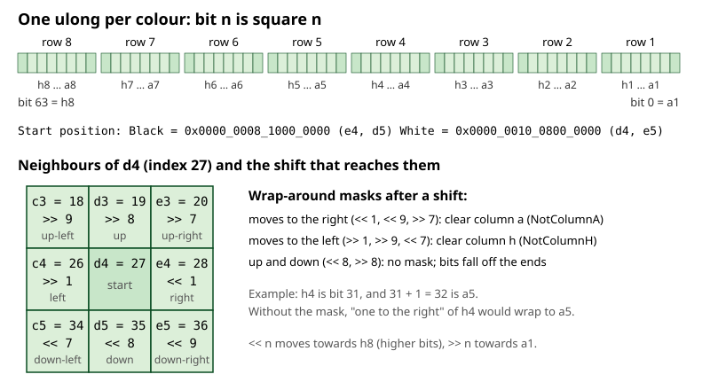
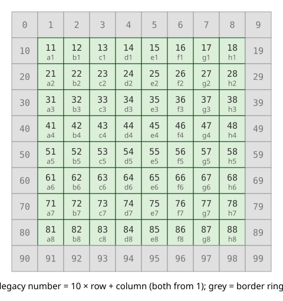
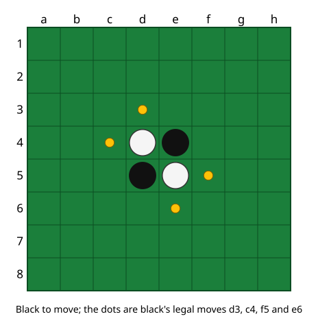

# 02 – Board and squares

[Back to the index](README.md)

## In short

A position is stored as two 64-bit numbers, one for the black discs and one for the white discs, with one bit per square. This is called a *bitboard*. With bitboards, the engine can work on all 64 squares at once with a few machine instructions, and a whole position is only 16 bytes. This chapter explains how squares are numbered, how the bits map to squares, and the older "legacy" square numbers that are still used by the opening book and the edge tables.

## Data structures

### `Square`

A square is a number from 0 to 63:

$$\text{index} = 8 \cdot \text{row} + \text{column}, \qquad \text{row}, \text{column} \in \{0, \dots, 7\}$$

Column 0 is a and row 0 is row 1, so a1 = 0, h1 = 7, a2 = 8 and h8 = 63. The board is drawn with a1 in the top-left corner, as in the app and in the usual Othello notation.



| Member | Meaning |
|---|---|
| `Index` | 0–63 |
| `Column`, `Row` | `Index & 7` and `Index >> 3` |
| `Bit` | `1UL << Index`, the square as a bitboard with one bit set |
| `At(column, row)` | Square from column and row (0–7) |
| `Parse`, `TryParse`, `ToString` | Text form "a1" … "h8" (upper case is accepted) |
| `ToLegacy`, `FromLegacy` | Conversion to and from the legacy numbers (below) |
| `InMask(mask)` | The squares of the set bits in a bitboard, from a1 to h8 |

`Square` is a `readonly record struct`, so squares can be compared with `==` and used as dictionary keys.

### `Player`

`Player.Black` or `Player.White`, with the extension method `Opponent()`. Black moves first.

### `Board`

A `Board` is an immutable `readonly record struct` with two fields:

| Member | Meaning |
|---|---|
| `Black`, `White` | The bitboards; bit *n* is set when square *n* holds a disc of that colour |
| `Empty` | `~(Black \| White)`, computed |
| `EmptyCount` | Number of empty squares (`PopCount(Empty)`) |
| `this[square]` | `Player.Black`, `Player.White` or `null` |
| `Discs(player)`, `Count(player)` | The bitboard and the disc count of one colour |
| `Initial` | The start position |
| `Parse`, `ToString` | The text form (below) |

The constructor rejects a board where a square is both black and white. Because a board is a value, "making a move" returns a new board and leaves the old one unchanged; the rules are in [chapter 03](03-rules-and-move-generation.md).

### Bits and directions

Bit 0 of the `ulong` is a1 and bit 63 is h8. Each byte of the number is one row: the lowest byte is row 1, the highest byte is row 8.



Moving one square in a direction is a shift of the whole bitboard:

| Direction (in the picture) | Index change | Shift | Mask after the shift |
|---|---|---|---|
| right | +1 | `<< 1` | `NotColumnA` |
| left | −1 | `>> 1` | `NotColumnH` |
| down | +8 | `<< 8` | none |
| up | −8 | `>> 8` | none |
| down-right | +9 | `<< 9` | `NotColumnA` |
| up-left | −9 | `>> 9` | `NotColumnH` |
| down-left | +7 | `<< 7` | `NotColumnH` |
| up-right | −7 | `>> 7` | `NotColumnA` |

Shifting "right" from column h would land on column a of the next row (h4 is bit 31, and bit 32 is a5). The masks `NotColumnA` (`0xFEFE_FEFE_FEFE_FEFE`) and `NotColumnH` (`0x7F7F_7F7F_7F7F_7F7F`) remove those wrapped bits. Shifts up and down need no mask: bits shifted past bit 0 or bit 63 simply disappear.

### Legacy square numbers

The C++ program used a 10 × 10 array with a border ring around the board, and numbered the squares 10 × row + column, both counted from 1. These numbers are still used in two places: the moves in the opening book file (chapter 11) and the tables ported from the C++ evaluation (chapter 05).



$$\text{legacy} = 10 \cdot (\text{row} + 1) + (\text{column} + 1)$$

and back:

$$\text{row} = \left\lfloor \frac{\text{legacy}}{10} \right\rfloor - 1, \qquad \text{column} = (\text{legacy} \bmod 10) - 1$$

`Square.FromLegacy` rejects the border numbers (for example 10, 19 or 90).

## The text form of a board

`Board.ToString` writes eight lines, row 1 first, with `X` for black, `O` for white and `-` for an empty square. `Board.Parse` reads the same format (it also accepts lower case and `.`, and ignores whitespace), so a position can be written directly in a test. The FFO endgame test positions (chapter 09) use the same 64-character layout on one line.

## Worked example: the start position

The start position has white discs on d4 and e5 and black discs on e4 and d5. Black moves first and has four legal moves.



As text (`Board.Initial.ToString()`):

```text
--------
--------
--------
---OX---
---XO---
--------
--------
--------
```

As bitboards:

| | Squares | Bits | Value |
|---|---|---|---|
| `Black` | e4, d5 | 28, 35 | `0x0000_0008_1000_0000` |
| `White` | d4, e5 | 27, 36 | `0x0000_0010_0800_0000` |
| Black's legal moves | d3, c4, f5, e6 | 19, 26, 37, 44 | `0x0000_1020_0408_0000` |

`Square.InMask(0x0000_1020_0408_0000)` returns d3, c4, f5, e6: it takes the lowest set bit with `TrailingZeroCount`, then clears it with `mask &= mask - 1`, until the mask is 0.

The four first moves in legacy numbers are d3 = 34, c4 = 43, f5 = 56 and e6 = 65; the opening book uses these numbers.

## Design notes

- **Why bitboards.** The C++ version used a 10 × 10 array with a border, a list of empty squares next to discs, and tables of directions per square. Bitboards replace all three: the border is replaced by the two column masks, and "all empty squares next to a disc" is a few shifts. See [Stello porting documentation.md](../../Stello%20porting%20documentation.md), phase 1.
- **Why immutable.** A `Board` is 16 bytes, the same size as two `long` values. Copying it is as cheap as passing a reference, so the search keeps the parent position in a local variable instead of undoing moves, and the game record stores every position ([chapter 04](04-game-record.md)).
- **Value equality.** `Board` is a record struct, so two boards with the same discs are equal. The tests compare boards directly, and the hash table and the opening book use the two bitboards as keys.
- **Side to move is not part of the board.** A position is a `Board` plus the `Player` to move. The search, the game record and the book always pass both.
- **Legacy numbers only at the edges.** The rest of the engine uses `Square` and bitboards. The evaluation still fills a 10 × 10 array for the ported C++ code (chapter 05).

## Where in the code

| File | Main members |
|---|---|
| [Square.cs](../../Stello.Net/Stello.Engine/Square.cs) | `Square`, `ToLegacy`, `FromLegacy`, `InMask` |
| [Player.cs](../../Stello.Net/Stello.Engine/Player.cs) | `Player`, `Opponent()` |
| [Board.cs](../../Stello.Net/Stello.Engine/Board.cs) | `Board`, `Initial`, `Parse`, `ToString` |
| [Bitboards.cs](../../Stello.Net/Stello.Engine/Bitboards.cs) | The masks `NotColumnA`, `NotColumnH`, `InnerColumns`, `InnerRows` |

## Tests

- [SquareTests.cs](../../Stello.Net/Stello.Engine.Tests/SquareTests.cs): index and legacy number of the corners and of the four first moves, the legacy round trip for all 64 squares, rejected border numbers and text, `InMask`.
- [BoardTests.cs](../../Stello.Net/Stello.Engine.Tests/BoardTests.cs): the start position, the parse order, the text round trip, rejected text and overlapping discs.

## Further reading

- [Bitboards – Chess Programming Wiki](https://www.chessprogramming.org/Bitboards): bitboards in general.
- [Reversi – Wikipedia](https://en.wikipedia.org/wiki/Reversi): the rules, the start position and the square notation.

---

Previous: [01 Overview](01-overview.md) · Next: [03 Rules and move generation](03-rules-and-move-generation.md)
