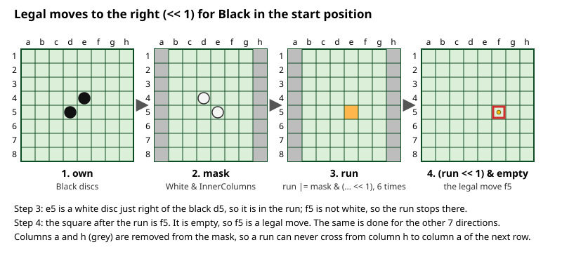
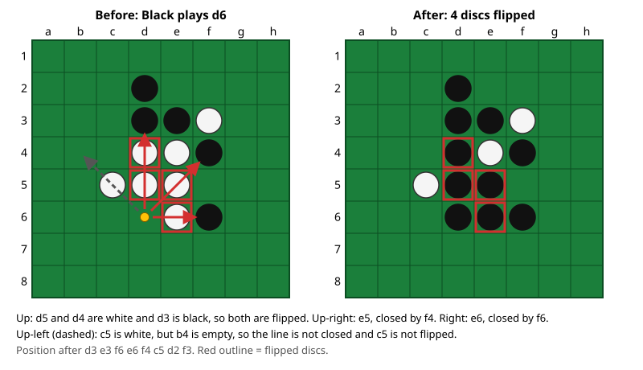
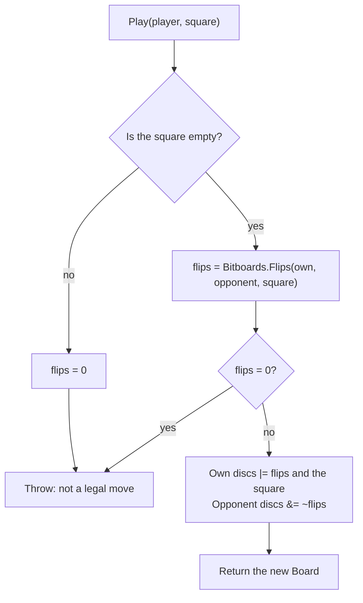

# 03 – Rules and move generation

[Back to the index](README.md)

## In short

A move is legal when it flips at least one opponent disc: the new disc and another disc of the same colour must enclose an unbroken line of opponent discs, horizontally, vertically or diagonally. The engine finds **all** legal moves of a player at once with bitboard shifts, eight directions at a time, without looping over squares. Flipping is done for one move at a time by walking along the eight lines from the new disc. A player without a legal move must pass; when neither player can move, the game is over.

## Data structures

All rule code works on raw bitboards in the internal static class `Bitboards`. `Board` wraps it for the rest of the engine.

| Constant | Value | Squares |
|---|---|---|
| `NotColumnA` | `0xFEFE_FEFE_FEFE_FEFE` | all except column a |
| `NotColumnH` | `0x7F7F_7F7F_7F7F_7F7F` | all except column h |
| `InnerColumns` | `0x7E7E_7E7E_7E7E_7E7E` | columns b–g |
| `InnerRows` | `0x00FF_FFFF_FFFF_FF00` | rows 2–7 |
| `Inner` | `InnerColumns & InnerRows` | b2–g7 |

| Method | Returns |
|---|---|
| `Bitboards.LegalMoves(own, opponent)` | A bitboard of all legal moves for `own` |
| `Bitboards.Flips(own, opponent, square)` | A bitboard of the discs flipped by a move on `square`; 0 if none |
| `Bitboards.PotentialMobility(own, opponent)` | A count used by the evaluation (chapter 05) |
| `Board.LegalMoves(player)`, `HasLegalMove`, `IsLegal` | The same for a `Board` and a `Player` |
| `Board.Flips(player, square)` | 0 if the square is occupied, otherwise `Bitboards.Flips` |
| `Board.Play(player, square)` | The new board; throws if the move flips nothing |
| `Board.IsGameOver` | True when neither player has a legal move |

The directions and their shifts are explained in [chapter 02](02-board-and-squares.md#bits-and-directions).

## Algorithm

### Legal moves: shift and mask

Think of one direction, "to the right". A legal move to the right of an own disc is an empty square that has one or more opponent discs between it and the own disc. The engine finds these for all own discs at the same time:

1. Shift the own discs one step: the result are the squares just right of an own disc. Keep only those that hold an opponent disc. This is the start of a *run*.
2. Shift the run one more step and again keep only opponent discs; add them to the run. Repeat. After six steps the run holds every opponent disc that is part of an unbroken line starting next to an own disc.
3. Shift the run one last step. The empty squares in the result are the legal moves in this direction.

Six steps are enough because a line on an 8-square row holds at most 6 opponent discs between the two ends. The same is done for all eight directions, and the results are combined with OR.

With $o$ = own discs, $m$ = the masked opponent discs, $e$ = empty squares and $s$ the shift of one direction:

$$
\begin{aligned}
r_1 &= m \land (o \ll s) \\
r_{k+1} &= r_k \lor \big(m \land (r_k \ll s)\big), \qquad k = 1, \dots, 5 \\
\text{moves} &= (r_6 \ll s) \land e
\end{aligned}
$$

For the directions to the left and up, $\ll$ is replaced by $\gg$.

**The mask.** The opponent discs are masked before the scan: `InnerColumns` for left and right, `InnerRows` for up and down, and `Inner` for the diagonals. A disc on column a or h can never be enclosed horizontally, because it has no neighbour on one side, so removing it loses nothing. It also stops the wrap-around: a run can never contain a disc on column h, so it can never be shifted from h onto column a of the next row. For up and down the mask is not needed against wrap-around, but it does no harm for the same reason.

This picture shows direction "right" for Black in the start position:



Doing the same to the left finds c4 (d4 is white, left of the black e4), downwards finds e6 and upwards finds d3: together the four legal moves of the start position.

The code for all eight directions, from [Bitboards.cs](../../Stello.Net/Stello.Engine/Bitboards.cs):

```csharp
public static ulong LegalMoves(ulong own, ulong opponent)
{
    ulong empty = ~(own | opponent);
    ulong horizontal = opponent & InnerColumns;
    ulong vertical = opponent & InnerRows;
    ulong diagonal = opponent & Inner;

    ulong moves =
        ScanLeft(own, horizontal, 1) | ScanRight(own, horizontal, 1) |
        ScanLeft(own, vertical, 8) | ScanRight(own, vertical, 8) |
        ScanLeft(own, diagonal, 7) | ScanRight(own, diagonal, 7) |
        ScanLeft(own, diagonal, 9) | ScanRight(own, diagonal, 9);

    return moves & empty;
}

private static ulong ScanLeft(ulong own, ulong mask, int shift)
{
    ulong run = mask & (own << shift);
    run |= mask & (run << shift);
    run |= mask & (run << shift);
    run |= mask & (run << shift);
    run |= mask & (run << shift);
    run |= mask & (run << shift);
    return run << shift;
}
```

`ScanRight` is the same with `>>`. "Left" in the name means the shift direction (`<<`, towards h8), not the direction on the board.

### Flips: walking the lines

For one move, the flipped discs are found by walking from the new disc in each of the eight directions:

1. Step to the next square (with the wrap-around mask of the direction).
2. While the square holds an opponent disc, add it to the line and step again.
3. If the walk stops on an own disc, the line is enclosed and all its discs are flipped. If it stops on an empty square or runs off the board, nothing in this direction is flipped.

```csharp
private static ulong RayLeft(ulong own, ulong opponent, ulong bit, int shift, ulong mask)
{
    ulong line = 0;
    ulong next = (bit << shift) & mask;
    while ((next & opponent) != 0)
    {
        line |= next;
        next = (next << shift) & mask;
    }

    return (next & own) != 0 ? line : 0;
}
```

`Flips` calls `RayLeft` and `RayRight` once per direction, with the masks from the table in [chapter 02](02-board-and-squares.md#bits-and-directions), and combines the results.

In this example Black plays d6 and flips in three directions; the fourth line is open and flips nothing:



### Playing a move

`Board.Play` puts it together:



`Play` does not call `LegalMoves`: a move is legal exactly when it flips at least one disc, so computing the flips is also the legality check.

### Pass and game over

- A player **must pass** when `LegalMoves` is 0 but the opponent can still move. The game record stores the pass as a move ([chapter 04](04-game-record.md)).
- The game is **over** when neither player can move (`Board.IsGameOver`). This happens when the board is full, when one colour is wiped out, or in rare positions where no empty square can be taken by either side.
- The **winner** has the most discs. The search scores a finished game with the empty squares given to the winner, which is the standard tournament rule ([Reversi – Wikipedia](https://en.wikipedia.org/wiki/Reversi)); see chapter 09.

## Worked example: perft

*Perft* counts the positions reached after exactly *n* plies from the start position, following every legal move. If the move generator or the flips have a bug, the counts are wrong, so perft is a strong test of this whole chapter. A pass counts as one ply, and a finished game counts as one leaf.

| Depth | Positions |
|---|---|
| 1 | 4 |
| 2 | 12 |
| 3 | 56 |
| 4 | 244 |
| 5 | 1 396 |
| 6 | 8 200 |
| 7 | 55 092 |
| 8 | 390 216 |

These are the values in [PerftTests.cs](../../Stello.Net/Stello.Engine.Tests/PerftTests.cs), and they match the published numbers on [Aart Bik's Reversi perft page](http://www.aartbik.com/MISC/reversi.html).

## Design notes

- **One implementation.** The C++ version had many hand-optimised variants of move generation and move making (for the search, the endgame, the evaluation). The C# version has one legal-move generator and one flip routine, used everywhere.
- **All moves at once, flips one move at a time.** Move generation is needed at every node and for mobility in the evaluation, so it is done without branches for all squares together. Flips are only needed for the move being played, so a short loop per direction is enough.
- **Fill technique.** The six repeated shift-and-mask steps are a form of the "fill" algorithms described on the [Othello page of the Chess Programming Wiki](https://www.chessprogramming.org/Othello) (Dumb7Fill). Faster variants exist; they are candidates for later performance work, not needed for correctness.
- **Legality through flips.** `Play` throws on an illegal move, so callers cannot corrupt a position by mistake. The search, which only plays generated moves, uses `Bitboards.Flips` directly.

## Where in the code

| File | Main members |
|---|---|
| [Bitboards.cs](../../Stello.Net/Stello.Engine/Bitboards.cs) | `LegalMoves`, `ScanLeft`, `ScanRight`, `Flips`, `RayLeft`, `RayRight`, `PotentialMobility` |
| [Board.cs](../../Stello.Net/Stello.Engine/Board.cs) | `LegalMoves`, `HasLegalMove`, `IsLegal`, `Flips`, `Play`, `IsGameOver` |

## Tests

- [BoardTests.cs](../../Stello.Net/Stello.Engine.Tests/BoardTests.cs):
  - the four legal moves of each colour in the start position;
  - flips in all eight directions at once, and the longest possible line (six discs);
  - only closed lines are flipped;
  - no wrap-around at the edges (four cases);
  - an illegal move throws;
  - pass, full board and wipe-out.
- [PerftTests.cs](../../Stello.Net/Stello.Engine.Tests/PerftTests.cs): perft to depth 8.

## Further reading

- [Bitboards – Chess Programming Wiki](https://www.chessprogramming.org/Bitboards): shifts, masks and fill algorithms in general.
- [Othello – Chess Programming Wiki](https://www.chessprogramming.org/Othello): the "Bitboards" section describes move generation for Othello.
- [Perft for Reversi – Aart Bik](http://www.aartbik.com/MISC/reversi.html): perft numbers to depth 14 and how passes and finished games are counted.

---

Previous: [02 Board and squares](02-board-and-squares.md) · Next: [04 Game record](04-game-record.md)
