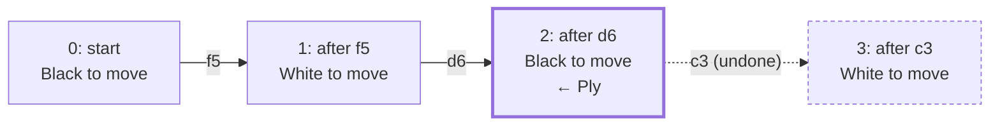
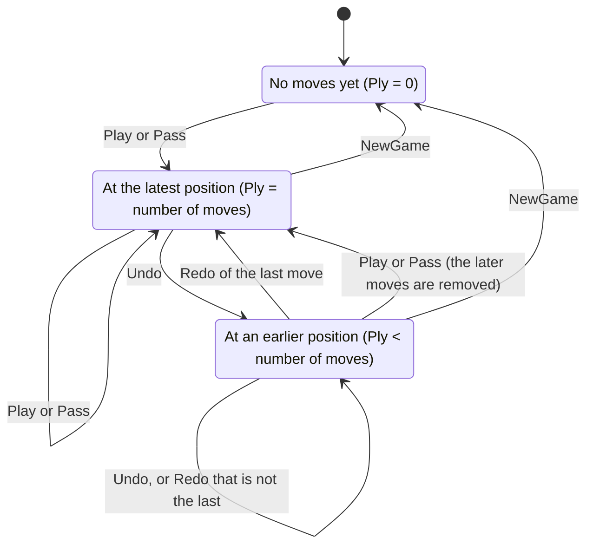

# 04 – Game record

[Back to the index](README.md)

## In short

`Game` holds a whole game: every move played, and the position after each one. It knows whose turn it is, allows passes only when they are forced, and supports undo and redo by moving a pointer in the history. `GameRecordFormat` saves a game as a plain text list of moves and reads it back, checking every move.

## Data structures

### `Move`

A `Move` is a square or a pass. It is a `readonly record struct` with one field, `Square?`; `null` means a pass, so `default(Move)` is `Move.Pass`. As text it is "f5" or "pass".

### `Game`

| Member | Meaning |
|---|---|
| `_moves` (private) | All moves in the history, including undone moves that can be redone |
| `_positions` (private) | The position (board and side to move) before each move, plus the position after the last one |
| `Ply` | The current position: the number of moves played to reach it |
| `Board`, `ToMove` | The current position, `_positions[Ply]` |
| `Moves`, `PlayedMoves` | All moves, and only the moves up to `Ply` |
| `LastMove` | The move that led to the current position, or `null` at the start |
| `Human`, `Computer`, `IsHumanToMove` | Which colour the human plays |
| `MustPass`, `IsGameOver`, `Winner` | The state of the current position |
| `CanUndo`, `CanRedo` | Whether `Ply` can move back or forward |

There is always one more position than moves: position *i* is the position before move *i*. The side to move is stored with each position, not computed from the ply number, because after a pass the same colour moves twice in a row.

For example, after "f5 d6 c3" and one Undo:



| Index | Position (side to move) | Move from it |
|---|---|---|
| 0 | start (Black) | f5 |
| 1 | after f5 (White) | d6 |
| 2 | after d6 (Black) ← `Ply` = 2 | c3 (undone, can be redone) |
| 3 | after c3 (White) | – |

`PlayedMoves` is "f5 d6", `LastMove` is d6 and `CanRedo` is true. If Black now plays c5 instead of redoing c3, the undone c3 and its position are removed, and the moves become "f5 d6 c5".

## Algorithm

### Changing the game

- **`Play(square)`**: throws if the game is over; otherwise computes the new board with `Board.Play` (which throws on an illegal move), then appends it.
- **`Pass()`**: allowed only when `MustPass` is true (no legal move, but the game is not over). The board stays the same and the other side is to move.
- **Append** (private): removes all moves and positions after `Ply`, adds the move and the new position, and increases `Ply`.
- **`Undo()` / `Redo()`**: decrease or increase `Ply`. Nothing else changes, so they are instant.
- **`NewGame()`**: clears the history and keeps the sides.
- **`SwitchSides()`**: swaps the human's and the computer's colour; the position does not change.

This state diagram shows how `Ply` moves through the history:



The app does not always undo one ply at a time: Back and Forward jump to the previous or next position where the human is to move, skipping the computer's moves (chapter 14).

### The text format

`GameRecordFormat.Format` writes `PlayedMoves` separated by spaces. Undone moves are not saved.

`GameRecordFormat.Parse` splits the text on any whitespace and replays the moves from the start position. It stops at the first problem and throws a `FormatException` with the move number:

| Problem | Example text | Message |
|---|---|---|
| Not a square or "pass" | `f5 z9` | Move 2: 'z9' is not a square (a1-h8) or 'pass'. |
| Illegal move | `a1` | Move 1: a1 is not a legal move for Black. |
| Pass that is not forced | `pass` | Move 1: Black has a legal move and cannot pass. |
| Move after the end | a wipe-out game followed by `a1` | Move 10: the game is already over. |

Upper and lower case and extra whitespace are accepted. The app saves games as `*.stello` files in this format.

## Worked example: a game with a pass

After these eight moves Black has no legal move, but White has:

```text
d3 c3 b3 b2 f5 a3 a1 c1
```

The position, Black to move (`Board.ToString()`):

```text
X-O-----
-O------
OOXX----
---XX---
---XXX--
--------
--------
--------
```

`MustPass` is true, so Black passes. White has two moves, e3 and f6; after White plays e3, Black can move again (c2, d2, e2 or f2). The saved record is:

```text
d3 c3 b3 b2 f5 a3 a1 c1 pass e3
```

Reading this text back with `Parse` gives the same game: the "pass" is accepted because Black has no legal move at that point.

## Design notes

- **A list of boards instead of undo information.** Because a `Board` is only 16 bytes ([chapter 02](02-board-and-squares.md)), keeping every position costs almost nothing, and undo, redo and "position at ply *n*" need no calculation. The C++ version kept fixed arrays of 80 moves and 80 full 10 × 10 boards.
- **Pass as a move.** As in C++ (move 0), a pass is stored in the record. This keeps the ply number and the side to move in step with the record, and it makes the text format unambiguous.
- **Redo is kept until a new move is played**, the same behaviour as the C++ program.
- **Saving is new.** The C++ program had Open and Save menu items, but they did nothing. The text format is easy to read, to type by hand and to use in tests.
- **Every move is checked when loading**, so a damaged or hand-edited file cannot create an impossible position.

## Where in the code

| File | Main members |
|---|---|
| [Move.cs](../../Stello.Net/Stello.Engine/Move.cs) | `Move`, `Pass`, `IsPass`, `TryParse` |
| [Game.cs](../../Stello.Net/Stello.Engine/Game.cs) | `Game`, `Play`, `Pass`, `Undo`, `Redo`, `NewGame`, `SwitchSides`, `MustPass`, `Winner` |
| [GameRecordFormat.cs](../../Stello.Net/Stello.Engine/GameRecordFormat.cs) | `Format`, `Parse` |

## Tests

- [GameTests.cs](../../Stello.Net/Stello.Engine.Tests/GameTests.cs): alternating players, an illegal move keeps the state, undo and redo, a new move after undo removes the undone moves, forced and illegal passes, game over and winner, switching sides, a new game.
- [GameRecordFormatTests.cs](../../Stello.Net/Stello.Engine.Tests/GameRecordFormatTests.cs): only played moves are written, a round trip with a pass, case and whitespace, a finished game, and the rejected records from the table above.
- [MoveTests.cs](../../Stello.Net/Stello.Engine.Tests/MoveTests.cs): reading "pass" and squares, rejected text.
- The positions used by several tests (a forced pass, a wipe-out after 9 moves) are in [TestGames.cs](../../Stello.Net/Stello.Engine.Tests/TestGames.cs).

---

Previous: [03 Rules and move generation](03-rules-and-move-generation.md) · Next: [05 Evaluation](05-evaluation.md)
