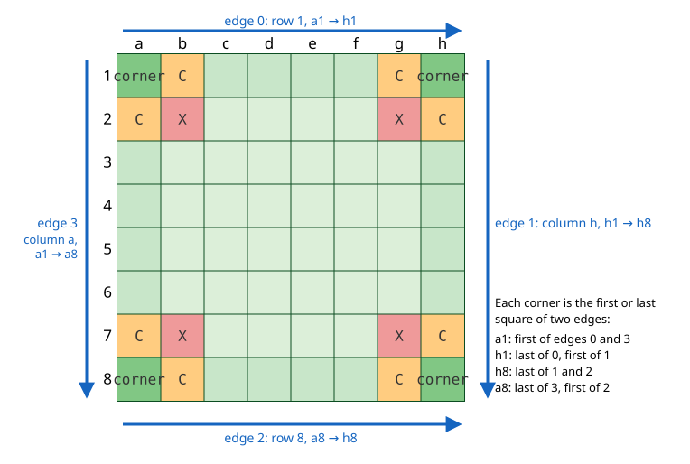
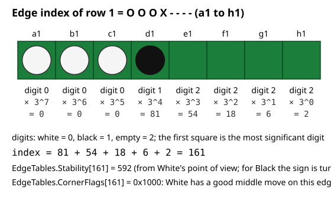
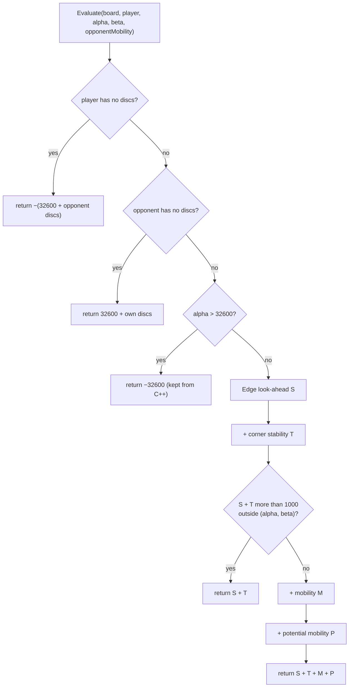
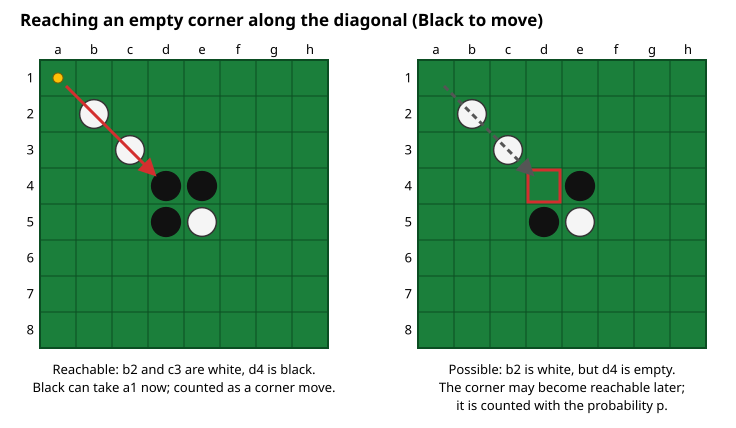
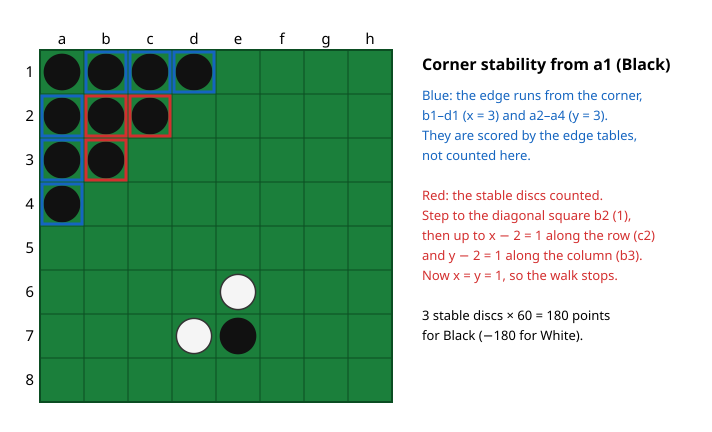

# 05 – Evaluation

[Back to the index](README.md)

## In short

At the leaves of the midgame search the engine cannot look further ahead, so it estimates how good the position is for the side to move. Stello's evaluation is built around the **edges**: corners and edges decide most Othello games, and a disc on an edge is hard to flip. Each of the four edges is looked up in precomputed tables, and a small two-ply search on the edges alone checks which edge and corner moves each side has. **Stable discs** grown out of the corners add a bonus. **Mobility** (how many moves each side has) and **potential mobility** (how many empty squares border the opponent's discs) make up the rest. The score is in "evaluation units"; a won game is worth more than 32 600.

The evaluation is a faithful port of the C++ `eval()` in [Eval.cpp](../../Stello%20C++/BRAIN/Eval.cpp). Its logic has been kept, including one quirk, so that the program plays in the same style.

## Data structures

### The four edges

An edge is read as eight squares in a fixed order:



Each corner is the first or the last square of two edges. The squares next to a corner have names used in Othello: the **X-square** is diagonally next to the corner (b2, g2, b7, g7) and the two **C-squares** are next to it on the edges (b1 and a2 for a1). A disc on an X- or C-square often gives the opponent the corner.

### The edge index

The eight squares of an edge are read as a number in base 3, with the first square as the most significant digit:

$$i = \sum_{k=0}^{7} d_k \cdot 3^{7-k}, \qquad d_k = \begin{cases} 0 & \text{white} \\ 1 & \text{black} \\ 2 & \text{empty} \end{cases}$$

so there are $3^8 = 6561$ possible edges, numbered 0 to 6560. An empty edge has index 6560. `Evaluator.EdgeIndices` computes the four indices of a board.



### The edge tables

[EdgeTables.cs](../../Stello.Net/Stello.Engine/Evaluation/EdgeTables.cs) holds eight tables of 6561 `short` values, one entry per edge index. They were computed once, long ago, by the C++ program [BORDERS.C](../../Stello%20C++/BORDERS/BORDERS.C), stored in [Kanter.cpp](../../Stello%20C++/BRAIN/Kanter.cpp), and copied unchanged into C#. All values are from **White's point of view**.

| C# table | C++ name | For each edge index |
|---|---|---|
| `Stability` | `sikker` | The value of the edge: corners, stable discs, dangerous C-squares |
| `WhiteFirstCorner`, `WhiteLastCorner` | `white_v`, `white_h` | The edge index after White takes the first / last corner of the edge |
| `BlackFirstCorner`, `BlackLastCorner` | `black_v`, `black_h` | The same for Black |
| `WhiteMiddle`, `BlackMiddle` | `white_m`, `black_m` | The edge index after that colour's best move on one of the six middle squares |
| `CornerFlags` | `hjo_trek` | Bit flags, below |

The flags in `CornerFlags` ("1" is the first corner of the edge, "2" the last):

| Bits | C++ name | Meaning |
|---|---|---|
| `0x2000`, `0x1000` | `MIDT_HUMAN`, `MIDT_COMPUTER` | Black / White has a good middle move on this edge |
| `0x0200`, `0x0100` | `SORT_HJ1`, `SORT_HJ2` | Black can take corner 1 / 2 now |
| `0x0002`, `0x0001` | `HVID_HJ1`, `HVID_HJ2` | White can take corner 1 / 2 now |
| `0x0008`, `0x0004` | `SORT_STABIL_HJ1`, `SORT_STABIL_HJ2` | Black can take corner 1 / 2 whatever White plays on the edge first |
| `0x0800`, `0x0400` | `HVID_STABIL_HJ1`, `HVID_STABIL_HJ2` | White can take corner 1 / 2 whatever Black plays on the edge first |
| `0x0080`, `0x0040` | `FARLIG_HJ1_SORT`, `FARLIG_HJ2_SORT` | Taking corner 1 / 2 is dangerous for Black |
| `0x0020`, `0x0010` | `FARLIG_HJ1_HVID`, `FARLIG_HJ2_HVID` | Taking corner 1 / 2 is dangerous for White |

In C++, "human" is Black and "computer" is White. The "now" flags are used for the side to move's own corner moves; the stronger "whatever … plays first" flags are used for the opponent's replies. BORDERS.C marked a corner move as *dangerous* when a small minimax on the edge alone showed that the opponent's best answer after it is more than 300 points worse for the mover than without it. 740 of the 6561 edges carry a danger flag for a first corner; for example `OOOOO-O-` (index 20) is marked dangerous for White's corner a1.

### A 10 × 10 board per call

The C++ code walks the board with legacy square numbers ([chapter 02](02-board-and-squares.md#legacy-square-numbers)): the diagonal from a corner, and the rows and columns for stability. To keep that code line by line, `Evaluate` fills a 100-byte array on the stack (`FillMailbox`) with white = 0, black = 1, empty = 2 and border = 3, and works on it.

## Algorithm

### Overview

`Evaluator.Evaluate(board, player, alpha, beta, opponentMobility)` returns the score for `player`, the side to move at the leaf:



$$E = S + T + M + P$$

### Edge look-ahead (S)

The static value of the four edges is the sum of their stability values, with the sign turned for Black because the tables are from White's point of view:

$$S_0(e) = \sigma \sum_{j=0}^{3} \text{Stability}[e_j], \qquad \sigma = \begin{cases} +1 & \text{White to move} \\ -1 & \text{Black to move} \end{cases}$$

Then a two-ply search is done on the edges alone. With $e$ the four edge indices:

1. **Which corners can each side take?** For each corner that is not marked dangerous for that side, the flags say whether the side can take it along an edge. If not, and the corner is empty with an opponent disc on the X-square, `DiagonalReaches` walks the diagonal: if the line of opponent discs is closed by an own disc, the corner can be taken along the diagonal. If the line is not closed, the corner is only *possible* (it may become reachable later).
2. **Which edges have a good middle move** for each side (the `MIDT` flags).
3. **The opponent replies first:** start with $S_0(e)$ and take the minimum over the opponent's middle moves and corner moves (edges looked up in the `…Middle` and `…Corner` tables).
4. **Then the side to move tries its own moves:** for each own middle move and corner move, compute the edges after it, let the opponent reply as in step 3, and keep the best result.

In short:

$$S = \max\Big( \operatorname{reply}(e),\ \max_{m} \operatorname{reply}\big(m(e)\big) \Big), \qquad \operatorname{reply}(e) = \min\Big( S_0(e),\ \min_{r} S_0\big(r(e)\big) \Big)$$

where $m$ are the side to move's edge and corner moves and $r$ the opponent's. After an own corner move the opponent's reply on that same corner is not considered.



**Possible corners** are weighted with a probability $p$ (per mille) that the corner can be taken later. It depends on the number of discs $n$ on the board (integer division):

$$p = \frac{1}{2} \left\lfloor \frac{1000\,(64 - n)}{64} \right\rfloor + 500$$

so $p$ falls from 968 at the start to 500 on a full board. The score with the corner taken, $s_{\text{with}}$, and without it, $s_{\text{without}}$, are blended:

$$B = \frac{p \cdot s_{\text{with}} + (1000 - p) \cdot s_{\text{without}}}{1000}$$

This is `EdgeContext.Blend`. `EdgeContext.Score` is $S_0$, and `EdgeContext.Reply` is the opponent's reply in step 4.

> [!NOTE]
> **Kept C++ quirk.** In `EdgeContext.Reply`, a *possible* opponent corner reply sets `score = min(result, blend)`. This overwrites the best score found so far (the running maximum of step 4) instead of lowering the reply score `result`. Changing it would change the playing style, so it is kept and marked in the code. See [Stello porting documentation.md](../../Stello%20porting%20documentation.md), section 3.2.

### Corner stability (T)

A disc is **stable** when it can never be flipped again. From each occupied corner, `CornerStability` counts discs of the corner's colour that are stable because they grow diagonally out of the corner:

1. Count the discs of the corner's colour along the row ($x$) and along the column ($y$) from the corner.
2. While $x \ge 1$ and $y > 1$, or $x > 1$ and $y \ge 1$: step one square diagonally inwards and count it; then count up to $x - 2$ discs along the row and up to $y - 2$ along the column from there, which gives the new $x$ and $y$.

Each stable disc counts `StableDiscWeight` = 60 points, positive for the corner's owner and negative for the opponent. The discs on the edge itself (the first $x$ and $y$) are not counted, because the edge tables already score them.



As in C++, the diagonal square in step 2 is counted without checking its colour.

### Lazy cut-off

Mobility and potential mobility together can change the score by at most 1000 (their weights 400 + 600). If $S + T + 1000 \le \alpha$ or $S + T - 1000 \ge \beta$, the result cannot fall inside the search window, so `Evaluate` returns $S + T$ without computing mobility. The search only needs to know that the score is outside the window.

### Mobility (M) and potential mobility (P)

$$M = \frac{400\,(m - m')}{m + m' + 2}, \qquad P = \frac{600\,(q - q')}{q + q' + 2}$$

(integer division, rounded towards zero)

- $m$ is the number of legal moves of the side to move, and $m'$ is `opponentMobility`: the number of moves the other side had in the parent position (C++ `plmov`). The search passes it in, so it does not have to be computed again.
- $q$ and $q'$ are the potential mobilities from `Bitboards.PotentialMobility`: the number of (empty square, direction) pairs where the neighbour is an opponent disc. They count places where moves may appear later. Having few discs of one's own, bordered by many empty squares, is bad for the opponent.
- 400 is `CurrentMobilityWeight` (C++ `CURMOB`) and 600 is `PotentialMobilityWeight` (C++ `POTMOB`).

The "+ 2" keeps the fraction defined when both counts are 0, and the fraction keeps the terms between −400 and +400 (−600 and +600).

### Dangerous corner moves

`Evaluator.IsDangerous(after, mover, move)` is called by the search before a leaf is evaluated. If the move just played is a corner, and the edge tables mark that corner as dangerous for the mover on the edges after the move, the leaf is **not evaluated**: the search looks one ply deeper instead (chapter 07). A corner that looks good but is dangerous is thus checked by a real search.

### Game over

A player without discs has lost: the score is $\pm(32600 + \text{discs of the winner})$. Other finished games are scored by the search itself, with the disc difference and the empty squares given to the winner (chapter 07). Values beyond ±32 600 therefore mean a won or lost game.

## Worked examples

The values below were computed with the engine.

### The first leaf of a search

After Black plays f5 from the start position, White is to move; Black had 4 moves before f5, so $m' = 4$.

```text
--------
--------
--------
---OX---
---XXX--
--------
--------
--------
```

| Term | Value | Why |
|---|---|---|
| Edges $S$ | 0 | All four edges are empty (index 6560, stability 0) |
| Corner stability $T$ | 0 | No corner is occupied |
| Mobility $M$ | −44 | White has $m = 3$ moves: $400 \cdot (3 - 4) / 9 = -44$ |
| Potential mobility $P$ | +323 | White $q = 19$, Black $q' = 5$: $600 \cdot 14 / 26 = 323$ |
| **Total** | **+279** | |

White is better: Black has more discs, which gives White many places to move later. This is the typical Othello idea that having fewer discs early in the game is good.

### A midgame position

After the 30 moves `c4 c5 d6 e7 c6 d3 c2 b4 c3 b6 e6 c1 b1 d2 c7 b3 a2 a1 b5 a5 a3 e3 a7 d8 d1 b2 f3 f5 f8 a4` (a random game), Black is to move; here White has 10 moves, used as $m'$.

```text
OOOX----
OOOX----
OOOOXX--
OOXXO---
OOXXOO--
-OXXO---
X-O-X---
---O-X--
```

| Edge | Squares | Index | Stability |
|---|---|---|---|
| 0 (row 1) | `OOOX----` | 161 | 592 |
| 1 (column h) | `--------` | 6560 | 0 |
| 2 (row 8) | `---O-X--` | 6389 | −15 |
| 3 (column a) | `OOOOO-X-` | 23 | 682 |

| Term | Value | Why |
|---|---|---|
| Edges $S$ | −1259 | $-(592 + 0 - 15 + 682)$; the look-ahead finds no edge move that changes it |
| Corner stability $T$ | −180 | White's a1: x = 2 (b1, c1), y = 4 (a2–a5); b2, b3 and b4 are stable: $3 \cdot 60$ for White |
| Mobility $M$ | −40 | Black $m = 8$, $m' = 10$: $400 \cdot (-2) / 20$ |
| Potential mobility $P$ | −56 | Black $q = 23$, White $q' = 28$: $600 \cdot (-5) / 53$ |
| **Total** | **−1535** | White's strong edges and corner dominate |

Here $p = 734$ (34 discs), but no corner is only "possible", so it is not used.

## Design notes

- **Edge knowledge in tables.** The tables turn a lot of Othello edge knowledge (stable discs, unbalanced edges, dangerous C-squares, corner fights) into one array lookup per edge. The two-ply look-ahead on the tables adds tactics on the edges at a small cost.
- **A faithful port.** The four corner blocks, written out four times in C++ (about 1000 lines), are written once in C# and driven by a table of corners (`Corners`: the two edges, first or last square, the diagonal). The globals `sindex1..4` that C++ computed in `dangerous()` are now computed inside `Evaluate`. The unused `pbonus` was dropped. Everything else, including the quirks, gives the same results as C++. See [Stello porting documentation.md](../../Stello%20porting%20documentation.md), sections 3.1–3.3.
- **Cost.** Building the 10 × 10 array for every call is the price of the line-by-line port. The evaluation is only called at the leaves of the midgame search and for move ordering far from the end (chapter 09), so it has not been a bottleneck so far.
- **The weights are old.** 400, 600, 60 and the edge values were tuned by hand for the C++ program. They are not learned from games, as in modern pattern-based programs (see Gunnar Andersson's page below).

## Where in the code

| File | Main members |
|---|---|
| [Evaluator.cs](../../Stello.Net/Stello.Engine/Evaluation/Evaluator.cs) | `Evaluate`, `IsDangerous`, `EdgeIndices`, `FillMailbox`, `EdgeScore`, `DiagonalReaches`, `CornerStability`, `EdgeContext` (`Score`, `Blend`, `Reply`), the flag sets `WhiteFlags` and `BlackFlags`, `Corners` |
| [EdgeTables.cs](../../Stello.Net/Stello.Engine/Evaluation/EdgeTables.cs) | The eight generated tables |
| [Bitboards.cs](../../Stello.Net/Stello.Engine/Bitboards.cs) | `LegalMoves`, `PotentialMobility` |
| [SearchEngine.cs](../../Stello.Net/Stello.Engine/SearchEngine.cs) | `EvaluateLeaf` (the call from the search) |
| C++: [Eval.cpp](../../Stello%20C++/BRAIN/Eval.cpp), [Kanter.cpp](../../Stello%20C++/BRAIN/Kanter.cpp), [BORDERS.C](../../Stello%20C++/BORDERS/BORDERS.C), [Minmax.cpp](../../Stello%20C++/BRAIN/Minmax.cpp) (`dangerous`) | The original code and the table generator |

## Tests

[EvaluatorTests.cs](../../Stello.Net/Stello.Engine.Tests/EvaluatorTests.cs):

- the tables have 6561 entries each, and corner moves on an empty edge change the corner square;
- the edge indices of the start position (all empty), and the order of the squares inside an edge;
- a wiped-out player loses with ±(32600 + discs);
- the same score for 200 random positions and their mirror images in the a1–h8 diagonal;
- the start position scores the same for both colours;
- `IsDangerous` is false for a non-corner move.

## Further reading

- [Writing an Othello program – Gunnar Andersson](http://radagast.se/othello/howto.html): the section "Position evaluation" describes disk-square tables, mobility-based evaluation (like Stello's) and pattern-based evaluation.
- [Computer Othello – Wikipedia](https://en.wikipedia.org/wiki/Computer_Othello): evaluation techniques, including mobility and potential mobility.
- [Othello – Chess Programming Wiki](https://www.chessprogramming.org/Othello): the "Evaluation" section, with references to IAGO (edge stability, mobility, potential mobility) and Logistello.

---

Previous: [04 Game record](04-game-record.md) · Next: [06 Move ordering](06-move-ordering.md)
