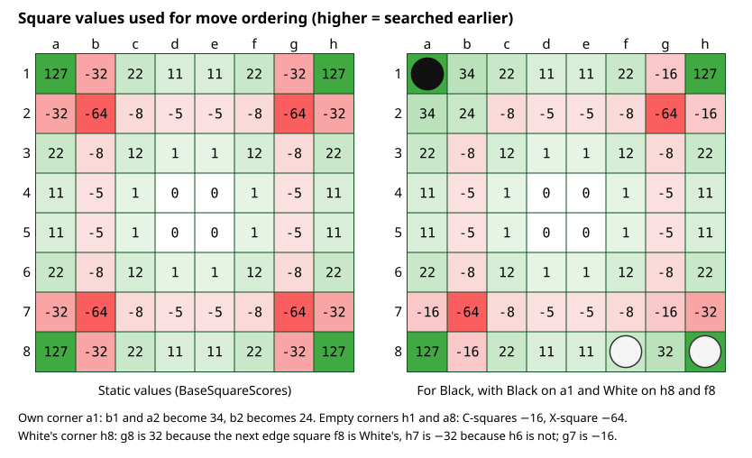
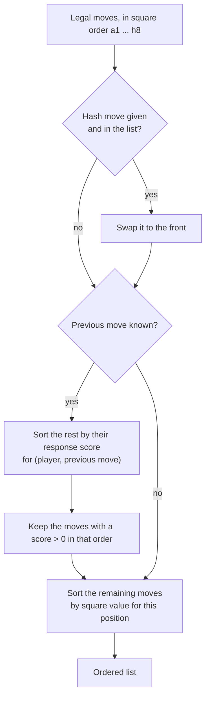

# 06 – Move ordering

[Back to the index](README.md)

## In short

Alpha-beta search (chapter 07) is fastest when the best move in each position is searched first: then the other moves are refuted quickly and whole branches are cut off. The engine cannot know the best move in advance, so it guesses, in this order: the move stored in the hash table from an earlier search, then replies that worked well against the opponent's last move before (the *response table*), and finally a fixed value per square that prefers corners and avoids the squares next to empty corners. This chapter describes the ordering of the midgame search; the endgame solver has its own ordering (chapter 09).

## Data structures

| Name | Type | Contents |
|---|---|---|
| `BaseSquareScores` | `sbyte[64]` (static) | The static value of each square (C++ `scores[100]`) |
| `CornerAreas` | table of 4 | For each corner: the two C-squares, the edge square beyond each C-square, and the X-square |
| `_responses` | `int[2 × 64 × 64]` | For each replying colour, each previous move and each reply: a score (C++ `humres`/`comres`) |

The static square values: corners 127, X-squares −64, C-squares −32, the other edge squares 22 or 11, and small values inside the board.

## Algorithm

### Ordering the moves of one position

`MoveOrdering.Order(moves, hashMove, previousMove, player, board)` sorts the list of legal moves in place:

All sorting uses `SortDescending`, a stable insertion sort: moves with the same key keep their square order. This makes the search deterministic, and insertion sort is fast for the short lists of Othello (usually fewer than 20 moves).

### Square values for this position

`SquareScores` starts from the static values and recomputes the squares next to each corner, from the point of view of the side to move:

| Corner is … | C-squares | X-square |
|---|---|---|
| owned by the side to move | 34 each | 24 |
| owned by the opponent | 32 if the opponent also owns the next edge square beyond the C-square, otherwise −32 | −16 |
| empty | −16 each | −64 |

Next to an own corner, the C- and X-squares are safe and become good moves. Next to an empty corner they are dangerous, because they can give the opponent the corner. Next to an opponent's corner a C-square is good only if it connects to the opponent's edge discs, so that the move cannot easily be flipped back.

### The response table

After each move `move` has been searched, the search records the opponent's best reply `reply` in the table (`RecordResponse`):

- **+4** if the reply refuted the move (the move's score did not rise above alpha);
- **+1** otherwise.

The row is chosen by the replying colour and the move it replied to, so the table learns "after this move, that reply is strong". When the same move appears again elsewhere in the tree, the reply is tried early (`Order` with `previousMove`). The table is cleared at the start of every search (`ClearResponses`), so it only holds knowledge from the current search. This idea is often called a *killer response* or *counter-move* heuristic.

### Where the ordering is used

- At every node of the midgame search, with the hash move and the opponent's last move (chapter 07).
- At the root, once at the start of a search without a hash move; after that, the root list is reordered by the search itself: each move that becomes the best is moved to the front for the next iteration (chapter 07).
- The endgame solver uses different keys (evaluation, fewest replies, parity), with `BaseScore` as a tie-breaker (chapter 09).

## Worked example

In the midgame position of [chapter 05](05-evaluation.md#a-midgame-position), Black has eight legal moves. Their square values for this position (a1 is White's, h1 and h8 are empty, a8 is empty):

| Move | e2 | f4 | g5 | a6 | f6 | f7 | b8 | c8 |
|---|---|---|---|---|---|---|---|---|
| Square value | −5 | 1 | −5 | 22 | 12 | −8 | −16 | 22 |

- **Without a hash move or a previous move** (as at the root): `a6 c8 f6 f4 e2 g5 f7 b8`. a6 and c8 have the same value and keep their square order; so do e2 and g5.
- **With hash move f4, and responses recorded after White's last move a4** (e2 refuted a move before: 4; g5 was the best reply once: 1): `f4 e2 g5 a6 c8 f6 f7 b8`. The hash move comes first, then the moves with a response score, then the rest by square value.

b8 is last: it is a C-square next to the empty corner a8.

## Design notes

- **Cheap and simple.** The ordering uses no search and no evaluation, only a hash lookup, a table lookup and a few comparisons, because it runs at every node.
- **Bug fixed.** In C++, after sorting by response score, the code read the response of the wrong square (the −11 offset of the legacy numbering was missing). The C# version reads the right entry.
- **One table per colour.** C++ had one table for the computer and one for the human. C# uses one per colour, which is the same while one side is the computer, and also correct when the engine searches for both sides (self-play, book learning).
- **No global state.** The dynamic square values are computed into a local array instead of overwriting a global table, and the response table belongs to the `SearchEngine` instance.
- **Tried and rejected.** For the endgame solver, ordering the moves by a shallow midgame search (with this evaluation) was tried in phase 8 and was much slower; adding potential mobility to the fastest-first key gave no measurable gain. See phase 8 in [the specification](../../Migrate%20Othello%20game%20from%20C++%20to%20C%23.md).

## Where in the code

| File | Main members |
|---|---|
| [MoveOrdering.cs](../../Stello.Net/Stello.Engine/Search/MoveOrdering.cs) | `BaseSquareScores`, `CornerAreas`, `Order`, `SquareScores`, `RecordResponse`, `ClearResponses`, `SortDescending`, `BaseScore` |
| [SearchEngine.cs](../../Stello.Net/Stello.Engine/SearchEngine.cs) | The calls to `Order` and `RecordResponse` in `Search` and `SearchRoot` |
| C++: [Sort.cpp](../../Stello%20C++/BRAIN/Sort.cpp) | `sortlist`, `simsort`, `scores` |

## Tests

There is no unit test of `MoveOrdering` on its own. The ordering only affects speed, not the result of a full-width search, so it is covered through the search tests: the same result every time (`FixedDepth_IsDeterministic` in [SearchEngineTests.cs](../../Stello.Net/Stello.Engine.Tests/SearchEngineTests.cs)), the strength tests in [StrengthTests.cs](../../Stello.Net/Stello.Engine.Tests/StrengthTests.cs), and the endgame positions in [EndgameTests.cs](../../Stello.Net/Stello.Engine.Tests/EndgameTests.cs), which only finish in time with good ordering.

## Further reading

- [Alpha-Beta – Chess Programming Wiki](https://www.chessprogramming.org/Alpha-Beta): the section "Savings" explains why the best move first gives the most cutoffs.
- [Writing an Othello program – Gunnar Andersson](http://radagast.se/othello/howto.html): the section "Move ordering" describes killer responses in Othello (after an X-square move, try the corner first).

---

Previous: [05 Evaluation](05-evaluation.md) · Next: [07 Midgame search](07-midgame-search.md)
