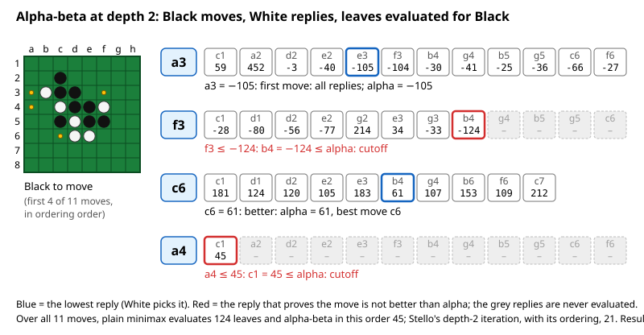
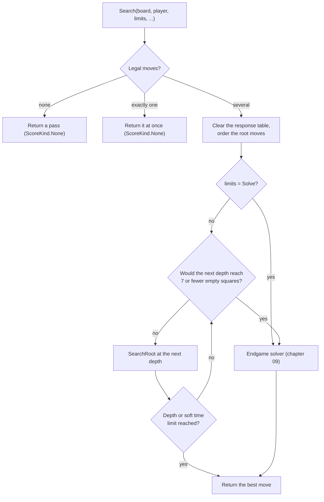
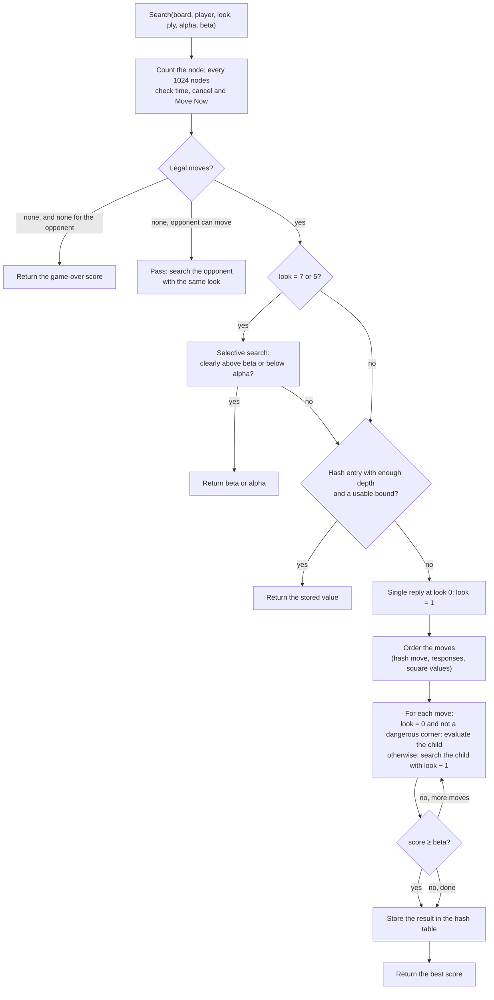

# 07 – Midgame search

[Back to the index](README.md)

## In short

To choose a move, the engine looks ahead: it tries its moves, the opponent's replies, its answers to those, and so on, and evaluates the positions at the end of each line (chapter 05). The best move is the one that leads to the best position when both sides play their best. This is **minimax**; Stello writes it as **negamax** with **alpha-beta pruning**, which skips lines that cannot change the result. The search runs **iteratively deeper**: first 1 ply, then 2, then 3, until the time is used. It is helped by the hash table (chapter 08), move ordering (chapter 06), a few **extensions** and a **selective search** that cuts off positions that are clearly outside the interesting range. When the end of the game is near enough, the endgame solver takes over (chapter 09).

## Data structures

`SearchEngine` holds everything one search needs. An instance runs one search at a time; the app keeps one engine for the whole game, so the hash tables survive from move to move.

| Field | Contents |
|---|---|
| `_midgameTable`, `_endgameTable` | The two hash tables (chapter 08) |
| `_ordering` | The move ordering with the response table (chapter 06) |
| `_clock`, `_hardLimitMs` | A `Stopwatch` and the time limit (chapter 10) |
| `_nodes`, `_evaluations` | Counters, reported in `SearchInfo` and `SearchResult` |
| `_hashGetHeight`, `_hashPutHeight` | How far from the root the midgame hash table is used |
| `_cancel`, `_moveNow`, `_progress` | The two tokens and the progress callback of the running search |

| Constant | Value | Meaning |
|---|---|---|
| `Infinity` | 32 767 | Larger than any score |
| `RootWindow` | 32 664 | The root window is (−32 664, 32 664) |
| `EndgameDistance` | 7 | Switch to the solver when the search would reach 7 or fewer empty squares |
| `SelectiveLook1`, `SelectiveLook2` | 7, 5 | The `look` values where the selective search is tried |
| `SelectiveShallowLook` | 3 | The `look` of its shallow test search |
| `SelectiveMargin` | 50 | Added to the margin of the selective search |
| `SelectiveScoreLimit` | 32 000 | No selective search near won or lost scores |

**Scores** are in evaluation units from the point of view of the side to move. A finished game scores ±(32 600 + disc difference), with the empty squares given to the winner, so every won game is better than any evaluation.

**Depth.** The code uses the C++ convention `look`: the remaining depth *after* the current move. A search with `look` = *n* looks *n* + 1 plies ahead, and the leaves are evaluated in the move loop of the node with `look` = 0.

## Algorithm

### Negamax with alpha-beta

In negamax, a position's score for the side to move is the maximum over its moves of the *negated* score of the position after the move (which is from the opponent's point of view). Alpha-beta passes a window (α, β) down the tree:

- α is the score the side to move is already sure of from an earlier move; a move that cannot beat α need not be searched exactly.
- β is the most the opponent will allow; as soon as a move reaches β, the opponent will avoid this position, so the other moves need not be searched: a **cutoff**.

A child is searched with the window (−β, −α). Stello's search is **fail-soft**: it returns the best score it found even when that is outside the window, which gives the hash table tighter bounds.

The picture shows a real depth-2 search for Black in the midgame test position (the one used in [SearchEngineTests.cs](../../Stello.Net/Stello.Engine.Tests/SearchEngineTests.cs)). Each row is a black move with White's replies; the leaves are evaluated for Black, and White picks the lowest.



With the root moves in this order and the replies in square order, alpha-beta evaluates 45 leaves instead of the 124 of a full minimax. In the real search, the depth-1 iteration has already moved c6 to the front, so α is 61 from the first move on and the other moves are refuted sooner; the replies are also tried in square-value order (chapter 06). The depth-2 iteration then needs only 21 evaluations. Both find c6 with score 61.

### The search as a whole

`SearchEngine.Search(board, player, limits, progress, cancellationToken, moveNowToken, onlyMoves)`:



With `onlyMoves`, only the given moves are searched, even a single one (used by book learning, chapter 12). A single legal move is not searched either, unless the limit is `Solve` or `onlyMoves` is given. If the time runs out or "Move Now" is used at any point, the search unwinds and returns the best move found so far (chapter 10).

### Iterative deepening

The loop runs `look` = 0, 1, 2, … as long as $\text{empties} - 1 - \text{look} > 7$, that is, as long as the search ends with more than 7 empty squares on the board. After each iteration it stops if the depth limit (fixed depth) or the soft time limit (the other modes) is reached. Searching depth 1, 2, 3, … sounds wasteful, but each iteration fills the hash table and reorders the root moves for the next one, and the deeper searches are so much bigger that the small ones hardly count.

### The root: principal variation search

`SearchRoot` searches every root move:

- The first move with the full window; the other moves, once the search is deeper than 3 plies (`look` > 2), with a **null window** (−α − 1, −α). A null-window search is fast because it only answers "better than α or not?". If a move turns out better, it is searched again with the full window. This is **principal variation search** (PVS), which replaces the C++ `zero_findmax`.
- After each root move, a `SearchInfo` is reported (depth, current move, best move, score, nodes, evaluations, time).
- Each move that becomes the new best is recorded; at the end they are moved to the front of the root list in that order (`MoveToFront`), so the next iteration starts with the latest best move (C++ `put_in_front`).

### One node

The private `Search(board, player, look, ply, previousMove, alpha, beta, out bestMove)`:



Some details:

- **Leaves are evaluated in the parent's loop.** When `look` is 0, the positions after each move are evaluated directly with `Evaluator.Evaluate`, passing the number of moves in the current position as the opponent's mobility $m'$ (chapter 05). This saves a function call per leaf, as in C++.
- **Passes** do not use up depth: the opponent is searched with the same `look`.
- **Extensions.** A position with only one legal move at the horizon is searched one ply deeper. A corner move that the edge tables mark as dangerous (`Evaluator.IsDangerous`) is searched instead of evaluated.
- **The response table** is updated after every searched child (chapter 06).
- **The hash table** is read only at plies ≤ `look` − 1 and written only at plies ≤ `look` of the current iteration, the same heights as in C++; so it is used in the upper part of the tree, where each entry saves the most work. A hash move is only used if it is legal in the position (chapter 08).
- Inside the tree the midgame search is plain alpha-beta; PVS is only used at the root.

### Selective search

At nodes with `look` = 7 or 5, a shallow search (`look` = 3) with a null window tests whether the position is **clearly** outside the window:

$$\beta' = \beta + \left\lfloor \frac{|\beta|}{2} \right\rfloor + 50, \qquad \alpha' = \alpha - \left\lfloor \frac{|\alpha|}{2} \right\rfloor - 50$$

- If the shallow search scores at least $\beta'$, the node returns β at once: a deep search would almost certainly fail high too.
- If it scores at most $\alpha'$, the node returns α.

The test is skipped when |β| or |α| is 32 000 or more, near won and lost scores. This is Stello's version of the idea behind **ProbCut** (Buro): a shallow search predicts the deep one. ProbCut computes the margin from statistics of shallow against deep results; Stello uses a fixed margin of half the bound plus 50, from the C++ `SELEXT` code. It can miss a good move, but it lets the search go much deeper in the same time.

### Game over inside the search

When neither side can move, the node returns $\pm(32600 + d)$, where $d$ is the disc difference with the empty squares given to the winner, and 0 for a draw (`GameOverScore`).

## Worked example: iterative deepening

The midgame test position after `f5 d6 c3 d3 c4 f4 c5 b3 c2 e6`, Black to move, searched with `SearchLimits.FixedDepth(10)` (Release build, 25 September 2026; times depend on the machine):

```text
--------
--X-----
-OXX----
--OXXO--
--XOXX--
---OO---
--------
--------
```

| Depth (plies) | Best move | Score | Nodes (total) | Evaluations (total) | Time (total) |
|---|---|---|---|---|---|
| 1 | c6 | −83 | 11 | 11 | 9 ms |
| 2 | c6 | 61 | 43 | 32 | 11 ms |
| 3 | b4 | −2 | 312 | 257 | 12 ms |
| 4 | c6 | 103 | 1 033 | 749 | 14 ms |
| 5 | c6 | 0 | 3 248 | 2 476 | 19 ms |
| 6 | b4 | 113 | 9 689 | 6 539 | 32 ms |
| 7 | c6 | 22 | 29 094 | 20 947 | 72 ms |
| 8 | c6 | 88 | 99 214 | 66 328 | 186 ms |
| 9 | c6 | 13 | 147 302 | 103 055 | 204 ms |
| 10 | c6 | 70 | 675 903 | 437 509 | 361 ms |

The counters and times are totals since the start of the search. Two things are typical:

- Each iteration costs a few times more than the previous one, so the earlier iterations are cheap.
- The score goes up and down between odd and even depths: at odd depths the leaves have White to move, at even depths Black, and the evaluation depends on who is to move (mobility). This is the *odd-even effect*; comparing only odd or only even depths gives a steadier picture.

## Design notes

- **No stored game tree.** The C++ search kept a tree of up to 300 000 nodes to order moves between iterations (`findmax`, `findmax1`). The hash table and the root reordering give the same ordering with much less code. Reusing the tree after the opponent's move is gone too, but the hash table survives between moves, so most of the benefit remains.
- **PVS instead of the C++ restart trick.** `zero_findmax` restarted the root loop after the second improvement; standard PVS re-search gives the same result.
- **Exceptions instead of `longjmp`.** A time-out or "Move Now" throws a private `SearchAbortedException` from `CheckAbort`, caught in `Search`; cancel throws `OperationCanceledException`, which reaches the caller.
- **Deterministic.** With the same position and limits the search gives the same result every time (no randomness, stable sorting). Only time limits make results differ between runs.
- **Game-over scores** give the empty squares to the winner, the standard rule; C++ did not count them.

See [Stello porting documentation.md](../../Stello%20porting%20documentation.md), section 3.6.

## Where in the code

| File | Main members |
|---|---|
| [SearchEngine.cs](../../Stello.Net/Stello.Engine/SearchEngine.cs) | `Search` (public), `SearchRoot`, `Search` (private node search), `EvaluateLeaf`, `GameOverScore`, `StopIterating`, `CheckAbort`, `Report`, `MoveToFront`, `Play` |
| [SearchLimits.cs](../../Stello.Net/Stello.Engine/SearchLimits.cs), [SearchResult.cs](../../Stello.Net/Stello.Engine/SearchResult.cs) | The limits, `SearchInfo`, `SearchResult`, `ScoreKind` |
| C++: [Minmax.cpp](../../Stello%20C++/BRAIN/Minmax.cpp), [Kontrol.cpp](../../Stello%20C++/BRAIN/Kontrol.cpp) | `findmax`, `findmax1`, `findmax2`, `zero_findmax`, `getcomputer` |

## Tests

- [SearchEngineTests.cs](../../Stello.Net/Stello.Engine.Tests/SearchEngineTests.cs): a pass when there is no legal move; a single legal move without search; the requested depth is reached (1, 4 and 7 plies); the same result twice; progress for every depth; time per move and per game are kept; "Move Now" and cancel stop within 100 ms; an already cancelled search throws.
- [StrengthTests.cs](../../Stello.Net/Stello.Engine.Tests/StrengthTests.cs): at depth 4 the engine beats a random player and a greedy player.
- [EndgameTests.cs](../../Stello.Net/Stello.Engine.Tests/EndgameTests.cs): a fixed-depth search near the end switches to the solver and returns the exact score.

## Further reading

- [Alpha-Beta – Chess Programming Wiki](https://www.chessprogramming.org/Alpha-Beta): alpha-beta in negamax form, fail-soft and fail-hard.
- [Negamax – Wikipedia](https://en.wikipedia.org/wiki/Negamax): negamax with alpha-beta and with a transposition table, in pseudocode.
- [Fail-Soft – Chess Programming Wiki](https://www.chessprogramming.org/Fail-Soft) and [Null Window – Chess Programming Wiki](https://www.chessprogramming.org/Null_Window).
- [Principal Variation Search – Chess Programming Wiki](https://www.chessprogramming.org/Principal_Variation_Search).
- [Iterative Deepening – Chess Programming Wiki](https://www.chessprogramming.org/Iterative_Deepening) and [Odd-Even Effect – Chess Programming Wiki](https://www.chessprogramming.org/Odd-Even_Effect).
- [ProbCut – Chess Programming Wiki](https://www.chessprogramming.org/ProbCut) and [Buro (1995), ProbCut (pdf)](https://skatgame.net/mburo/ps/probcut.pdf): the statistical form of the selective search.
- [Writing an Othello program – Gunnar Andersson](http://radagast.se/othello/howto.html): "Searching", with alpha-beta, move ordering and selective search in Othello.

---

Previous: [06 Move ordering](06-move-ordering.md) · Next: [08 Transposition table](08-transposition-table.md)
