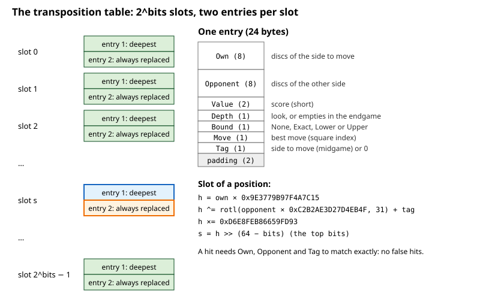
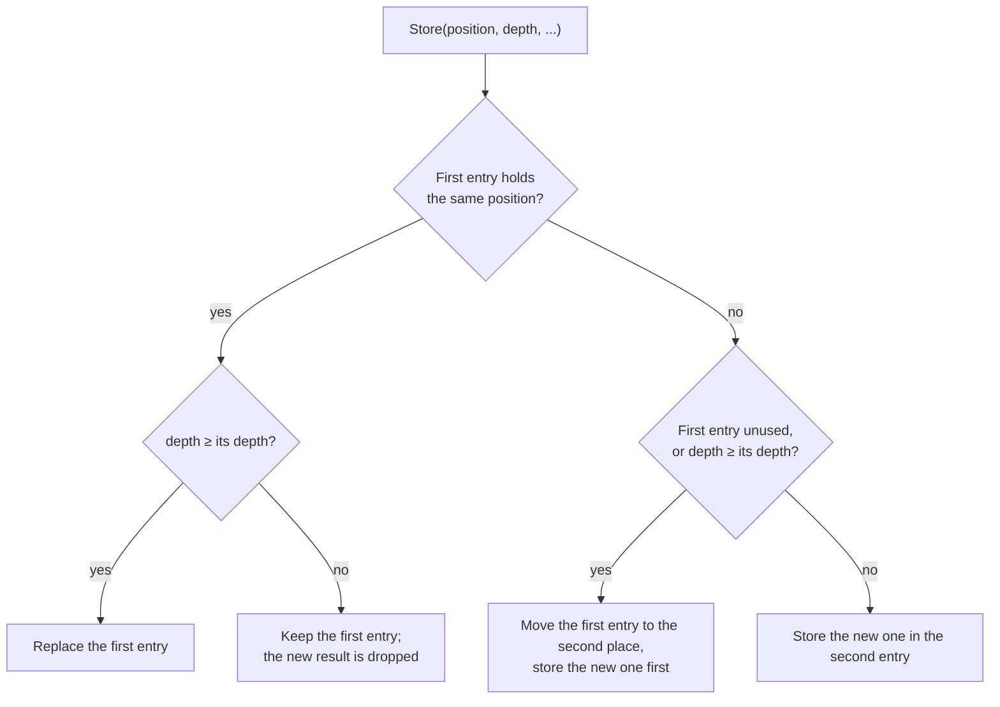

# 08 – Transposition table

[Back to the index](README.md)

## In short

In Othello the same position is often reached by different move orders: a **transposition**. The transposition table (also called the hash table) remembers what the search found out about each position it has searched: the score, whether that score is exact or only a bound, how deep the search was, and the best move. When the position comes up again, the stored result can end the search of that position at once, or at least give the best move to try first. Stello has two tables, one for the midgame search and one for the endgame solver, with two entries per slot so that deep results are not pushed out by shallow ones.

## Data structures



An `Entry` is a `readonly record struct` of 24 bytes:

| Field | Type | Contents |
|---|---|---|
| `Own`, `Opponent` | `ulong` | The discs of the side to move and of the other side: the whole position |
| `Value` | `short` | The score |
| `Depth` | `sbyte` | The midgame `look` of the search, or the number of empty squares in the endgame |
| `Bound` | `Bound` | `Exact`, `Lower`, `Upper`, or `None` for an unused entry |
| `Move` | `sbyte` | The best move (square index), or −1 |
| `Tag` | `byte` | Extra key: the side to move in the midgame table, 0 in the endgame table |

| `Bound` | Meaning | C++ name |
|---|---|---|
| `Exact` | The value is the true score (it was inside the window) | `OK_HASH` |
| `Lower` | The true score is at least the value (it failed high: ≥ β) | `HI_HASH` |
| `Upper` | The true score is at most the value (it failed low: ≤ α) | `LO_HASH` |

`new TranspositionTable(bits)` allocates $2^{\text{bits}}$ slots of two entries. `SearchEngine` takes `hashBits` (10–26, default 19) and creates two tables of that size:

$$2^{19} \text{ slots} \times 2 \text{ entries} \times 24 \text{ bytes} = 24 \text{ MiB per table}$$

## Algorithm

### Finding the slot

The slot comes from a hash of the whole position:

$$
\begin{aligned}
h &= \text{own} \cdot \texttt{0x9E3779B97F4A7C15} \\
h &= h \oplus \big(\operatorname{rotl}(\text{opponent} \cdot \texttt{0xC2B2AE3D27D4EB4F}, 31) + \text{tag}\big) \\
h &= h \cdot \texttt{0xD6E8FEB86659FD93} \\
\text{slot} &= h \gg (64 - \text{bits})
\end{aligned}
$$

(multiplications modulo $2^{64}$). The top bits of $h$ choose the slot; they depend on all the input bits.

### Looking up: `TryGet`

`TryGet(own, opponent, tag, out entry)` checks the two entries of the slot. An entry is a hit only if `Own`, `Opponent` and `Tag` are all equal and the entry is in use. Because the whole position is stored, there are **no false hits**: an entry can never belong to a different position that happens to have the same hash.

### Storing: `Store`

`Store(own, opponent, tag, depth, bound, value, move)` keeps the deepest result in the first entry and uses the second entry for everything else:



The first entry is "depth-preferred": it survives until a result at least as deep arrives. The second entry is "always replaced": it keeps the most recent shallow result. This is the *two-tier* scheme described on the Chess Programming Wiki. C++ had one entry per slot, so a deep endgame result could be overwritten by many shallow ones; the second entry was added in phase 8.

### Use in the midgame search

In the node search (chapter 07):

- The table is read at plies ≤ `look` − 1 and written at plies ≤ `look` of the current iteration, with the side to move as the tag.
- A stored move is only used if it is a legal move in the position.
- If the stored depth is at least the node's `look`, the stored value ends the search when:
  - the bound is `Exact`, or
  - the bound is `Upper` and the value is below α (the position is too bad for us), or
  - the bound is `Lower` and the value is at least β (too good; the opponent avoids it).
- Otherwise the stored move is searched first (chapter 06).
- After the node is searched, the result is stored with the node's `look` as depth and the bound from the window: `Lower` if the best score ≥ β, `Exact` if it is above α, else `Upper`.

### Use in the endgame solver

In `Solve` (chapter 09), with 7 or more empty squares and tag 0:

- An `Exact` entry is returned at once.
- A `Lower` entry raises α and an `Upper` entry lowers β; if then α ≥ β, the stored value is returned.
- The stored move is tried first.
- The result is stored with the number of empty squares as depth; an exact endgame score never needs a deeper search.
- With 10 or more empty squares, the positions after each move are looked up first (*enhanced transposition cutoff*, chapter 09).

### Two tables

Midgame values (evaluation units, depending on the search depth) and endgame values (final disc differences) mean different things, so they are kept in separate tables. The tables are never cleared during a game: `SearchEngine.ClearHash` exists, but the app does not call it, so results from the previous move are still there when the next search starts.

## Worked examples

### A transposition

The tiger opening `f5 d6 c3 d3 c4` and the order `f5 d6 c4 d3 c3` reach the same position, White to move:

```text
--------
--------
--XO----
--XXX---
---OXX--
---O----
--------
--------
```

When the search has stored this position once, the second path finds it in the table.

### Replacement in one slot

Four positions A, B, C and D with the same slot, stored in this order in a table with `bits` = 1 (two slots), with the found entries after each step:

| Step | Store | Found afterwards |
|---|---|---|
| 1 | A, depth 5 | A (5) |
| 2 | B, depth 2 | A (5), B (2) |
| 3 | C, depth 1 | A (5), C (1) – C replaced B in the second entry |
| 4 | D, depth 6 | A (5), D (6) – D is deeper, so it takes the first entry and A moves to the second |
| 5 | B, depth 3 | D (6), B (3) – B replaced A in the second entry |

The deep result A survived two shallow stores (steps 2 and 3); only a deeper result (D) pushed it to the second place, from where the next store removed it.

## Design notes

- **Full positions instead of Zobrist keys.** C++ used 32-bit Zobrist-style keys from random numbers, and checked only 32 bits, so false hits were possible. Storing both bitboards costs 16 bytes per entry but makes every hit certain, and there is no random key table to maintain. See [Stello porting documentation.md](../../Stello%20porting%20documentation.md), section 3.5.
- **Two tables** instead of one shared table: C++ mixed midgame and endgame values in the same table.
- **Two entries per slot** (phase 8) was the biggest single gain of phase 8: the nodes for FFO #43 dropped from 292 M to about 117–168 M. A single-entry table of $2^{23}$ entries gave a similar result, so the problem had been deep entries being overwritten. Larger two-entry tables ($2^{21}$–$2^{23}$ slots) gave no further gain: FFO #40–#44 took 17.4–17.9 s against 17.0 s with $2^{19}$ slots, so the default stayed at $2^{19}$ (see [Tested and rejected](../../Stello%20porting%20documentation.md#tested-and-rejected) in the porting documentation).
- **Bounds narrow the endgame window.** In the endgame, a stored bound that does not end the search still narrows (α, β), which C++ did not do.

## Where in the code

| File | Main members |
|---|---|
| [TranspositionTable.cs](../../Stello.Net/Stello.Engine/Search/TranspositionTable.cs) | `Bound`, `TranspositionTable`, `Entry`, `TryGet`, `Store`, `Clear`, `Slot` |
| [SearchEngine.cs](../../Stello.Net/Stello.Engine/SearchEngine.cs) | `_midgameTable` and `_endgameTable`, their use in `Search` and `Solve`, `ClearHash` |
| C++: [Minmax.cpp](../../Stello%20C++/BRAIN/Minmax.cpp), [HASH.H](../../Stello%20C++/BRAIN/HASH.H) | `f_hash_put`, the C++ hash table |

## Tests

[TranspositionTableTests.cs](../../Stello.Net/Stello.Engine.Tests/TranspositionTableTests.cs): store and find; another position or tag is not found; the deeper result for the same position is kept; a deep entry survives many shallow entries in the same slot; clear removes everything. The endgame tests (chapter 09) check that the table gives correct scores in real searches.

## Further reading

- [Transposition Table – Chess Programming Wiki](https://www.chessprogramming.org/Transposition_Table): what is stored, the three bound types, collisions, and replacement schemes including the two-tier system.
- [Negamax – Wikipedia](https://en.wikipedia.org/wiki/Negamax): pseudocode for negamax with a transposition table.
- [Writing an Othello program – Gunnar Andersson](http://radagast.se/othello/howto.html): "Transposition tables", with the same tiger-opening example.

---

Previous: [07 Midgame search](07-midgame-search.md) · Next: [09 Endgame solver](09-endgame-solver.md)
