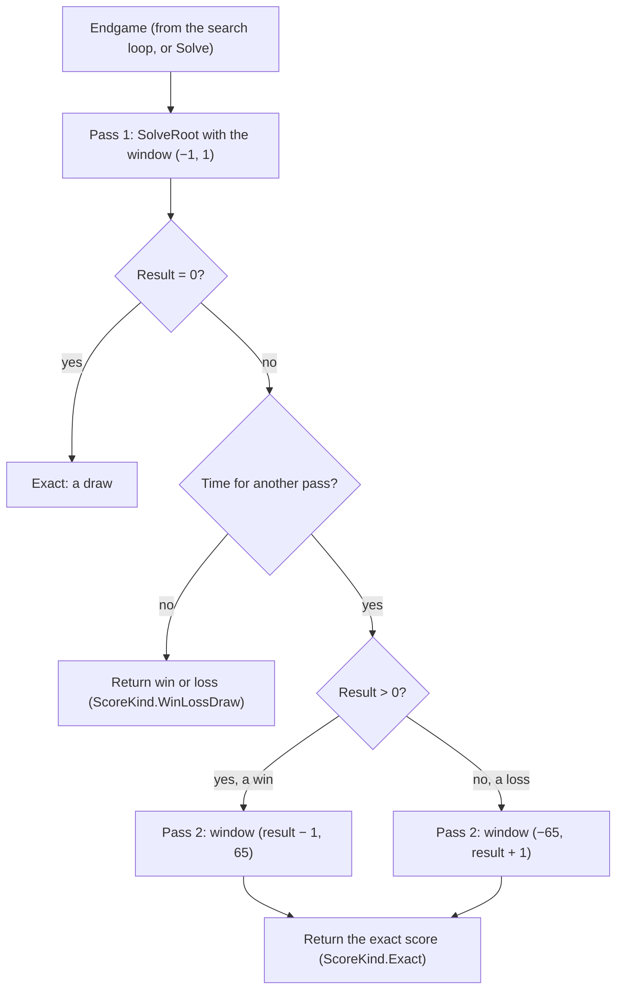
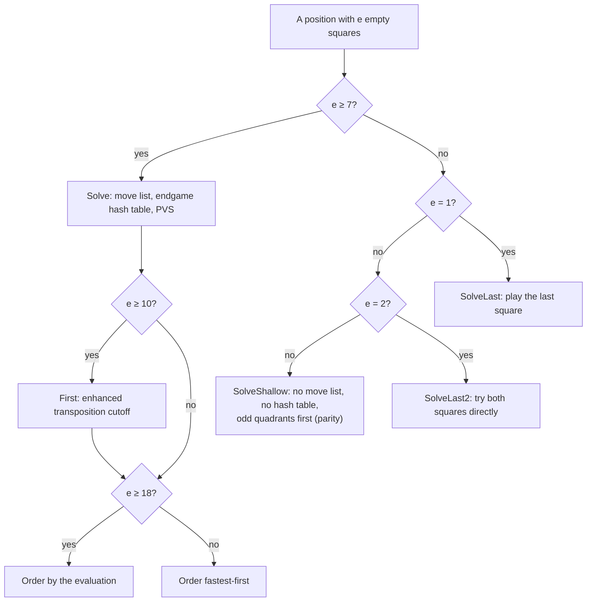
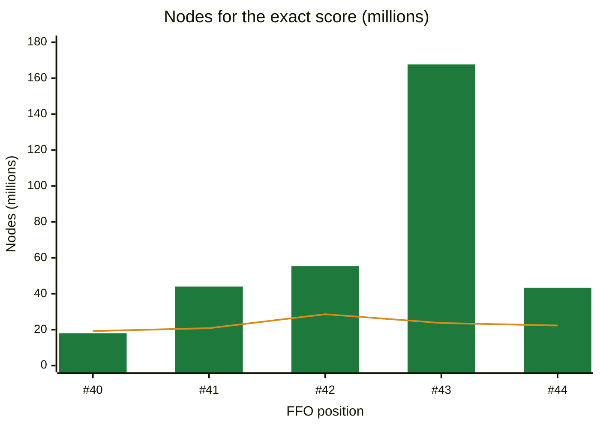

# 09 – Endgame solver

[Back to the index](README.md)

## In short

Near the end of the game the engine stops guessing. The **endgame solver** searches every line to the end of the game and computes the true result with perfect play by both sides, as a final disc difference. It works in two passes: first it only finds out whether the side to move **wins, loses or draws**, which is much faster, and then, if there is time, the **exact score**. Because the solver searches to the end, move ordering decides almost everything; it uses the hash table, "fastest-first" ordering, parity and an enhanced transposition cutoff.

## Data structures

The solver is part of `SearchEngine` and works on raw bitboards (`own`, `opponent`) instead of `Board`, from the point of view of the side to move. Scores are final disc differences, from −64 to +64.

| Constant | Value | Meaning |
|---|---|---|
| `EndgameDistance` | 7 | The solver takes over when the midgame search would reach 7 or fewer empty squares |
| `EndgameHashMinEmpties` | 7 | The endgame hash table is used from 7 empty squares |
| `FastestFirstMinEmpties` | 7 | Fastest-first ordering from 7 empty squares |
| `EvaluationOrderMinEmpties` | 18 | Ordering by the evaluation from 18 empty squares |
| `TranspositionCutoffMinEmpties` | 10 | Enhanced transposition cutoff from 10 empty squares |
| `ShallowEmpties` | 6 | With 6 or fewer empty squares, `SolveShallow` is used |
| `Quadrants` | 4 masks | a1–d4, e1–h4, a5–d8, e5–h8, for parity |
| `Corners` | mask | a1, h1, a8, h8, for fastest-first |

## Algorithm

### When the solver runs

- In the normal modes, the iterative deepening loop (chapter 07) switches to the solver when the next midgame iteration would end with 7 or fewer empty squares. With 8 or fewer empty squares there is no midgame search at all.
- With `SearchLimits.Solve`, the midgame search is skipped and the solver runs at once, without a time limit. The tests and book learning use this.

### Final score

When neither side can move, the score is the disc difference $d$ = own − opponent, with the $e$ empty squares given to the winner:

$$\text{score} = \begin{cases} d + e & \text{if } d > 0 \\ d - e & \text{if } d < 0 \\ 0 & \text{if } d = 0 \end{cases}$$

This is the standard tournament rule, and it is how the FFO test values are counted.

### Two passes

The solver first finds out whether the side to move wins, and then, if there is time, by how much:

- **Pass 1** uses the null window (−1, 1): the search only has to prove "at least +1", "at most −1" or "exactly 0". Many more cutoffs happen than with a full window.
- The search is fail-soft, so the result of pass 1 is a **bound**: after a win it is a lower bound (for FFO #40 it is +2, the true score is +38), after a loss an upper bound. Pass 2 searches only the range that is still possible.
- If pass 1 finds a loss and the midgame search had a best move, that move is kept: all moves lose, and the midgame move gives the opponent the most chances to go wrong.
- `SolveRoot` does principal variation search at the root, reports progress after each root move, stops as soon as a move reaches β (in pass 1: the first winning move), and moves each new best move to the front of the root list. Pass 2 therefore starts with the winning move.

### Which routine at how many empty squares

The number of empty squares decides which routine searches a position and which tricks it uses:

### `Solve` (7 or more empty squares)

1. Count the node; every 1024 nodes check the time and the tokens.
2. Generate the legal moves. Without a move: if the opponent cannot move either, return the final score; otherwise pass (the number of empty squares stays the same).
3. Look up the endgame hash table (chapter 08): an exact entry is returned; a bound narrows (α, β); the stored move is tried first.
4. Compute the flips of every move once; they are used for ordering, for the cutoff test and for playing the move.
5. **Enhanced transposition cutoff** (from 10 empty squares): look up the position after each move in the hash table. If one of them has an exact value or an upper bound $v$ (from the opponent's point of view) with $-v \ge \beta$, that move already proves a cutoff, and the node returns $-v$ without searching anything.
6. **Order the moves** (the hash move always first):
   - from 18 empty squares: by the evaluation of the position after the move (chapter 05), best for the side to move first;
   - otherwise **fastest-first**: fewest replies for the opponent first, with replies on corners counted twice, and the square value (chapter 06) as tie-breaker:

     $$\text{key} = -256 \cdot (r + r_{\text{corner}}) + \text{BaseScore}(\text{square})$$

7. Search the moves with PVS: the first with the full window, the others with a null window and a re-search if they turn out better.
8. Store the result in the hash table, with the number of empty squares as depth.

**Why fastest-first?** Most positions in the tree are reached by a bad move somewhere above, and the solver only needs *one* refutation, not the best one. A move that leaves the opponent few replies gives a small subtree, so a refutation is found quickly.

### `SolveShallow` (3 to 6 empty squares)

With so few empty squares, generating and sorting a move list costs more than it saves. `SolveShallow` tries the empty squares directly (a square is skipped if it flips nothing) in two groups: first the squares in quadrants with an **odd** number of empty squares, then the others. It does plain alpha-beta without a hash table. A pass is handled with a `passed` flag: if both sides must pass, the game is over.

**Parity.** In a region with an odd number of empty squares, the player who moves there first can usually also make the last move there, which is an advantage at the end. Trying those squares first finds good moves sooner.

In this position the solver tries a1, (a6), b6, (b8), g1 and h1; a6 and b8 are skipped because they flip nothing. The best move is a1, and Black loses by 8 discs.

### `SolveLast2` (2 empty squares)

With two empty squares, parity no longer changes the order, so `SolveLast2` tries the two squares directly: each one that flips something is played and the last square is finished with `SolveLast`. If the side to move can play neither, it passes; if the opponent cannot play either, the game is over. This saves the loop and the quadrant count of `SolveShallow` at the most frequent nodes. It visits the same nodes and made the solver about 3 % faster (phase 8, round 2). The idea comes from the solver endgame.c (see Further reading).

### `SolveLast` (1 empty square)

The last square is played by the side to move if it flips something, otherwise by the opponent if it can, otherwise nobody can move; then the final score is returned. No move generation is needed.

## Worked example: the FFO positions

The tests solve five positions from the FFO endgame test suite. Measured with `SearchLimits.Solve` in a Release build on 25 September 2026 (times depend on the machine):

| Position | Empty squares | To move | Pass 1 result | Exact score | Best move(s) | Stello move | Pass 1 done | Total time | Nodes | Zebra nodes |
|---|---|---|---|---|---|---|---|---|---|---|
| #40 | 20 | Black | ≥ +2 | +38 | a2 | a2 | 0.02 s | 1.2 s | 18.0 M | 19.2 M |
| #41 | 22 | Black | 0 | 0 | h4 | h4 | 2.6 s | 2.6 s | 44.0 M | 20.8 M |
| #42 | 22 | Black | ≥ +2 | +6 | g2 | g2 | 2.8 s | 3.1 s | 55.3 M | 28.6 M |
| #43 | 23 | White | ≤ −2 | −12 | c7, g3 | g3 | 2.9 s | 11.0 s | 167.7 M | 23.7 M |
| #44 | 23 | White | ≤ −2 | −14 | d2, b8 | d2 | 0.6 s | 2.8 s | 43.3 M | 22.3 M |
| **Total** | | | | | | | | **20.7 s** | **328 M** | |

The nodes per position in millions, Stello (green bars) against Zebra (orange line):

Zebra needs about 20–30 M nodes for every position. Stello needs about the same for #40, about twice as many for #41, #42 and #44, and seven times as many for #43.

- "Pass 1 done" is the time of the last progress report of the win/loss/draw pass.
- #41 is a draw, so there is no second pass.
- For #43, most of the time is spent in pass 2, proving that −12 is the best White can do.
- The correct scores and moves, and Zebra's node counts for the exact score, are from [the FFO test suite page](http://radagast.se/othello/ffotest.html). Stello visits up to about 7 times more nodes than Zebra (#43), which is where the remaining speed difference comes from.

## Design notes

- **Two passes, as in C++.** The C++ solver also found win/loss/draw first and then the exact score, if there was time. After a win, C++ removed the root moves before the winning move; C# instead moves the winning move to the front.
- **Better ordering than C++.** C++ ordered the endgame moves by two killer moves and the square values (`simsort`). Fastest-first, parity and the evaluation-based ordering were needed to solve the FFO positions in reasonable time. See [Stello porting documentation.md](../../Stello%20porting%20documentation.md), section 3.7.
- **Phase 8.** Two entries per hash slot, the enhanced transposition cutoff and computing the flips only once brought FFO #40–#44 from 31.6 s to about 19–21 s. In round 2, `SolveLast2` saved about 3 % more. The target of under 10 s is not reached yet. These ideas were tried and rejected (the full tables are in [Tested and rejected](../../Stello%20porting%20documentation.md#tested-and-rejected) in the porting documentation):
  - round 1, FFO #40–#44 total time:
    - MTD(f) for pass 2, with null-window steps from the pass 1 bound: 38.0 s against 31.6 s, because #43 needed five steps from −2 to −12. Only worth another try with a good first guess;
    - one wide window (−65, 65) without pass 1: 32.8 s against 31.6 s;
    - ordering by a shallow midgame search from 12–16 empty squares: 51–101 s;
    - potential mobility in the fastest-first key: 5 % fewer nodes, but no time gain;
    - a stability cutoff: almost the same nodes, slightly slower;
    - other thresholds for `SolveShallow` and the endgame hash table, and larger hash tables: within the noise;
  - round 2, the ideas from endgame.c, measured on its 112 test positions: a fixed square order, a list of the empty squares prepared once, parity by connected regions, and no parity at the last few squares. They saved 0–3 % of the nodes but cost more per node than they saved (up to 25 % slower): with bitboards, the shallow solver is limited by the cost per node, not by the ordering.
- **Stopping.** The solver checks the time like the midgame search. If it is stopped during pass 1, the midgame move is played; if it is stopped during pass 2, the result of pass 1 is used.
- **No tree reuse.** C++ could play the next moves from the tree of a full solve. C# searches again, but the endgame hash table usually answers at once.

## Where in the code

| File | Main members |
|---|---|
| [SearchEngine.cs](../../Stello.Net/Stello.Engine/SearchEngine.cs) | The endgame part of `Search`, `SolveRoot`, `Solve`, `SolveShallow`, `SolveLast2`, `SolveLast`, `FinalScore`, `SortDescending` (with flips) |
| C++: [Minmax.cpp](../../Stello%20C++/BRAIN/Minmax.cpp) | `slutmax`, `slutmax1`, `slutmax2`, `slutmax3`, `zero_slutmax` |

## Tests

[EndgameTests.cs](../../Stello.Net/Stello.Engine.Tests/EndgameTests.cs):

- FFO #40–#44: exact score and one of the correct best moves;
- the 112 test positions from endgame.c ([Data/endgame-c-positions.txt](../../Stello.Net/Stello.Engine.Tests/Data/endgame-c-positions.txt), 100 of them with 12 empty squares): the exact scores, checked once with a plain alpha-beta search;
- 40 random endgames after 52 random plies (about 8 empty squares): the solver's score and move agree with a plain negamax search to the end;
- 300 random positions with 1–4 empty squares: the same check, for `SolveShallow`, `SolveLast2` and `SolveLast`;
- a fixed-depth search near the end switches to the solver and returns the exact score.

## Further reading

- [The FFO endgame test suite – radagast.se](http://radagast.se/othello/ffotest.html): all 20 positions, their correct scores and moves, and Zebra's results.
- [Writing an Othello program – Gunnar Andersson](http://radagast.se/othello/howto.html): the "Endgame" section explains why move ordering decides everything and describes fastest-first.
- [Enhanced Transposition Cutoff – Chess Programming Wiki](https://www.chessprogramming.org/Enhanced_Transposition_Cutoff).
- [endgame.c – radagast.se](http://radagast.se/othello/endgame.c): a small solver for up to about 12 empty squares by Warren D. Smith and Jean-Christophe Weill, improved by Gunnar Andersson, with parity by regions, a fixed square order, fastest-first and 112 test positions.
- [Edax on GitHub](https://github.com/abulmo/edax-reversi): a much faster open-source bitboard solver, for comparison.

---

Previous: [08 Transposition table](08-transposition-table.md) · Next: [10 Time control](10-time-control.md)
