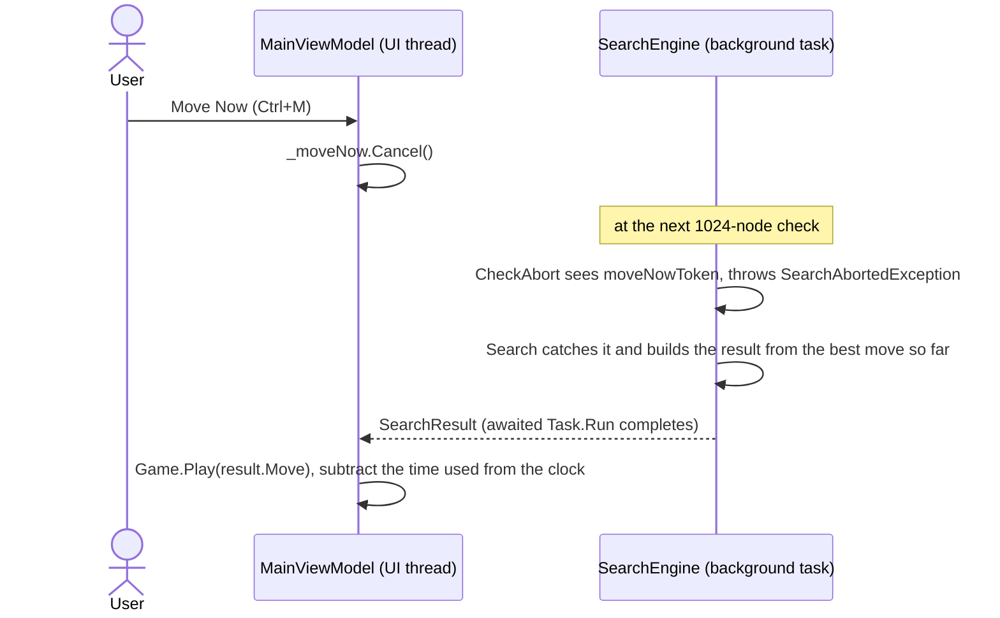

# 10 – Time control

[Back to the index](README.md)

## In short

The search can always go one ply deeper, so something must decide when to stop. `SearchLimits` says what the caller wants: a fixed depth, a fixed time per move, a share of the time left for the whole game, or a full solve. `TimeControl` turns that into two limits: a **soft** limit (do not start another iteration after it) and a **hard** limit (stop the search in the middle). The user can also stop the search at any moment: **Move Now** plays the best move found so far, and **cancel** discards the search. Progress is reported while the engine thinks, and the result says what kind of score it found.

## Data structures

### `SearchLimits`

| Mode (`TimeControlMode`) | Created with | Meaning | C++ |
|---|---|---|---|
| `FixedDepth` | `SearchLimits.FixedDepth(plies)` | Search 1–60 plies, no time limit | `sogedybde` |
| `TimePerMove` | `SearchLimits.TimePerMove(time)` | A fixed time for this move | `tid_per_trek` |
| `TimePerGame` | `SearchLimits.TimePerGame(remaining)` | Share the time left on the computer's clock over the remaining moves | `spil_tid` |
| `Solve` | `SearchLimits.Solve` | Solve to the end, no time limit (tests and book learning) | – |

In the app, the settings dialog gives a depth of 1–20 plies, 1–60 seconds per move or 1–60 minutes per game; the default is 5 minutes per game, as in C++ (`GameSettings.ToLimits`).

### `TimeBudget`

An internal `readonly record struct` with `SoftMs` and `HardMs`, in milliseconds since the search started. `TimeBudget.Unlimited` is used for fixed depth and solve.

### Progress and result

| Type | Contents |
|---|---|
| `SearchInfo` | Reported after each root move: depth (plies, or empty squares in the endgame), current move, best move so far, score, `ScoreKind`, nodes, evaluations, elapsed time |
| `SearchResult` | The move (or a pass), score, `ScoreKind`, depth, nodes, evaluations, elapsed time |

`ScoreKind` says what the score means, and how the app's analysis panel shows it:

| `ScoreKind` | Meaning | Shown as |
|---|---|---|
| `None` | No search: a pass or a single legal move | (nothing) |
| `Heuristic` | Evaluation units from the midgame search; beyond ±32 600 the game is won or lost | "+123", or "Win"/"Loss"; depth "8 plies" |
| `WinLossDraw` | Only the sign is known | "Win", "Loss" or "Draw"; depth "to the end (20 empty)" |
| `Exact` | The final disc difference with perfect play | "+12 discs" |
| `Book` | The move comes from the opening book; the score is the book value | "Book" |

## Algorithm

### The budget for the midgame

`TimeControl.ForMidgame(limits, empties)`:

- **Time per move:** hard = the given time, soft = 2/3 of it (as the C++ `tider`/`rtider` tables, where `tider` was about 2/3 of `rtider`).
- **Time per game:** from the remaining time $T$ and the number of empty squares $e$ (C++ `calc_time`), in integer arithmetic:

$$
\begin{aligned}
s &= \max(0,\ e - 6) \qquad \text{(the last 6 squares take almost no time)} \\
n &= \lfloor s / 2 \rfloor \qquad \text{(the computer's moves left)} \\
t &= T / n \qquad \text{(or } T \text{ if } n = 0\text{)} \\
\text{hard} &= \left\lfloor \frac{t}{4} \right\rfloor + \left\lfloor \frac{3\,t\,(64 - s)}{256} \right\rfloor \\
\text{soft} &= \left\lfloor \frac{10 \cdot \text{hard}}{15} \right\rfloor
\end{aligned}
$$

  Early in the game $64 - s$ is small, so a move gets about a third of its average share $t$; near the end it gets almost all of it. This saves time for the middle and end of the game, where the search matters most. The 6 is `FastEndgameEmpties` (C++ `lookahead − 2` at the default level). If the clock is already below zero, 10 ms is used.
- **Fixed depth and solve:** no time limit.

### The budget for the endgame

When the search switches to the solver, `TimeControl.ForEndgame` gives it more time, but only with a game clock (C++ `calc_end_time`): with $R$ = the time left minus the time already used for this move, it may use half of it:

$$m = \lfloor R / 2 \rfloor, \qquad \text{hard} = \text{elapsed} + m, \qquad \text{soft} = \left\lfloor \frac{10\,m}{15} \right\rfloor$$

The soft limit decides whether pass 2 (the exact score) is started after pass 1 (chapter 09). With a time per move, the midgame budget is kept.

### How the search uses the limits

- **Soft limit:** `StopIterating` is checked after each midgame iteration and after the win/loss/draw pass. For fixed depth it checks the depth instead; for solve it never stops.
- **Hard limit:** `CheckAbort` is called every 1024 nodes (in the midgame search and in the solver). When the hard limit is passed, or Move Now is requested, it throws a private exception that unwinds the whole search; `Search` catches it and returns the best move found so far. That move may come from an unfinished iteration: each iteration starts with the previous best move, so a new best move from an unfinished iteration has already been compared with it at the new depth.
- **Cancel:** `CheckAbort` also calls `cancellationToken.ThrowIfCancellationRequested()`. The `OperationCanceledException` is not caught by the engine, so the caller knows that nothing should be played.

At 15–20 million nodes per second, 1024 nodes take well under a millisecond, so the search reacts to the limits and the tokens almost at once.

### Move Now

This sequence shows what happens when the user presses Ctrl+M while the computer thinks:

New Game, Open, Back and the other commands that change the game use the other token: `StopAsync` cancels the search and waits for it, and `ComputerMoveAsync` catches the `OperationCanceledException` and plays nothing (chapter 13).

## Worked example: time budgets

Values from `TimeControl` (soft / hard):

| Situation | Soft | Hard |
|---|---|---|
| Game clock 5 min, 60 empty squares (first move) | 2.7 s | 4.1 s |
| Game clock 5 min, 50 empty squares | 4.4 s | 6.6 s |
| Game clock 3 min, 40 empty squares | 4.2 s | 6.4 s |
| Game clock 2 min, 30 empty squares | 4.8 s | 7.2 s |
| Game clock 1 min, 20 empty squares | 4.8 s | 7.2 s |
| Game clock 30 s, 14 empty squares | 4.5 s | 6.8 s |
| 5 s per move | 3.3 s | 5.0 s |
| Endgame, 60 s left, 2 s already used for this move | 19.3 s | 31.0 s |

For the first move with 5 minutes: $s = 54$, $n = 27$, $t = 300\,000 / 27 = 11\,111$ ms, hard $= 2\,777 + \lfloor 3 \cdot 11\,111 \cdot 10 / 256 \rfloor = 2\,777 + 1\,302 = 4\,079$ ms, soft $= 2\,719$ ms.

## Design notes

- **Seconds instead of levels.** C++ had levels 0–14 that mapped to times in the tables `tider` and `rtider`. C# uses seconds and plies directly; the formulas for the game clock are the same.
- **Deadline checks instead of a timer and `longjmp`.** C++ used a Windows multimedia timer that set a flag, and jumped out of the search with `longjmp`. C# checks a `Stopwatch` every 1024 nodes and unwinds with an exception, which is safe in .NET.
- **Two kinds of stop.** C++ had a "Træk nu" (Move Now) menu item without any code behind it. C# has both Move Now and cancel.
- **The engine does not know the clock.** The app keeps the computer's clock, passes the time left in `TimePerGame`, subtracts the time used after each move, and restores it on Back and Forward (chapter 13).

See [Stello porting documentation.md](../../Stello%20porting%20documentation.md), section 3.8.

## Where in the code

| File | Main members |
|---|---|
| [SearchLimits.cs](../../Stello.Net/Stello.Engine/SearchLimits.cs) | `TimeControlMode`, `SearchLimits` |
| [Search/TimeControl.cs](../../Stello.Net/Stello.Engine/Search/TimeControl.cs) | `TimeBudget`, `ForMidgame`, `ForEndgame`, `ForGame`, `FastEndgameEmpties` |
| [SearchEngine.cs](../../Stello.Net/Stello.Engine/SearchEngine.cs) | `StopIterating`, `CheckAbort`, `Report`, `Result`, `SearchAbortedException` |
| [SearchResult.cs](../../Stello.Net/Stello.Engine/SearchResult.cs) | `ScoreKind`, `SearchInfo`, `SearchResult` |
| [GameSettings.cs](../../Stello.Net/Stello.Net/Models/GameSettings.cs), [AnalysisViewModel.cs](../../Stello.Net/Stello.Net/ViewModels/AnalysisViewModel.cs) | The app's settings and how scores are shown |
| C++: [Kontrol.cpp](../../Stello%20C++/BRAIN/Kontrol.cpp) | `calc_time`, `calc_end_time`, `getcomputer` |

## Tests

[SearchEngineTests.cs](../../Stello.Net/Stello.Engine.Tests/SearchEngineTests.cs):

- 300 ms per move finishes within 400 ms with a legal move;
- a 10-second game clock uses at most 2 seconds for one midgame move;
- progress is reported for every depth;
- Move Now returns a legal move within 100 ms;
- cancel throws within 100 ms, and an already cancelled token throws at once.

In the app tests, [MainViewModelTests.cs](../../Stello.Net/Stello.Net.Tests/MainViewModelTests.cs) check that Move Now stops the search, that the settings dialog sets the clock, and that the clock runs down during a game. The restore of the clock on Back and Forward has no test of its own.

## Further reading

- [Iterative Deepening – Chess Programming Wiki](https://www.chessprogramming.org/Iterative_Deepening): iterative deepening as the basis of time management.

---

Previous: [09 Endgame solver](09-endgame-solver.md) · Next: [11 Opening book](11-opening-book.md)
