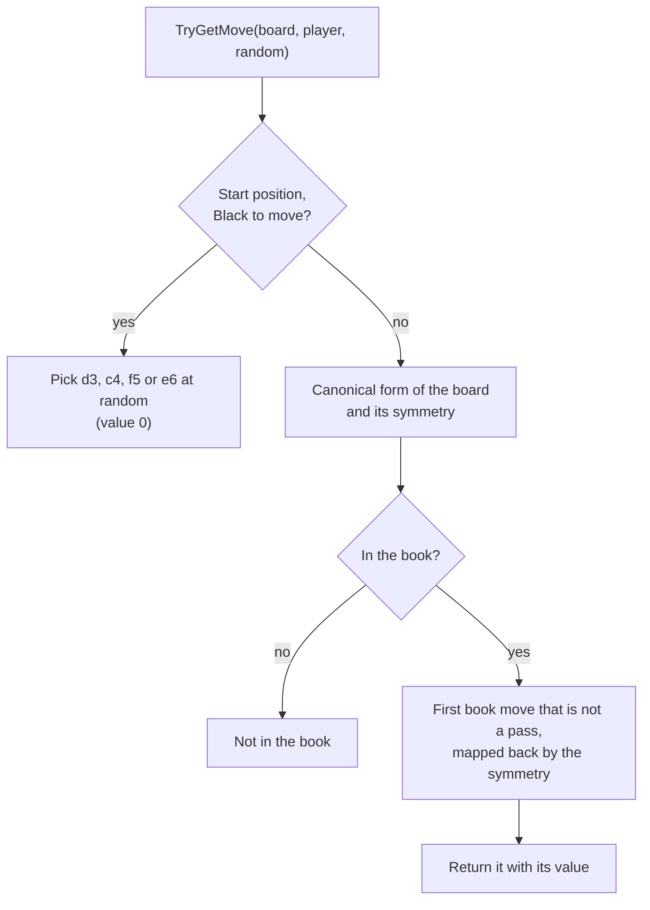
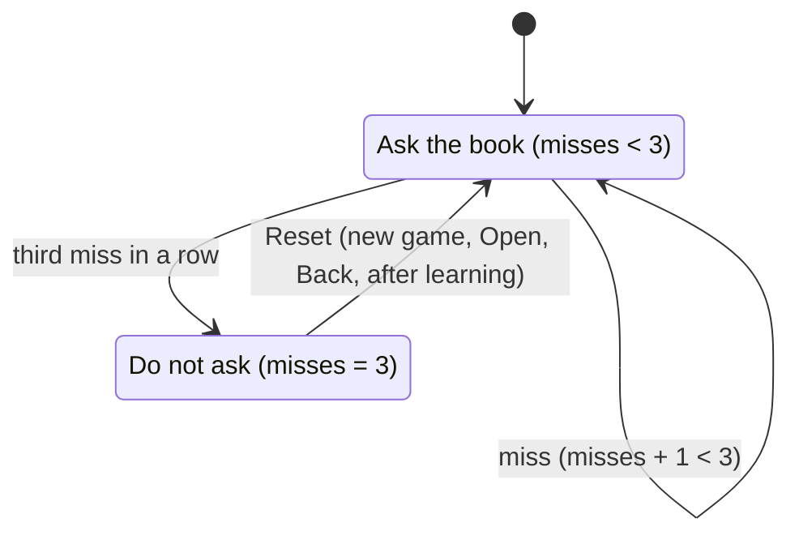
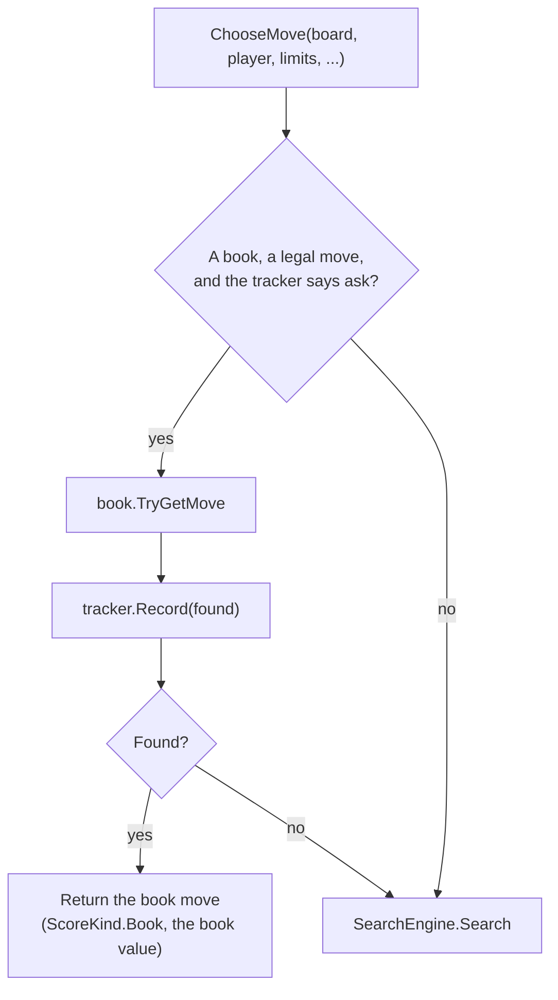

# 11 – Opening book

[Back to the index](README.md)

## In short

In the opening, even a deep search sees little difference between the moves, and the same positions come up in game after game. So Stello plays its first moves from an **opening book**: the known positions, each with its **book moves** and a value for each move. A position is stored **once**, whatever order of moves led to it and whichever of Black's four (mirror-image) first moves started the game: positions are stored in a **canonical form**, the smallest of the four mirror images. Each value also records **how it was found** (its origin and search effort), so the values can be improved later.

The master book lives in git as a **text file**, one line per position; the apps use a compact **binary file** built from it by the book tool ([chapter 16](16-book-tool.md)). The book is the one the C++ program learned over many games; its file is only read once, to import it. The computer asks the book until it has missed three times in a row.

## Data structures

### `BookEntry`

One book move (internal class):

| Member | Type | Contents |
|---|---|---|
| `Move` | `Move` | The move in the position's canonical frame; `Move.Pass` for a pass |
| `Value` | `short` | The value of the move for the player who makes it (chapter 12) |
| `Origin` | `BookOrigin` | Where the value comes from (below) |
| `Effort` | `BookEffort` | How hard it was searched for (below) |
| `IsSearched` | `bool` | The origin is a search: `Heuristic`, `WinLossDraw` or `Exact` (C++ flag `CALCULATED`) |

| `BookOrigin` | Meaning |
|---|---|
| `Unknown` | Not searched: a move from an added game (±32 665), or an imported value that cannot be trusted |
| `Heuristic` | A midgame search of the position after the move |
| `WinLossDraw` | A search that solved the position for win, loss or draw |
| `Exact` | A search that solved the position exactly, or a finished game |
| `BackedUp` | Minus the value of the position after the move, which is itself in the book |

`BookEffort(Kind, Amount, DepthReached, EngineVersion)` records the search limit (`Time` in milliseconds, `Depth` in plies, `Solve`, or `None` if unknown), the depth the search reached, and the engine version. `OpeningBook.EngineVersion` (now 1) is raised by hand when a change to the evaluation or the search changes the values it finds, so old values can be told apart and searched again. Values imported from the C++ book have no effort.

### `OpeningBook`

| Member | Contents |
|---|---|
| `_positions` | `Dictionary<BookKey, List<BookEntry>>`: from a canonical position to its book moves, in book order |
| `BookKey` | `(ulong Black, ulong White, Player ToMove)` of the canonical form |
| `RootBoard` | The position after d3, where every line starts |
| `NodeCount` | The number of book moves |
| `PositionCount` | The number of positions with book moves |
| `Symmetry` | `Identity`, `MainDiagonal`, `AntiDiagonal`, `HalfTurn` |

`BookMove(Square, Value)` is what `TryGetMove` returns. Only positions with at least one book move are stored, and every book move is legal: the files are checked when they are read, and games are checked when they are added.

### The text file (the master book)

The master book is [Stello.Net/Book/opening-book.txt](../../Stello.Net/Book/opening-book.txt) (`BookTextFormat`). It starts like this:

```text
# Stello opening book, format 2
# 11200 positions, 22878 moves
# <line> <move>:<value>:<origin>[:<limit>:d<depth reached>:v<engine version>] ...
# origin: U unknown, H heuristic, W win/loss/draw, X exact, B backed up; limit: time per move (s, ms), depth (ply), solve, - unknown
d3 c5:-10:B c3:-35:B e3:-126:B
d3c3 c4:35:B e6:-18:W:60s:d18:v1
d3c5 f6:10:B e6:10:B d6:-8:B c6:-56:W:60s:d18:v1
d3e3 f4:126:B f3:35:W:60s:d18:v1
d3c3c4 c5:-35:B e3:-35:B
```

- The first line identifies the format; other lines starting with `#` are comments.
- Each other line is one position. It starts with the **key**: the moves from the start that reach it, without spaces and beginning with d3 (`--` is a pass). Of the lines of book moves that reach the position, the shortest is used, and of those the alphabetically first.
- Then follow the book moves in book order, in the frame of the key line, as `move:value:origin`. A searched value adds the effort, e.g. `c6:-56:W:60s:d18:v1` (a win/loss/draw result, 60 s per move, depth 18 reached, engine version 1). Only the 1 091 exact values from the C++ book have no effort.
- The lines are sorted by length, then alphabetically, and written with `\n` and invariant culture, so a change to the book only changes the lines of the positions that changed.
- Reading checks that every line is a legal game from the start, every book move is legal, no position or move is given twice, and every position can be reached from d3 by book moves. Errors give an `InvalidDataException` with the line number.

### The binary file (for the apps)

The apps use [Stello.Net/Book/opening-book.bin](../../Stello.Net/Book/opening-book.bin) (`BookBinaryFormat`), built from the text file by the book tool. It is linked into the WPF app as `Data/OPENING` and copied to the web app as `wwwroot/data/OPENING.bin`; user books (`%AppData%\Stello\OPENING`, the browser's local storage) are saved in this format too. Little-endian:

| Part | Contents |
|---|---|
| Header | `"STBK"`, byte version (2), `int32` positions, `int32` moves |
| Position | byte number of moves, then each move |
| Move | byte square (0–63, 64 = pass), `int16` value, byte origin; for a searched origin also byte effort kind, 7-bit encoded amount, byte depth reached, byte engine version; then a 7-bit encoded reference to the position after the move |
| Reference | 0 = not in the book, 1 = the position follows here, $n + 2$ = position number $n$ (numbered in the order they are written), reached by another move order |

The positions are written depth first from the position after d3, in book order. A position's bitboards are not stored: they are found by playing the moves, and the squares are written in the frame of the board as it is reached. So a book move takes about 8.5 bytes (the master book is 193 209 bytes, against 187 118 for the C++ file, which had no search effort). Reading checks the moves, the references and the counts.

### The C++ file (import only)

The C++ program's file `OPENING` (`Put_book`/`savebook` in [Book.cpp](../../Stello%20C++/BRAIN/Book.cpp)) is a tree of the lines after d3 (`LegacyBookFormat`):


- The header is the value of the C++ allocation counter when the book was saved (23 530 for the master file, which has 23 389 nodes); it is ignored.
- Moves are legacy square numbers ([chapter 02](02-board-and-squares.md#legacy-square-numbers)), 0 for a pass. The flags are `CALCULATED`, `EXACT` and `INEXACT`.
- `Load` recognises the file because it does not start with `STBK` or `# Stello opening book`. It checks every chain (count 0–64, at most 64 levels, no truncation).

The import walks the tree depth first, in file order, and adds each legal move to the position it is played in:

| C++ node | Origin |
|---|---|
| Has replies, or leads to a position that another line continues from | `BackedUp` |
| `CALCULATED` and `EXACT` | `Exact` |
| `CALCULATED` and `INEXACT` | `WinLossDraw` |
| `CALCULATED` | `Heuristic` (effort unknown) |
| Not `CALCULATED` (a move from an added game, ±32 665) | `Unknown` |
| The first node of a chain with value 0, not `EXACT` | `Unknown`: C++ `savebook` wrote 0 instead of 32 600 here, so the 0 cannot be trusted |

- Moves that are not legal could never be played and are left out.
- When two lines reach the same position, their moves are joined: the moves of the first line come first, in their order, and moves only the later line has are added at the end. For a move in both, the value with the better origin is kept (`Exact` > `WinLossDraw` > `BackedUp` > `Heuristic` > `Unknown`).

## Algorithm

### Canonical form

Black's four first moves d3, c4, f5 and e6 are equivalent: each can be turned into d3 by a mirror or a turn of the board that keeps the start position.


| Symmetry | Square (column, row) goes to | Maps to d3 |
|---|---|---|
| `Identity` | (column, row) | d3 |
| `MainDiagonal` (mirror in a1–h8) | (row, column) | c4 |
| `AntiDiagonal` (mirror in h1–a8) | (7 − row, 7 − column) | f5 |
| `HalfTurn` (turn by 180°) | (7 − column, 7 − row) | e6 |

`Canonical(board, player)` applies the four symmetries and takes the board with the smallest `(Black, White)` bitboards (the first symmetry on a tie). The book stores the position under that board, and its moves in that frame. Each symmetry is its own inverse, so the same symmetry maps a book move back to the real board. The other four symmetries of a square board are not used: they turn the start position into a different one.

Because the key is the position itself, the book handles **transpositions**: every order of moves that reaches a position, in any of the four frames, finds the same entry.

### Looking up a move: `TryGetMove`



The **first** book move is played, as in C++. Book learning sorts every list of moves best first (chapter 12), so the first move is the book's best move. A position where the player must pass has only a pass in the book; the app plays passes itself and does not ask the book.

### When to ask the book: `BookTracker`

`BookTracker` counts the misses in a row (C++ `libon`/`tryagain`):



After a miss the game may still transpose back into the book, so the book is asked a few more times before it is given up.

### Choosing the computer's move: `ComputerPlayer`

`ComputerPlayer` asks the book first and searches only when the book has no move:



A book move returns at once, with 0 nodes and no time used.

### Loading and saving

- `Load(stream)` reads the binary format, the text format or the C++ file, by looking at the first bytes. A damaged file gives an `InvalidDataException`.
- `Save(stream)` always writes the binary format. An old user book in the C++ format is read as before and saved in the new format the next time it is saved (after book learning or Add Game to Book). The app never overwrites the shipped book (chapters 12 and 13).
- `CreateEmpty` gives an empty book, used when no book file can be loaded, so that learning still works.

## Worked examples

### The master book

`Stello.BookTool stats` on the master book:

| Property | Value |
|---|---|
| Positions / book moves | 11 200 / 22 878 |
| Leaf moves (the position after them is not in the book) | 11 622 |
| White's replies to d3 | c5 (−10), c3 (−35), e3 (−126) |
| Longest line | 57 plies |
| Origins | 11 256 backed up, 5 645 heuristic, 2 987 win/loss/draw, 2 990 exact |
| Search effort | 10 531 values searched for 60 s per move (`recalc`, chapter 16); 1 091 exact values from the C++ book |
| Pass moves | 4 |
| Files | text 898 KB, binary 193 KB |

Counting d3 as ply 1 and each position at its shortest line, the book has about 500 positions at plies 10–12, then 180–330 per ply up to ply 40; after that fewer and fewer lines continue, down to 26 positions at ply 55. The C++ tree had 23 389 nodes; the import has 511 fewer moves, because a move stored in two lines (or in two frames) is now stored once and moves that could not be played are left out. 14 positions were stored in two frames. After the import all leaves were searched again (chapter 16), and the book now plays another first move in 2 163 positions.

### The same reply for all four first moves

After each of Black's first moves the book gives the mirrored reply with the same value −10:

| Black's first move | Symmetry to d3 | Book reply | Value |
|---|---|---|---|
| d3 | `Identity` | c5 | −10 |
| c4 | `MainDiagonal` | e3 | −10 |
| f5 | `AntiDiagonal` | d6 | −10 |
| e6 | `HalfTurn` | f4 | −10 |

### A game from the book

Playing only book moves for both sides from the start (random first move with `new Random(0)`) gives 17 moves, with the values ±10:

```text
f5 d6 c3 d3 c4 f4 f6 g5 e6 f7 g6 c5 f3 e7 h6 g4 g3
```

It starts as the well-known "tiger" opening (f5 d6 c3 d3 c4). Up to g6 it is the main line of the C++ book; there the C++ book played e7, the recalculated book plays c5. After g3 the book has no reply.

## Design notes

- **Positions instead of a tree.** The C++ book was a tree of lines, so a position reached by two lines was stored twice, possibly with different moves and values, and minimax needed ten rounds to carry values between the copies. Now each position is stored once, and back-up is exact in one pass (chapter 12).
- **One canonical form instead of four lookups.** C++ transformed the game's moves (`convop`, with a special case for the symmetric position after c3, c4, c5) and tried three transposition patterns; the first C# version tried all four symmetries against an index. The canonical form finds a position in any frame with one lookup.
- **Origin and effort instead of flags.** The C++ flags did not say how long a value was searched for, so a 1-second value could not be told from a 2-minute value. The effort lets the book tool search only the values that are not good enough yet.
- **Text in git, binary for the apps.** The text file can be read and compared in git; the binary file is small for the web version. The binary file is built by the book tool and committed next to the text file; a test checks that it holds the same book, instead of building it on every build.
- **The C++ format is only read.** Byte-identical saving of the C++ file was dropped; the C++ program keeps its own `Stello C++/OPENING`.
- **The same moves as before.** The import keeps the order of the first line that reaches a position, as the old lookup did, so the computer plays the same book moves. The only exception is one of the 14 positions that C++ stored in two frames, where the first one in the file is now used.
- **The same reply choice as C++.** C++ also played the first legal reply: code that picked the best value was overwritten right after, and random choice was disabled with `#if 0`.

See [Stello porting documentation.md](../../Stello%20porting%20documentation.md), phases 4 and 10.

## Where in the code

| File | Main members |
|---|---|
| [OpeningBook.cs](../../Stello.Net/Stello.Engine/OpeningBook.cs) | `Load`, `Save`, `CreateEmpty`, `TryGetMove`, `TryGetReplies`, `GetOrAddReplies`, `Canonical`, `Transform`, `Play`, `IsLegal`, `EngineVersion` |
| [BookEntry.cs](../../Stello.Net/Stello.Engine/BookEntry.cs) | `BookEntry`, `BookOrigin`, `BookEffort`, `EffortKind` |
| [BookTextFormat.cs](../../Stello.Net/Stello.Engine/BookTextFormat.cs) | `Read`, `Write`, `Lines` |
| [BookBinaryFormat.cs](../../Stello.Net/Stello.Engine/BookBinaryFormat.cs) | `Read`, `Write` |
| [LegacyBookFormat.cs](../../Stello.Net/Stello.Engine/LegacyBookFormat.cs) | `Read` (import of the C++ file) |
| [BookTracker.cs](../../Stello.Net/Stello.Engine/BookTracker.cs) | `ShouldConsult`, `Record`, `Reset` |
| [ComputerPlayer.cs](../../Stello.Net/Stello.Engine/ComputerPlayer.cs) | `ChooseMove` |
| C++: [Book.cpp](../../Stello%20C++/BRAIN/Book.cpp), [Book.h](../../Stello%20C++/BRAIN/Book.h) | `booktree`, `Get_book`, `Put_book`, `getlib`, `getopn`, `convop` |

## Tests

- [OpeningBookTests.cs](../../Stello.Net/Stello.Engine.Tests/OpeningBookTests.cs):
  - all four first moves over 100 seeds; the same reply (value −10) after the four symmetric first moves; the 17-move main line;
  - a legal book move in every one of the more than 11 000 book positions, and an equivalent move in each of their mirror images;
  - a random position is not in the book; the four first moves give the same canonical position;
  - the shipped binary file holds the text book, the text book is in its normal form, and the text and binary files read to the same book;
  - values, origins and efforts survive saving and loading;
  - the import plays the same move as the old lookup in every position of the C++ book (except positions it stored in two frames), stores each position once, and takes the origins from the flags;
  - invalid files in all three formats.
- `BookTrackerTests` (in the same file): three misses stop the book, a hit starts the count again, `Reset`.
- [ComputerPlayerTests.cs](../../Stello.Net/Stello.Engine.Tests/ComputerPlayerTests.cs): the book is asked first; outside the book the engine searches; after three misses the book is not asked; without a book the engine searches; a pass does not ask the book.

## Further reading

- [Writing an Othello program – Gunnar Andersson](http://radagast.se/othello/howto.html): the section "Opening knowledge" describes how strong programs build and use their books.
- [Computer Othello – Wikipedia](https://en.wikipedia.org/wiki/Computer_Othello): the section "Opening book".

---

Previous: [10 Time control](10-time-control.md) · Next: [12 Book learning](12-book-learning.md)
