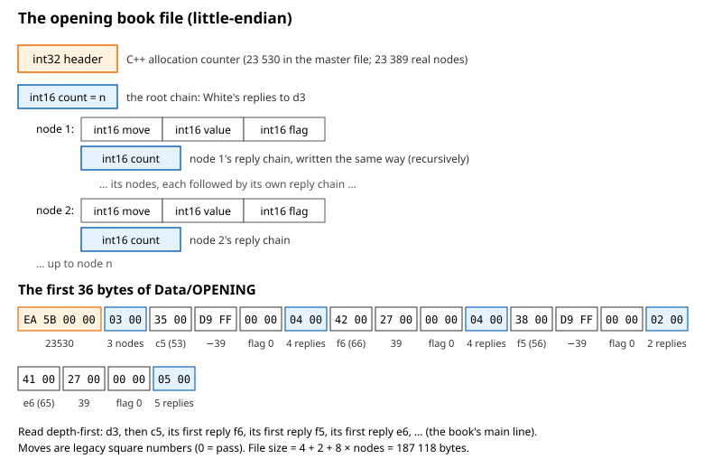
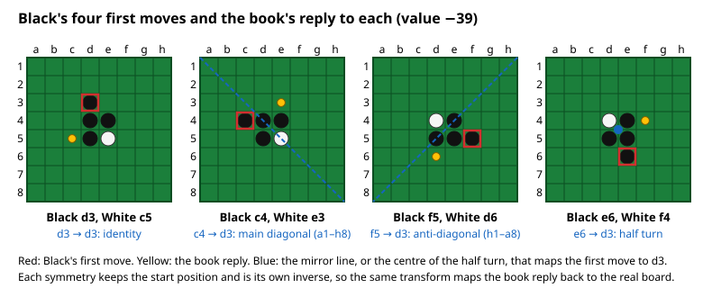
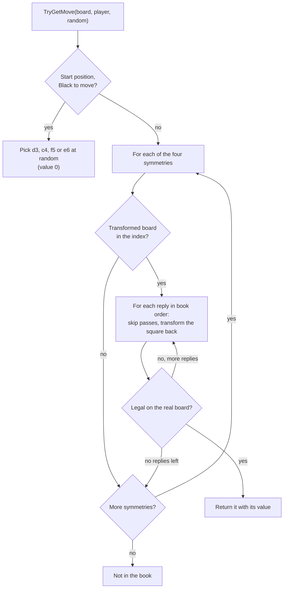
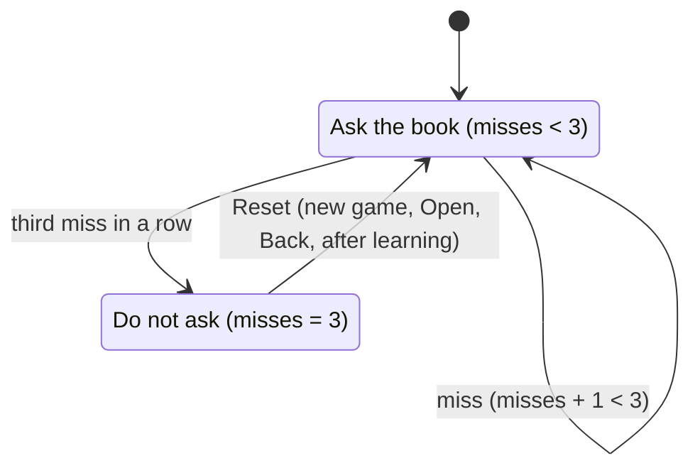
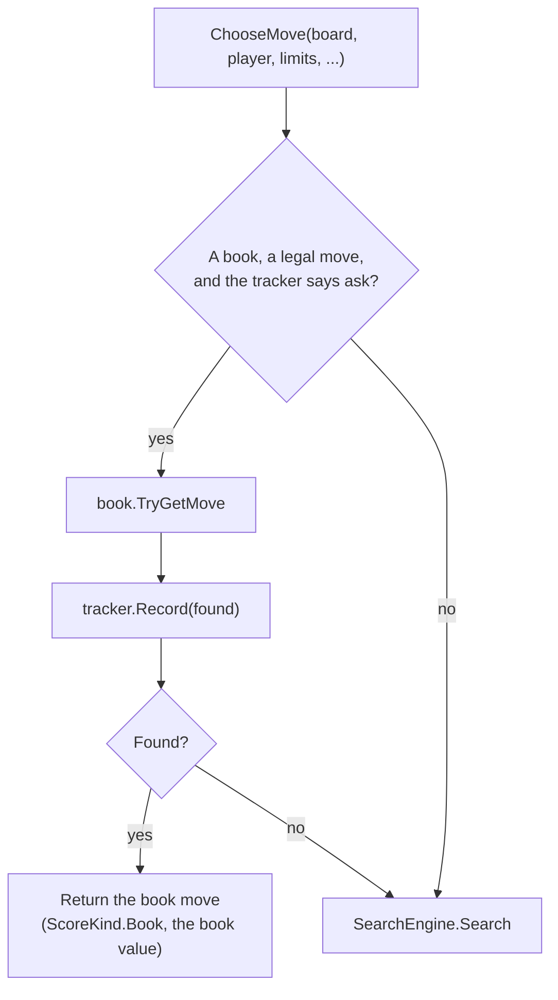

# 11 – Opening book

[Back to the index](README.md)

## In short

In the opening, even a deep search sees little difference between the moves, and the same positions come up in game after game. So Stello plays its first moves from an **opening book**: a tree of known lines with a value for each move, learned over many games by the C++ program. The book is stored **normalised**: every line starts with Black's move d3, and the other three first moves are found by mirroring or turning the board. When the book is loaded, every position in the tree is put in an **index**, so a position is found whatever move order led to it. The computer asks the book until it has missed three times in a row.

## Data structures

### `BookNode`

One move in the tree (internal class):

| Member | Type | Contents |
|---|---|---|
| `Move` | `short` | The move as a legacy square number ([chapter 02](02-board-and-squares.md#legacy-square-numbers)), 0 for a pass |
| `Value` | `short` | The value of the move for the player who makes it (chapter 12) |
| `Flag` | `BookFlags` | `Calculated`, `Exact`, `Inexact`: used by book learning (chapter 12) |
| `Children` | `List<BookNode>` | The replies, in book order: the first legal one is played |

### `OpeningBook`

| Member | Contents |
|---|---|
| `Root` | White's replies to d3 |
| `NodeCount` | The number of nodes in the tree |
| `_headerNodeCount` | The header value from the file, kept so that saving gives the same file |
| `_positions` | The index: `Dictionary<(ulong Black, ulong White, Player ToMove), List<BookNode>>`, from a position to its list of replies |
| `Symmetry` | `Identity`, `MainDiagonal`, `AntiDiagonal`, `HalfTurn` |

`BookMove(Square, Value)` is what `TryGetMove` returns.

### The file

The file format is the one written by the C++ program (`Put_book`/`savebook` in [Book.cpp](../../Stello%20C++/BRAIN/Book.cpp)), little-endian:



- The header is **not** the number of nodes: it is the value of the C++ allocation counter when the book was saved. For the master file it is 23 530, while the tree has 23 389 nodes. `Save` writes the larger of the header and the node count.
- C++ `savebook` wrote 0 instead of 32 600 as the value of the first node of a chain. `Save` does the same, so loading and saving the master book gives a byte-identical file.
- Every node takes 8 bytes (6 for itself and 2 for the count of its reply chain), so the file size is $4 + 2 + 8 \cdot \text{nodes}$.

### The master book

The shipped book is [Stello C++/OPENING](../../Stello%20C++/OPENING), copied to the app as `Data/OPENING`:

| Property | Value |
|---|---|
| File size | 187 118 bytes |
| Header / nodes | 23 530 / 23 389 |
| Leaves | 11 978 |
| Positions in the index | 11 214 |
| White's replies to d3 | c5 (−39), c3 (−40), e3 (−110) |
| Longest line | 57 plies |
| Nodes with a search value (`Calculated`) | 11 972, of which 1 217 solved exactly and 3 500 solved win/loss/draw |
| Pass nodes | 4 |

Counting d3 as ply 1, the tree widens to about 1 100 nodes at plies 11 and 12, then has about 400–670 nodes per ply up to ply 40; after that fewer and fewer lines continue, down to 48 nodes at ply 57.

## Algorithm

### Normalisation by symmetry

Black's four first moves d3, c4, f5 and e6 are equivalent: each can be turned into d3 by a mirror or a turn of the board that keeps the start position. The book only stores the lines after d3.



| Symmetry | Square (column, row) goes to | Maps to d3 |
|---|---|---|
| `Identity` | (column, row) | d3 |
| `MainDiagonal` (mirror in a1–h8) | (row, column) | c4 |
| `AntiDiagonal` (mirror in h1–a8) | (7 − row, 7 − column) | f5 |
| `HalfTurn` (turn by 180°) | (7 − column, 7 − row) | e6 |

Each symmetry is its own inverse: doing it twice gives the original board. So the same transform that maps the real board into the book's frame also maps the book's move back to the real board.

### The position index

`Rebuild` (called after loading and after each change by book learning) replays the whole tree from the position after d3 and records, for every position that has replies, which list of replies belongs to it:

- The key is the position: both bitboards and the side to move.
- If a position is reached by several lines, the first line in tree order wins.
- A line with a move that is not legal cannot be reached and is skipped. A pass node (move 0) is only followed when the player really has no legal move.

The index is what lets the book handle **transpositions**: a position is found no matter in which order its moves were played, also when it is stored under another line of the tree.

### Looking up a move: `TryGetMove`

This is how the book finds a move for a position, trying each symmetry in turn:



The **first legal reply** is played. Book learning sorts every list of replies best first (chapter 12), so the first reply is the book's best move. The legality check protects against lines in the file with moves that are not legal in the position.

### When to ask the book: `BookTracker`

`BookTracker` counts the misses in a row (C++ `libon`/`tryagain`):



After a miss the game may still transpose back into the book, so the book is asked a few more times before it is given up.

### Choosing the computer's move: `ComputerPlayer`

`ComputerPlayer` asks the book first and searches only when the book has no move:



A book move returns at once, with 0 nodes and no time used.

### Loading and saving

- `Load` reads the header and the chains recursively. It checks every chain: the count must be 0–64 and the tree at most 64 levels deep; a truncated file also gives an `InvalidDataException` instead of a crash or a huge allocation.
- `Save` writes the same format. The app never overwrites the shipped book: learned books are saved to `%AppData%\Stello\OPENING` (chapters 12 and 13).
- `CreateEmpty` gives an empty book, used when no book file can be loaded, so that learning still works.

## Worked examples

### The first bytes of the file

```text
0000: EA 5B 00 00 03 00 35 00 D9 FF 00 00 04 00 42 00
0010: 27 00 00 00 04 00 38 00 D9 FF 00 00 02 00 41 00
0020: 27 00 00 00 05 00 23 00 D9 FF 00 00 04 00 21 00
```

| Bytes | Value | Meaning |
|---|---|---|
| `EA 5B 00 00` | 23 530 | Header |
| `03 00` | 3 | The root chain has 3 nodes (White's replies to d3) |
| `35 00`, `D9 FF`, `00 00` | 53, −39, 0 | c5, value −39, no flags |
| `04 00` | 4 | c5 has 4 replies |
| `42 00`, `27 00`, `00 00` | 66, 39, 0 | f6, value 39 |
| `04 00` | 4 | f6 has 4 replies |
| `38 00`, `D9 FF`, `00 00`, `02 00` | 56, −39, 0, 2 | f5, value −39, 2 replies |
| `41 00`, `27 00`, `00 00`, `05 00` | 65, 39, 0, 5 | e6, value 39, 5 replies |
| `23 00`, `D9 FF`, … | 35, −39, … | e3, … |

Because the tree is written depth-first and the lists are sorted best first, the start of the file is the book's main line: d3 c5 f6 f5 e6 e3 c3 d2 c4 b3 c2 b4 f3 f4 c6 e7, 16 plies with the values ±39.

### The same reply for all four first moves

After each of Black's first moves the book gives the mirrored reply with the same value −39:

| Black's first move | Symmetry to d3 | Book reply | Value |
|---|---|---|---|
| d3 | `Identity` | c5 | −39 |
| c4 | `MainDiagonal` | e3 | −39 |
| f5 | `AntiDiagonal` | d6 | −39 |
| e6 | `HalfTurn` | f4 | −39 |

### A game from the book

Playing only book moves for both sides from the start (random first move with `new Random(0)`) gives 16 moves:

```text
f5 d6 c3 d3 c4 f4 f6 g5 e6 f7 g6 e7 f3 e3 c6 b4
```

This is the main line above, seen in the f5 frame (it is the well-known "tiger" opening). After b4 the book has no reply.

## Design notes

- **An index instead of move-order patterns.** The C++ lookup walked the normalised game through the tree move by move. On a mismatch it tried three transposition patterns (swapping two moves) and checked the resulting boards. The position index finds every transposition, so the C# version stays in the book in positions where the C++ version left it.
- **Transforming the board instead of the moves.** C++ transformed the game's moves (`convop`), with a special case for the symmetric position after c3, c4, c5. Transforming the board with all four symmetries covers that case automatically.
- **The same reply as C++.** C++ also played the first legal reply: code that picked the best value was overwritten right after, and random choice was disabled with `#if 0`.
- **Child lists instead of pointers.** C++ nodes had "first child" and "next sibling" pointers from a node pool; C# uses a list of children per node.
- **Validation is new.** The C++ reader trusted the file. Only the little-endian format is supported; `Stello C++/BRAIN/OPENING` is an older big-endian file and is not used.

See [Stello porting documentation.md](../../Stello%20porting%20documentation.md), phase 4.

## Where in the code

| File | Main members |
|---|---|
| [OpeningBook.cs](../../Stello.Net/Stello.Engine/OpeningBook.cs) | `Load`, `Save`, `CreateEmpty`, `TryGetMove`, `TryFindReplies`, `Rebuild`, `Index`, `Transform`, `FirstMoveSymmetry`, `Symmetry` |
| [BookNode.cs](../../Stello.Net/Stello.Engine/BookNode.cs) | `BookNode`, `BookFlags` |
| [BookTracker.cs](../../Stello.Net/Stello.Engine/BookTracker.cs) | `ShouldConsult`, `Record`, `Reset` |
| [ComputerPlayer.cs](../../Stello.Net/Stello.Engine/ComputerPlayer.cs) | `ChooseMove` |
| C++: [Book.cpp](../../Stello%20C++/BRAIN/Book.cpp), [Book.h](../../Stello%20C++/BRAIN/Book.h) | `booktree`, `Get_book`, `Put_book`, `getlib`, `getopn`, `convop` |

## Tests

- [OpeningBookTests.cs](../../Stello.Net/Stello.Engine.Tests/OpeningBookTests.cs):
  - the master book's node count matches the file size, and saving it gives the identical file;
  - all four first moves are chosen over 100 seeds;
  - the same reply (value −39) after the four symmetric first moves;
  - a legal book move in every one of more than 1000 book positions;
  - a random position is not in the book;
  - the 32 600 rule, and three kinds of invalid file.
- `BookTrackerTests` (in the same file): three misses stop the book, a hit starts the count again, `Reset`.
- [ComputerPlayerTests.cs](../../Stello.Net/Stello.Engine.Tests/ComputerPlayerTests.cs): the book is asked first; outside the book the engine searches; after three misses the book is not asked; without a book the engine searches; a pass does not ask the book.

## Further reading

- [Writing an Othello program – Gunnar Andersson](http://radagast.se/othello/howto.html): the section "Opening knowledge" describes how strong programs build and use their books.
- [Computer Othello – Wikipedia](https://en.wikipedia.org/wiki/Computer_Othello): the section "Opening book".

---

Previous: [10 Time control](10-time-control.md) · Next: [12 Book learning](12-book-learning.md)
