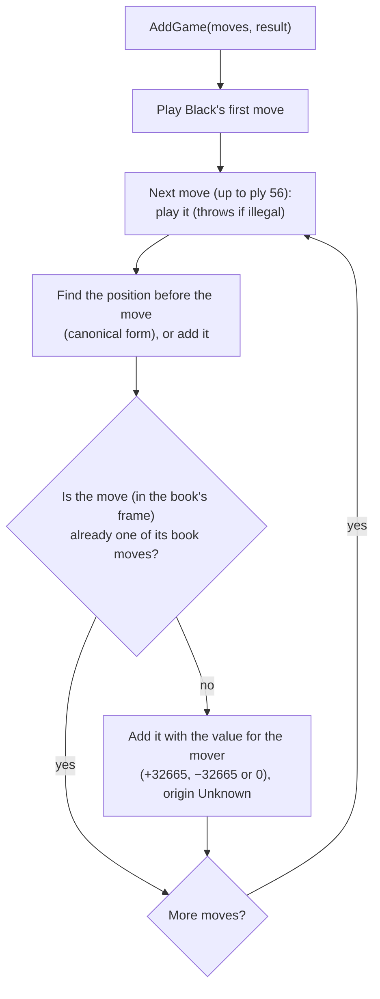
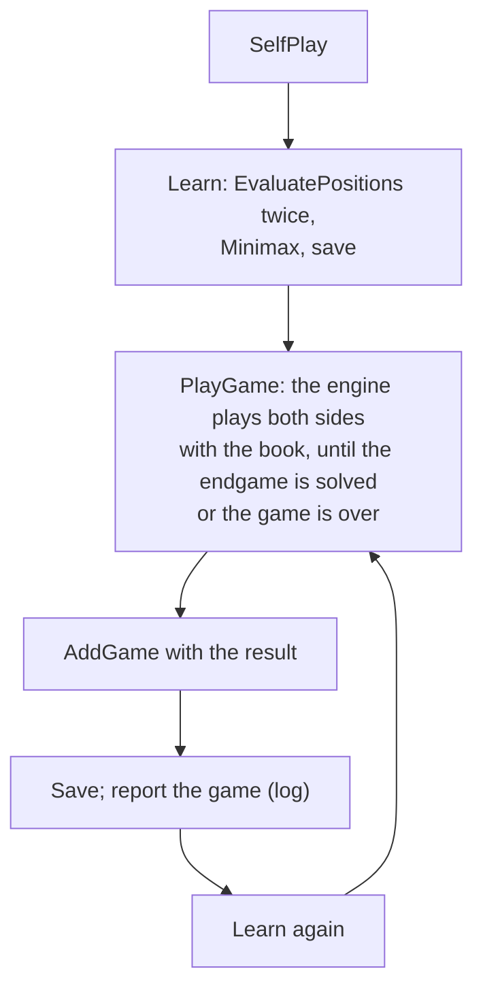

# 12 – Book learning

[Back to the index](README.md)

## In short

The opening book can grow and improve itself. **Adding a game** stores its moves in the book, with a value that says who won. **Evaluating the book** searches every new leaf (a book move whose position is not in the book), and for each position it also searches the best move that is *not* yet in the book and adds it (**dropout expansion**). **Minimax** then backs the values up through the book and sorts the moves of every position best first, so the book plays its best known move. **Self-play** repeats all of this: the engine plays games against itself with the book, adds them, and evaluates again, until it is stopped. This is a port of the C++ menu items "Flet spil", "Minmaxlib" and "Lær spil".

## Data structures

### Values, origin and effort

- The **value** of a book move is the value of the move **for the player who makes it**. The value of a position, for the player to move, is the highest value of its book moves.
- Values of different origin share one scale:

| Origin | Value |
|---|---|
| A move in an added game | +32 665 for the winner's moves, −32 665 for the loser's, 0 in a draw (`WinValue`) |
| A search with a heuristic score | The evaluation score (chapter 05) |
| A search that solved the position | ±(32 600 + disc difference), 0 for a draw |
| A move to a position that is in the book | −(value of the best move there), backed up by minimax |

- Each book move also records its **origin** and **effort** (chapter 11):

| Origin | Set by |
|---|---|
| `Unknown` | `AddGame`, for a new move (the game value) |
| `Heuristic`, `WinLossDraw`, `Exact` | A search of the position after the move, from the kind of its result; also a finished game (`Exact`) |
| `BackedUp` | Evaluation and minimax, when the position after the move is in the book |

- A move with a search origin (`IsSearched`, C++ `CALCULATED`) is not searched again. Its effort records the learning's search limit (fixed depth or time per move), the depth the search reached and the engine version.

Origin and effort are saved in the file, so a long learning run can be stopped and continued later.

### `BookLearner`

| Member | Contents |
|---|---|
| constructor `(book, engine, limits, random, checkpoint)` | The book to change, the engine and the limits for its searches, and a callback to save the book now and then |
| `AddGame(moves, result)` | Adds a game |
| `EvaluatePositions(progress, token)` | Searches leaves and adds dropout moves |
| `Minimax()` | Backs up values and sorts |
| `PlayGame(token)` | One self-play game |
| `SelfPlay(progress, token, gamePlayed)` | The self-play loop |
| `PositionsEvaluated`, `GamesPlayed` | Counters, also reported in `BookLearningProgress` |

Two small public types go with it:

- `GameResult`: `BlackWins`, `WhiteWins` or `Draw`, the result given to `AddGame` and returned by `PlayGame`.
- `BookLearningProgress(Stage, PositionsEvaluated, GamesPlayed, NodeCount)`: reported after every search and before every self-play game; `Stage` is a `BookLearningStage`, `EvaluatingPositions` or `PlayingGame`.

| Constant | Value | Meaning |
|---|---|---|
| `WinValue` | 32 665 | The value of a move in an added game |
| `MaxGameDepth` | 56 | Moves after ply 56 are not added |
| `CheckpointInterval` | 10 | Save the book after every 10 searched positions |

## Algorithm

### Adding a game: `AddGame`

`AddGame` walks through the game move by move and adds only the moves the book does not know yet:

- A pass is stored as a pass move, so the values keep alternating between the two players.
- Book moves that already exist keep their values: a game only adds new moves.
- Positions are found by their canonical form, so a game that reaches a known position by another move order, or in another frame, continues there instead of creating a second copy. The move that led there is added to the position it was played in, so the book knows both move orders.

### Evaluating the book: `EvaluatePositions`

`EvaluatePositions` walks every position of the book from the position after d3 (C++ `minmaxlib`), each position once. For each position:

1. For each book move:
   - if the position after it is in the book: evaluate that position first, and take the negated value of its best move (`BackedUp`);
   - a move with a search origin: keep its value;
   - otherwise: **search** the position after the move and store the value, origin and effort.
2. **Dropout expansion.** If no book move had a search origin when the position was reached, the engine searches the position once more with only the moves that are *not* in the book (`onlyMoves`, chapter 07), and adds the best one as a new book move with its value, origin and effort.

Step 2 is how the book grows: every position in the book gets at least one searched alternative, so the book knows whether the move it has is really the best one. A position gets its dropout move on the first evaluation; while it has a searched move, no more moves are added. A searched move whose position later gets book moves (from an added game) becomes `BackedUp`, so the position gets a new dropout move.

Each search counts as one evaluated position. After every 10 positions the checkpoint callback saves the book, so hours of work are not lost if the program is closed. Progress is reported after every search, and cancellation stops the current search.

### Minimax and sorting: `Minimax`

`Minimax` (C++ `minmax_lib` and `sort_lib`):

1. **Back up** the values: every book move whose position is in the book gets −(best value in that position). Each position is backed up once, after all the positions below it, so one pass is enough, also through transpositions (C++ needed ten rounds).
2. **Sort** the moves of every position by value, best first. The sort is stable, so equal values keep their order.

Because `TryGetMove` plays the first legal reply (chapter 11), the sorted book plays its best known move.

### Self-play: `PlayGame` and `SelfPlay`

Self-play alternates between learning and playing, until it is stopped:

- `PlayGame` uses a `ComputerPlayer` with the book, so each game follows the book as far as it goes and then searches. It stops as soon as a search returns an exact endgame score; the result is taken from that score (for the side that moved), otherwise from the final board.
- The loop runs until the token is cancelled; `SelfPlay` then throws `OperationCanceledException`.

### In the app

The Book menu has four commands ([chapter 14](14-app-integration.md#threading)):

| Command | Does |
|---|---|
| Add Game to Book… | Needs at least two moves and a confirmation. A finished game uses its result; otherwise the user is asked "Did Black win the game?" |
| Evaluate Book… | `EvaluatePositions`, then `Minimax` |
| Self-play… | `SelfPlay` until stopped; each game is appended to `%AppData%\Stello\SELFPLAY` as "played game N: moves" |
| Stop Learning | Cancels the learning |

- Each learned position is searched with the user's setting: fixed depth if that mode is selected, otherwise the "time per move" setting (1–60 s). C++ used 2 minutes per position.
- Learning runs on a background task with its own `SearchEngine`; the game's commands are disabled meanwhile.
- The book is saved to `%AppData%\Stello\OPENING` (a temporary file first, then renamed), never over the shipped `Data/OPENING`. On the next start the user's book is loaded first.
- Evaluate Book and Self-play ask for a confirmation first. At the end the book is saved, the book tracker is reset, and a summary (positions searched, games played, positions in the book) is shown.

## Worked example: learning on an empty book

Starting from `OpeningBook.CreateEmpty()`, with `SearchLimits.FixedDepth(4)`: the tiger line d3 c5 f6 f5 e6 (in the book's d3 frame) is added as a win for Black, then the book is evaluated and minimaxed.

- **AddGame** creates 4 book moves with ±32 665.
- **EvaluatePositions** searches 5 positions: the leaf e6, and one dropout move in each of the four positions (e3 as White's reply to d3, e6 after c5, e3 after f6, d6 after f5). The book now has 8 book moves, and the values are backed up: the game move c5 is worth −100 for White, the new move e3 +17.
- **Minimax** sorts the moves: the book now answers d3 with e3, and after d3 c5 it plays e6 (100) instead of the game move f6 (−54).

Adding the same game in another frame afterwards, `f5 d6 c3 d3 c4` (the tiger after f5), adds no moves: the book still has 8. The test `Learning_WorkedExampleOfChapter12` checks these numbers.

## Design notes

- **A port of the C++ learning.** The values, dropout expansion, stable sorting and saving every 10 positions work as in C++ `Book.cpp`. The flags became origin and effort (chapter 11).
- **Positions instead of lines.** The book stores each position once (chapter 11), so evaluation searches a transposed position once, and minimax backs up in one pass instead of ten rounds. C++ (and the first C# version) did not add the move that led into a known position by another move order; now it is added, so back-up also reaches that move order.
- **No illegal moves to remove.** C++ removed book moves that were not legal while it evaluated; the files are now checked when they are read, and games when they are added, so the book never holds an illegal move.
- **Bugs fixed.** C++ stored a solved draw as −32 600 (a loss); C# stores 0. C++ self-play took the result from the last *midgame* value even when the endgame had been solved; C# uses the exact score or the final board.
- **Usable interactively.** C++ self-play ran forever on the UI thread and the program had to be killed; C# runs in the background and stops on request.
- **An illegal game throws.** `AddGame` checks every move and throws an `ArgumentException` for an illegal one; the moves before it have then already been added. The app only adds games it has played itself, which are always legal.
- **Not ported.** `extend_lib` (not reachable from the Windows menus) and `Mergelib.cpp` (merging a black and a white book, not in the C++ build).

See [Stello porting documentation.md](../../Stello%20porting%20documentation.md), phases 7 and 10.

## Where in the code

| File | Main members |
|---|---|
| [BookLearner.cs](../../Stello.Net/Stello.Engine/BookLearner.cs) | `AddGame`, `EvaluatePositions`, `EvaluateReplies`, `Minimax`, `PlayGame`, `SelfPlay`, `Learn`, `Searched`, `ValueFor` |
| [BookSearch.cs](../../Stello.Net/Stello.Engine/BookSearch.cs) | `PositionValue` (C++ `getvalue`), `Search` (shared with the book tool, chapter 13) |
| [BookMinimax.cs](../../Stello.Net/Stello.Engine/BookMinimax.cs) | `Run`, `BackUp`, `Sort` (shared with the book tool) |
| [OpeningBook.cs](../../Stello.Net/Stello.Engine/OpeningBook.cs) | `CreateEmpty`, `GetOrAddReplies`, `TryGetReplies`, `Canonical`, `Transform` |
| [BookEntry.cs](../../Stello.Net/Stello.Engine/BookEntry.cs) | `BookEntry.Set`, `IsSearched`, `BookEffort.For` |
| [MainViewModel.cs](../../Stello.Net/Stello.App/ViewModels/MainViewModel.cs) | `AddGameToBook`, `EvaluateBook`, `SelfPlay`, `StopLearning`, `LearnAsync` |
| [LocalEngineHost.cs](../../Stello.Net/Stello.App/Services/LocalEngineHost.cs) | `AddGameToBookAsync`, `LearnAsync`, `CreateLearner` |
| [FileBookStore.cs](../../Stello.Net/Stello.Net/Services/FileBookStore.cs) | `Save`, `AppendSelfPlayLog` |
| C++: [Book.cpp](../../Stello%20C++/BRAIN/Book.cpp) | `convert_game`, `mmgame`, `calc_lib`, `minmaxlib`, `minmax_lib`, `mmlib`, `sort_lib`, `selfplay`, `splay` |
| C++: [MainFrm.cpp](../../Stello%20C++/MainFrm.cpp) | `OnSpilFletspil`, `OnMinmaxlib`, `OnSelfplay` |

## Tests

- [BookLearnerTests.cs](../../Stello.Net/Stello.Engine.Tests/BookLearnerTests.cs):
  - a game is stored normalised to d3, and the book then suggests the line for all symmetric move orders;
  - known, repeated and symmetric games add no moves, also into the master book; a game that transposes into a known position joins it;
  - a draw gives 0 values; a pass is stored; an illegal game throws;
  - `EvaluatePositions` searches the leaf and adds dropout moves with origin and effort, a second run searches nothing new, and a transposed position is searched once;
  - `Minimax` backs up the values and sorts best first, also through a transposition to both move orders;
  - the worked example above;
  - `PlayGame` gives a legal game; `SelfPlay` runs until cancelled and saves checkpoints;
  - origins and efforts survive saving and loading;
  - `onlyMoves` searches even a single move and must contain a legal move.
- [MainViewModelTests.cs](../../Stello.Net/Stello.Net.Tests/MainViewModelTests.cs): adding a finished and an unfinished game, cancelling the questions, a game that is too short, Evaluate Book, and self-play with Stop Learning.

## Further reading

- [Writing an Othello program – Gunnar Andersson](http://radagast.se/othello/howto.html): the section "Opening knowledge" describes the same approach: search the best move not played in any game ("the best deviation") for every book position, then minimax the book.
- [Computer Othello – Wikipedia](https://en.wikipedia.org/wiki/Computer_Othello): the section "Opening book".

---

Previous: [11 Opening book](11-opening-book.md) · Next: [13 Book tool](13-book-tool.md)
