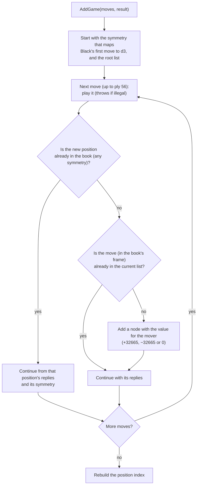
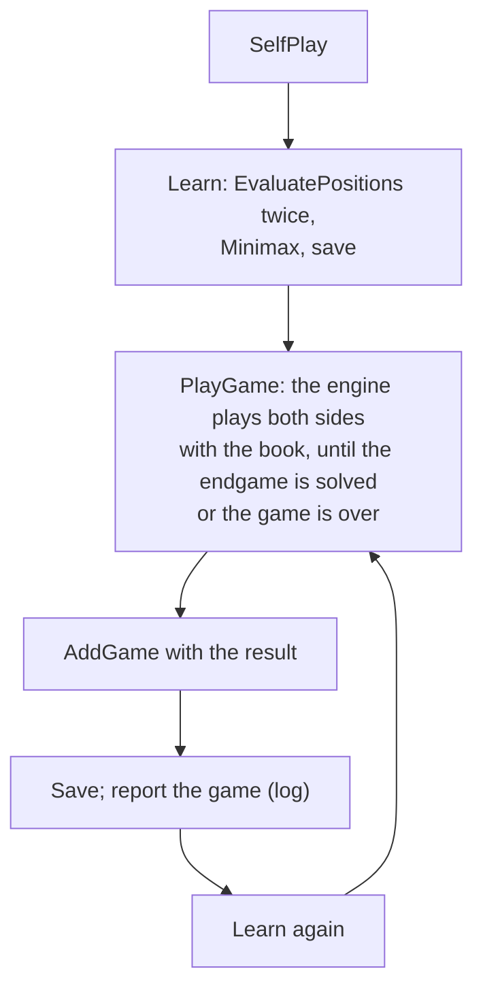

# 12 – Book learning

[Back to the index](README.md)

## In short

The opening book can grow and improve itself. **Adding a game** stores its moves in the tree, with a value that says who won. **Evaluating the book** searches every new leaf of the tree, and for each position it also searches the best move that is *not* yet in the book and adds it (**dropout expansion**). **Minimax** then backs the values up the tree and sorts every list of replies best first, so the book plays its best known move. **Self-play** repeats all of this: the engine plays games against itself with the book, adds them, and evaluates again, until it is stopped. This is a port of the C++ menu items "Flet spil", "Minmaxlib" and "Lær spil".

## Data structures

### Values and flags

- The **value** of a node is the value of its move **for the player who makes it**. The value of a list of replies, for the player to move, is the highest value in the list.
- Values of different origin share one scale:

| Origin | Value |
|---|---|
| A move in an added game | +32 665 for the winner's moves, −32 665 for the loser's, 0 in a draw (`WinValue`) |
| A search with a heuristic score | The evaluation score (chapter 05) |
| A search that solved the position | ±(32 600 + disc difference), 0 for a draw |
| An interior node | −(value of the best reply), backed up by minimax |

- The **flags** (`BookFlags`) record what is known about a leaf:

| Flag | Meaning |
|---|---|
| `Calculated` | The value comes from a search of this leaf; it is not searched again |
| `Exact` | That search solved the position exactly |
| `Inexact` | That search solved it for win/loss/draw only |

The flags are saved in the file, so a long learning run can be stopped and continued later.

### `BookLearner`

| Member | Contents |
|---|---|
| constructor `(book, engine, limits, random, checkpoint)` | The book to change, the engine and the limits for its searches, and a callback to save the book now and then |
| `AddGame(moves, result)` | Adds a game |
| `EvaluatePositions(progress, token)` | Searches leaves and adds dropout moves |
| `Minimax()` | Backs up values and sorts |
| `PlayGame(token)` | One self-play game |
| `SelfPlay(progress, token, gamePlayed)` | The self-play loop |
| `PositionsEvaluated`, `GamesPlayed` | Counters, also reported in `BookLearningProgress` |

Two small public types go with it:

- `GameResult`: `BlackWins`, `WhiteWins` or `Draw`, the result given to `AddGame` and returned by `PlayGame`.
- `BookLearningProgress(Stage, PositionsEvaluated, GamesPlayed, NodeCount)`: reported after every search and before every self-play game; `Stage` is a `BookLearningStage`, `EvaluatingPositions` or `PlayingGame`.

| Constant | Value | Meaning |
|---|---|---|
| `WinValue` | 32 665 | The value of a move in an added game |
| `MaxGameDepth` | 56 | Moves after ply 56 are not added |
| `MinimaxRounds` | 10 | Rounds of backing up, so values also travel through transpositions |
| `CheckpointInterval` | 10 | Save the book after every 10 searched positions |

## Algorithm

### Adding a game: `AddGame`

`AddGame` walks through the game move by move and adds only the moves the book does not know yet:

- A pass is stored as move 0, so the values keep alternating between the two players.
- Nodes that already exist keep their values: a game only adds new moves.
- Because the position index is checked at every ply, a game that transposes into a known line continues there instead of creating a second copy of the same positions.

### Evaluating the book: `EvaluatePositions`

`EvaluatePositions` walks the whole tree from the position after d3 (C++ `minmaxlib`). For each list of replies:

1. Replies that are not legal moves in the position are **removed**.
2. For each reply:
   - with replies of its own: recurse, and take the negated best value of the child list;
   - a leaf with `Calculated`: keep its value;
   - a leaf whose position is in the book through another line (a transposition): take the negated value of the book's reply there;
   - otherwise: **search** the position after the move and store the value and the flags.
3. **Dropout expansion.** If no reply in the list had `Calculated` when the list was reached, the engine searches the position once more with only the moves that are *not* in the book (`onlyMoves`, chapter 07), and adds the best one as a new node with its value and `Calculated`.

Step 3 is how the book grows: every position in the book gets at least one searched alternative, so the book knows whether the move it has is really the best one. A list gets its dropout move on the first evaluation; while it has a calculated leaf, no more moves are added. Interior nodes and transposition leaves get the flags `None`, so a list whose calculated leaf later gets replies (from an added game) gets a new dropout move.

Each search counts as one evaluated position. After every 10 positions the checkpoint callback saves the book, so hours of work are not lost if the program is closed. Progress is reported after every search, and cancellation stops the current search.

### Minimax and sorting: `Minimax`

`Minimax` (C++ `minmax_lib` and `sort_lib`):

1. **Back up** the values 10 times: every interior node gets −(best value of its replies); a leaf whose position is also in the book elsewhere gets the value of the book's reply there. Repeating it lets values travel through transpositions, where one line's leaf is another line's interior node.
2. **Sort** every list of replies by value, best first. The sort is stable, so equal values keep their order.

Because `TryGetMove` plays the first legal reply (chapter 11), the sorted book plays its best known move.

### Self-play: `PlayGame` and `SelfPlay`

Self-play alternates between learning and playing, until it is stopped:

- `PlayGame` uses a `ComputerPlayer` with the book, so each game follows the book as far as it goes and then searches. It stops as soon as a search returns an exact endgame score; the result is taken from that score (for the side that moved), otherwise from the final board.
- The loop runs until the token is cancelled; `SelfPlay` then throws `OperationCanceledException`.

### In the app

The Book menu has four commands ([chapter 13](13-app-integration.md#threading)):

| Command | Does |
|---|---|
| Add Game to Book… | Needs at least two moves and a confirmation. A finished game uses its result; otherwise the user is asked "Did Black win the game?" |
| Evaluate Book… | `EvaluatePositions`, then `Minimax` |
| Self-play… | `SelfPlay` until stopped; each game is appended to `%AppData%\Stello\SELFPLAY` as "played game N: moves" |
| Stop Learning | Cancels the learning |

- Each learned position is searched with the user's setting: fixed depth if that mode is selected, otherwise the "time per move" setting (1–60 s). C++ used 2 minutes per position.
- Learning runs on a background task with its own `SearchEngine`; the game's commands are disabled meanwhile.
- The book is saved to `%AppData%\Stello\OPENING` (a temporary file first, then renamed), never over the shipped `Data/OPENING`. On the next start the user's book is loaded first.
- Evaluate Book and Self-play ask for a confirmation first. At the end the book is saved, the book tracker is reset, and a summary (positions searched, games played, positions in the book) is shown.

## Worked example: learning on an empty book

Starting from `OpeningBook.CreateEmpty()`, with `SearchLimits.FixedDepth(4)`: the tiger line d3 c5 f6 f5 e6 (in the book's d3 frame) is added as a win for Black, then the book is evaluated and minimaxed.

- **AddGame** creates 4 nodes with ±32 665.
- **EvaluatePositions** searches 5 positions: the leaf e6, and one dropout move in each of the four lists (e3 as White's reply to d3, e6 after c5, e3 after f6, d6 after f5). The book now has 8 nodes, and the values are backed up: the game move c5 is worth −100 for White, the new move e3 +17.
- **Minimax** sorts the lists: the book now answers d3 with e3, and after d3 c5 it plays e6 (100) instead of the game move f6 (−54).

Adding the same game in another frame afterwards, `f5 d6 c3 d3 c4` (the tiger after f5), adds no nodes: the book still has 8.

## Design notes

- **A port of the C++ learning.** The node values, flags, file layout, dropout expansion, removal of illegal nodes, 10 minimax rounds, stable sorting and saving every 10 positions work as in C++ `Book.cpp`.
- **Transpositions everywhere.** Adding a game, evaluating and minimax all use the position index with the four symmetries (chapter 11) instead of the C++ `convop`/`getlibpos`, so every transposition is found.
- **Bugs fixed.** C++ stored a solved draw as −32 600 (a loss); C# stores 0. C++ self-play took the result from the last *midgame* value even when the endgame had been solved; C# uses the exact score or the final board. C++ wrote `flag &= !CALCULATED`, which clears all flags; C# writes `Flag = None`, which is what the C++ line does.
- **Usable interactively.** C++ self-play ran forever on the UI thread and the program had to be killed; C# runs in the background and stops on request.
- **An illegal game throws.** `AddGame` checks every move and throws an `ArgumentException` for an illegal one; the moves before it have then already been added, but the index is not rebuilt until the next change. The app only adds games it has played itself, which are always legal.
- **Not ported.** `extend_lib` (not reachable from the Windows menus) and `Mergelib.cpp` (merging a black and a white book, not in the C++ build).

See [Stello porting documentation.md](../../Stello%20porting%20documentation.md), phase 7.

## Where in the code

| File | Main members |
|---|---|
| [BookLearner.cs](../../Stello.Net/Stello.Engine/BookLearner.cs) | `AddGame`, `EvaluatePositions`, `EvaluateReplies`, `Minimax`, `BackUp`, `Sort`, `PlayGame`, `SelfPlay`, `Learn`, `SearchValue`, `Search`, `ValueFor` |
| [OpeningBook.cs](../../Stello.Net/Stello.Engine/OpeningBook.cs) | `CreateEmpty`, `Rebuild`, `TryFindReplies` |
| [MainViewModel.cs](../../Stello.Net/Stello.App/ViewModels/MainViewModel.cs) | `AddGameToBook`, `EvaluateBook`, `SelfPlay`, `StopLearning`, `LearnAsync` |
| [LocalEngineHost.cs](../../Stello.Net/Stello.App/Services/LocalEngineHost.cs) | `AddGameToBookAsync`, `LearnAsync`, `CreateLearner` |
| [FileBookStore.cs](../../Stello.Net/Stello.Net/Services/FileBookStore.cs) | `Save`, `AppendSelfPlayLog` |
| C++: [Book.cpp](../../Stello%20C++/BRAIN/Book.cpp) | `convert_game`, `mmgame`, `calc_lib`, `minmaxlib`, `minmax_lib`, `mmlib`, `sort_lib`, `selfplay`, `splay` |
| C++: [MainFrm.cpp](../../Stello%20C++/MainFrm.cpp) | `OnSpilFletspil`, `OnMinmaxlib`, `OnSelfplay` |

## Tests

- [BookLearnerTests.cs](../../Stello.Net/Stello.Engine.Tests/BookLearnerTests.cs):
  - a game is stored normalised to d3, and the book then suggests the line for all symmetric move orders;
  - known, repeated and symmetric games add no nodes, also into the master book;
  - a draw gives 0 values; a pass is stored as move 0; an illegal game throws;
  - `EvaluatePositions` searches the leaf and adds dropout moves, a second run searches nothing new, and illegal moves are removed;
  - `Minimax` backs up the values and sorts best first;
  - `PlayGame` gives a legal game; `SelfPlay` runs until cancelled and saves checkpoints;
  - the flags survive saving and loading;
  - `onlyMoves` searches even a single move and must contain a legal move.
- [MainViewModelTests.cs](../../Stello.Net/Stello.Net.Tests/MainViewModelTests.cs): adding a finished and an unfinished game, cancelling the questions, a game that is too short, Evaluate Book, and self-play with Stop Learning.

## Further reading

- [Writing an Othello program – Gunnar Andersson](http://radagast.se/othello/howto.html): the section "Opening knowledge" describes the same approach: search the best move not played in any game ("the best deviation") for every book position, then minimax the book.
- [Computer Othello – Wikipedia](https://en.wikipedia.org/wiki/Computer_Othello): the section "Opening book".

---

Previous: [11 Opening book](11-opening-book.md) · Next: [13 App integration](13-app-integration.md)
