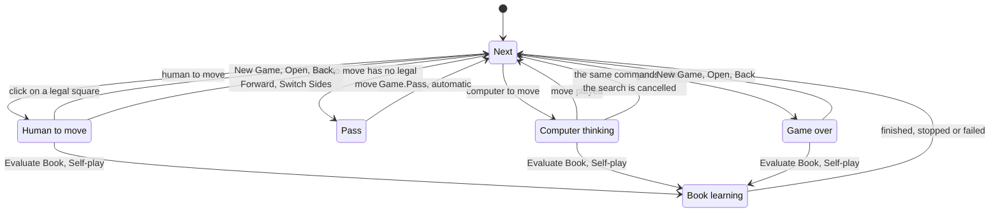
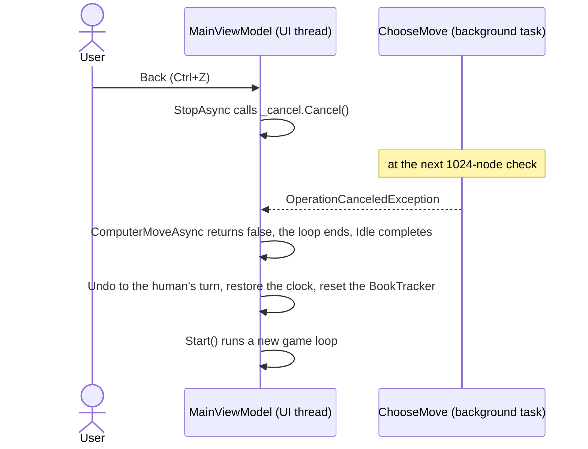
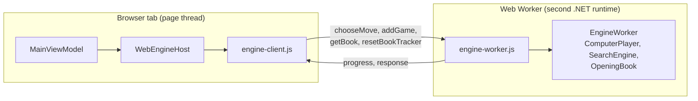
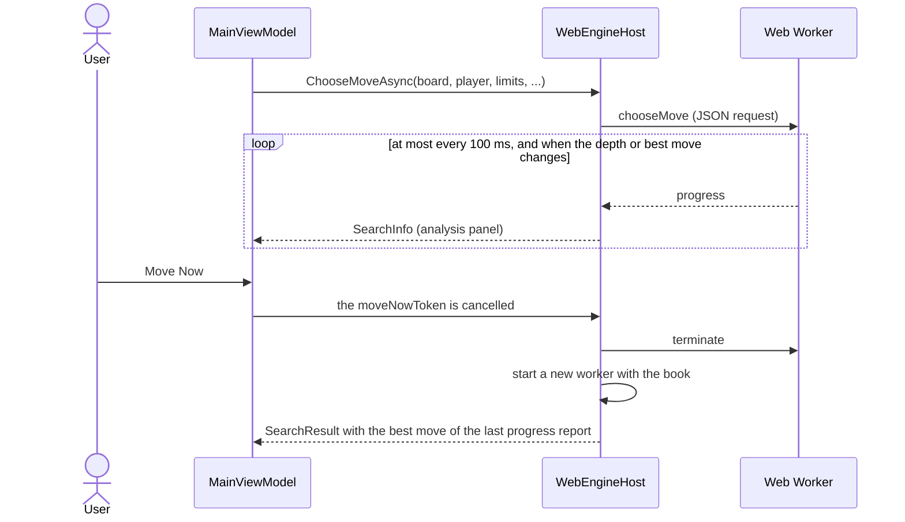
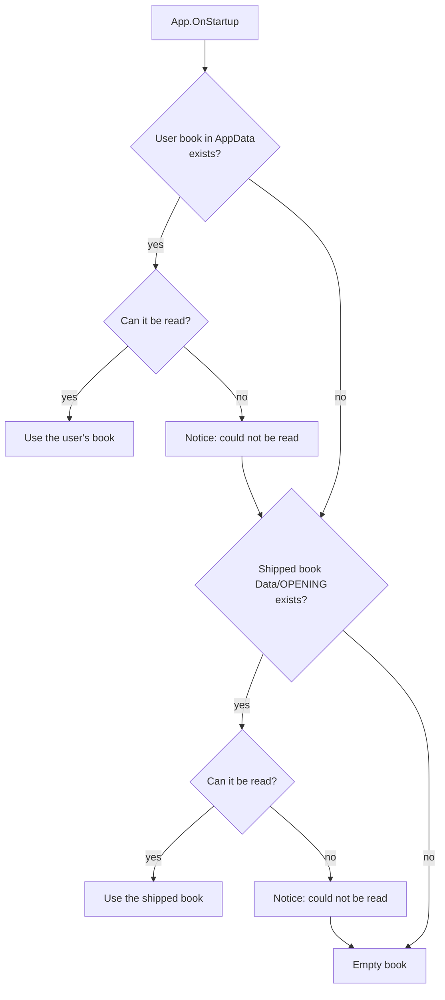

# 14 – App integration

[Back to the index](README.md)

## In short

The engine is a plain library: it knows nothing about windows, threads, clocks or files. Both apps, the WPF desktop app and the web app, drive it from one class, `MainViewModel` in `Stello.App`. It runs a **game loop** that plays passes and computer moves until the human is to move. It runs every search and every book-learning job through an **engine host**: on a background task in the desktop app, in a Web Worker in the browser, so the window stays responsive. It **stops the computer** before any command that changes the game. It turns the user's **settings** into `SearchLimits` and keeps the **computer's clock**. It also decides where the **opening book** is loaded from and saved to. This chapter explains these parts; the layout of the windows and pages is not covered.

## Data structures

### `MainViewModel`

The state that matters for the engine:

| Member | Contents |
|---|---|
| `_game` | The `Game` (chapter 04), including which colour the human plays (`Human`) |
| `_engine` | The `IEngineHost` that runs the searches and owns the opening book. In the desktop app it is `LocalEngineHost`, with the game's `ComputerPlayer` (its `SearchEngine`, the book and the `BookTracker`, chapter 11); in the browser it is `WebEngineHost` |
| `IsThinking`, `IsLearning` | True while a search or a learning job runs; they enable and disable commands |
| `Idle` | The task of the running game loop; it completes when the human is to move or the game is over |
| `Learning` | The task of the running learning job |
| `_cancel`, `_moveNow`, `_learningCancel` | The cancellation sources of the current search (two tokens, chapter 10) and of learning |
| `_searchId` | A number that goes up with each computer move, to recognise old progress reports |
| `Settings` | The `GameSettings`: mode, depth, seconds per move, minutes per game |
| `_computerTimeLeft`, `_timeLeftAtPly` | The computer's clock, and its value before each computer move |
| `Analysis` | The `AnalysisViewModel` that shows `SearchInfo` and `SearchResult` (chapter 10) |

The commands are generated by the MVVM Toolkit from methods marked `[RelayCommand]`, with a `CanExecute` method or property that decides when they are enabled. When `IsThinking` or `IsLearning` changes, the commands that depend on it are told to check again (`[NotifyCanExecuteChangedFor]`).

### Services

The view model reaches the engine, files and dialogs only through small interfaces, so each app can supply its own implementation and the tests can replace them:

| Interface | Desktop app | Web app | Does |
|---|---|---|---|
| `IEngineHost` | `LocalEngineHost` | `WebEngineHost` | Runs the searches and book learning; owns the book |
| `IBookStore` | `FileBookStore` | `LocalStorageBookStore` | Saves the learned book; appends to the self-play log |
| `ISettingsStore` | `JsonSettingsStore` | `LocalStorageSettingsStore` | Loads and saves `AppSettings` (game settings, analysis panel, window position) as JSON |
| `IDialogService` | `DialogService` | `BrowserDialogService` | Message boxes, file dialogs, the settings dialog, "Did Black win the game?" |
| `IGameFileService` | `GameFileService` | `BrowserGameFileService` | Opens and saves game files |

In the desktop app, `BookLoader` (static) picks the book file at start-up, and `AppPaths` (static) holds all file locations. The web app keeps the settings and the learned book in the browser's local storage instead.

### Files

| File (`AppPaths`) | Location | Written |
|---|---|---|
| `SettingsFile` | `%AppData%\Stello\settings.json` | When a setting, the analysis panel or the window position changes |
| `UserBookFile` | `%AppData%\Stello\OPENING` | After book learning and after Add Game to Book |
| `SelfPlayLogFile` | `%AppData%\Stello\SELFPLAY` | One line per self-play game |
| `DefaultBookFile` | `Data\OPENING` next to the program | Never; it is the shipped master book |

Settings and the book are written to a temporary file first and then renamed over the old file, so a crash cannot leave half a file. Nothing depends on the current directory. Both book files are in the binary book format (chapter 11); a user book saved by an older version in the C++ format is still read, and is written in the new format the next time it is saved.

## Algorithm

### The game loop

`Start()` runs `RunAsync` and keeps its task in `Idle`. The loop refreshes the board, and then, depending on the position:

- **Pass** is never a command: when the side to move has no legal move, the loop passes for it and says so in the status panel ("You have no legal move and must pass.").
- **Thinking** is `ComputerMoveAsync`: it asks the engine host for a move (`ChooseMoveAsync`, which runs `ComputerPlayer.ChooseMove` in the background) and plays the result. If the search is cancelled, it plays nothing and the loop ends with "Stopped."; the command that cancelled it then starts a new loop.
- Every command that changes the game (New Game, Open, Back, Forward, Switch Sides, Add Game to Book, Evaluate Book, Self-play) first calls `StopAsync`, which cancels the search and waits for `Idle`. Then it changes the game and calls `Start()` again. So there is never more than one loop, and the game is never changed while the engine reads it.
- Back goes back to the previous position where the human is to move, skipping the computer's moves and passes; Forward goes to the next such position or to the end. Switch Sides gives the human the other colour, so the computer moves at once. After Open the human plays the side to move.

### Which commands are enabled

| Command | Human to move | Computer thinking | Game over | Book learning |
|---|---|---|---|---|
| Click on a square | Plays it if legal, otherwise beeps | Beeps | Beeps | Beeps |
| New Game, Open, Switch Sides | Yes | Yes, stops the search first | Yes | No |
| Back / Forward | If there is a move to go back / forward to | The same, stops the search first | The same | No |
| Move Now | No | Yes | No | No |
| Settings | Yes | Yes; the new settings count from the next computer move | Yes | No |
| Save, Save As | Yes | Yes | Yes | Yes |
| Add Game to Book | Yes (at least two moves) | Yes, stops the search first | Yes | No |
| Evaluate Book, Self-play | Yes | Yes, stops the search first | Yes | No |
| Stop Learning | No | No | No | Yes |
| Analysis, About, Exit | Yes | Yes | Yes | Yes |

An asynchronous command is also disabled while it runs, for example while New Game waits for the search to stop (the MVVM Toolkit default). Exit cancels the search and learning without waiting (`Stop`).

### Threading

The engine is synchronous (chapter 01). The desktop host, `LocalEngineHost`, runs it with `Task.Run`, and the view model awaits the task on the UI thread:

- **Progress.** `ComputerMoveAsync` creates a `Progress<SearchInfo>` on the UI thread. `Progress<T>` posts every report to the thread where it was created, so the analysis panel is always updated on the UI thread. A report can be handled after its search has ended, so the callback first checks that the report's search id is still `_searchId` and that the computer is still thinking; if not, the report is dropped.
- **Result.** After `await`, the code is back on the UI thread: it subtracts the time used from the clock, shows the result in the analysis panel and plays the move.
- **Stopping.** Move Now and cancel are the two tokens of chapter 10. This sequence shows Back while the computer thinks:

- **Book learning** (chapter 12) runs the same way in `LearnAsync`: `StopAsync`, then `IsLearning = true` (which disables the game commands), then `IEngineHost.LearnAsync`, which runs the learning job on `Task.Run` with its own `SearchEngine` and reports a `Progress<BookLearningProgress>` to the status panel. The book is shared with the game's `ComputerPlayer`, which is safe because the game loop does not run while learning runs. When the job ends (finished, stopped or failed), the book is saved, the `BookTracker` is reset, a summary is shown, and the game loop starts again.

### The engine in the browser

WebAssembly in the browser runs on one thread, so a search on the page would freeze it. The web app therefore starts a second .NET runtime in a **Web Worker** and runs the engine there. `WebEngineHost` is the `IEngineHost` on the page side; it talks to the worker through small JavaScript modules, with plain JSON messages:

A search inside the worker cannot be interrupted: the worker only reads its next message when the search is over. So Move Now and cancel **terminate the worker** and start a new one at once:

- **Move Now** plays the best move from the last progress report (or the current move, or the first legal move if there was none). **Cancel** throws `OperationCanceledException`, as in the desktop app.
- The new worker starts with an empty hash table and a fresh `BookTracker`. The page does not wait for it, and it is usually ready before the computer's next move.
- **Add Game to Book** runs in the worker; the changed book is then read back (`getBook`) and saved in the browser's local storage. Evaluate Book and Self-play are only in the desktop app (`SupportsLearning` is false).

### Settings and the clock

`GameSettings.ToLimits` turns the settings into the limits for the next computer move (chapter 10):

| Mode | Setting | Range | Default | `SearchLimits` |
|---|---|---|---|---|
| `FixedDepth` | `Depth` | 1–20 plies | 8 | `FixedDepth(Depth)` |
| `TimePerMove` | `SecondsPerMove` | 1–60 s | 5 | `TimePerMove(SecondsPerMove)` |
| `TimePerGame` (default) | `MinutesPerGame` | 1–60 min | 5 | `TimePerGame(the computer's time left)` |

`GameSettings.Normalize` clamps the values into these ranges and replaces any other mode (including `Solve`) by the default mode. It is used when the settings are loaded and when the settings dialog closes.

Only the computer has a clock:

- It starts at `MinutesPerGame`. `ResetClock` sets it back to the full time on New Game, on Open, and when the mode or the minutes per game change.
- Before each computer move, `ComputerMoveAsync` stores the time left in `_timeLeftAtPly[ply]`; after the move, it subtracts the time `ChooseMove` took (almost nothing for a book move).
- After Back and Forward, `RestoreClock` sets the clock to the stored value of the first computer move at or after the new ply. If there is none, the clock is not changed.
- In `TimePerGame` mode the status panel shows "Computer time left: m:ss" (never below 0:00).

### Loading the book

At start-up `App.OnStartup` loads the book with `BookLoader.Load(AppPaths.BookFiles)`, which tries the files in this order:

"Cannot be read" means an `IOException`, `UnauthorizedAccessException` or `InvalidDataException` (a damaged file, chapter 11). If no file exists at all, the notice is "No opening book was found." The notice is shown in the status panel before "Your move.". The same `OpeningBook` object goes to the `ComputerPlayer` (with a `SearchEngine` of the default size, chapter 08) and to `LocalEngineHost` for book learning, which saves it through `FileBookStore` to the user's file. The shipped book is never overwritten, so deleting `%AppData%\Stello\OPENING` goes back to the master book. The web app loads the book it saved in local storage, or else the shipped `data/OPENING.bin`.

## Worked example: the clock with Back and Forward

A run of `MainViewModel` with an empty book and 1 minute per game: the human (Black) plays f5, c3 and f3, and the computer replies d6, f4 and g5. Then Back is used twice and Forward twice. The times are from a Release build on 2026-09-25 and depend on the machine.

| Step | Ply | Computer's clock | Why |
|---|---|---|---|
| Start | 0 | 1:00.000 | `MinutesPerGame` = 1 |
| f5, the computer thinks 0.778 s and plays d6 | 2 | 0:59.222 | Stored `_timeLeftAtPly[1]` = 1:00.000 |
| c3, 0.953 s, f4 | 4 | 0:58.269 | Stored `[3]` = 0:59.222 |
| f3, 0.760 s, g5 | 6 | 0:57.508 | Stored `[5]` = 0:58.269 |
| Back | 4 | 0:58.269 | First stored ply ≥ 4 is 5 |
| Back | 2 | 0:59.222 | First stored ply ≥ 2 is 3 |
| Forward | 4 | 0:58.269 | First stored ply ≥ 4 is 5 |
| Forward | 6 | 0:58.269 | No stored ply ≥ 6, so the clock is not changed |

After Back, the computer gets back the time of the moves that were taken back, which is the point: it will play those positions again. The last row shows a side effect: after going Forward to a position after the computer's last move, the 0.760 s of g5 is not charged again. C++ behaves the same way: it stored the time for ply $p$ and $p + 1$ before each computer move (`timesleft` in [Kontrol.cpp](../../Stello%20C++/BRAIN/Kontrol.cpp)).

## Design notes

- **One loop, stopped before every change.** Because every command that changes the game waits for `StopAsync`, the engine never sees a game that changes under it, and there is no locking. The price is that a command during a long search waits until the next 1024-node check, which is well under a millisecond (chapter 10).
- **Two tokens.** Move Now must play a move and cancel must not, so they are separate tokens instead of one token with a flag (chapter 10).
- **Old progress reports.** The search id is needed because `Progress<T>` posts reports: one can arrive after the result, or after the next search has started. The order of reports and result relies on the UI thread's `SynchronizationContext`. Without one (for example in a console program), `Progress<T>` calls back on the thread pool, and a late report can overwrite the final analysis.
- **Services behind interfaces.** Files and dialogs are behind `IBookStore`, `ISettingsStore` and `IDialogService`, so `MainViewModelTests` run the real view model and the real engine with fakes and a temporary file.
- **Files in AppData.** C++ read and wrote `rev.cfg`, `OPENING` and `selfplay` in the current directory. The app keeps the shipped book read-only and writes only to `%AppData%\Stello`. See [Stello porting documentation.md](../../Stello%20porting%20documentation.md), phases 5 and 6.
- **Kept C++ behaviour.** Back re-enables the book (`BookTracker.Reset`), the human continues with the side to move after Open, and the clock is restored as with C++ `timesleft[]`, including the side effect in the worked example.

## Where in the code

| File | Main members |
|---|---|
| [MainViewModel.cs](../../Stello.Net/Stello.App/ViewModels/MainViewModel.cs) | `Start`, `RunAsync`, `ComputerMoveAsync`, `StopAsync`, `Stop`, `Play`, `NewGame`, `Open`, `Undo`, `Redo`, `SwitchSides`, `MoveNow`, `EditSettings`, `ResetClock`, `RestoreClock`, `LearnAsync` |
| [LocalEngineHost.cs](../../Stello.Net/Stello.App/Services/LocalEngineHost.cs) | `ChooseMoveAsync`, `ResetBookTracker`, `AddGameToBookAsync`, `LearnAsync`, `CreateLearner` |
| [WebEngineHost.cs](../../Stello.Net/Stello.Web/Services/WebEngineHost.cs) | `ChooseMoveAsync` (Move Now and cancel), `Restart`, `AddGameToBookAsync` |
| [EngineWorker.cs](../../Stello.Net/Stello.Web/Worker/EngineWorker.cs), [engine-worker.js](../../Stello.Net/Stello.Web/wwwroot/js/engine-worker.js), [engine-client.js](../../Stello.Net/Stello.Web/wwwroot/js/engine-client.js) | The engine inside the Web Worker, and the messages to and from it |
| [AnalysisViewModel.cs](../../Stello.Net/Stello.App/ViewModels/AnalysisViewModel.cs) | `Update`, `FormatScore` |
| [GameSettings.cs](../../Stello.Net/Stello.App/Models/GameSettings.cs) | `Default`, `Normalize`, `ToLimits`, `GameTime` |
| [AppSettings.cs](../../Stello.Net/Stello.App/Models/AppSettings.cs) | `AppSettings`, `WindowPlacement` |
| [BookLoader.cs](../../Stello.Net/Stello.Net/Services/BookLoader.cs) | `Load` |
| [AppPaths.cs](../../Stello.Net/Stello.Net/Services/AppPaths.cs) | `DataDirectory`, `SettingsFile`, `UserBookFile`, `SelfPlayLogFile`, `DefaultBookFile`, `BookFiles` |
| [FileBookStore.cs](../../Stello.Net/Stello.Net/Services/FileBookStore.cs) | `Save`, `AppendSelfPlayLog` |
| [JsonSettingsStore.cs](../../Stello.Net/Stello.Net/Services/JsonSettingsStore.cs) | `Load`, `Save` |
| [App.xaml.cs](../../Stello.Net/Stello.Net/App.xaml.cs) | `OnStartup`: wiring the book, engine, services and view model |
| [MainWindow.xaml.cs](../../Stello.Net/Stello.Net/MainWindow.xaml.cs) | `OnClosing`: stop and save the window position |
| C++: [MainFrm.cpp](../../Stello%20C++/MainFrm.cpp), [Kontrol.cpp](../../Stello%20C++/BRAIN/Kontrol.cpp) | `OnTilbage`, `OnFrem` and the other menu handlers; `getcomputer` (stores `timesleft`) |

## Tests

- [MainViewModelTests.cs](../../Stello.Net/Stello.Net.Tests/MainViewModelTests.cs):
  - the start position and the start-up notice;
  - the computer replies; an illegal click and a click while thinking beep;
  - Back and Forward move between the human's turns; Switch Sides makes the computer move at once;
  - Move Now and New Game stop the search;
  - saving and opening a game, the side to move after Open, a damaged file, an automatic pass after Open, a finished game;
  - the settings change the clock, cancelling keeps them, the clock runs down in `TimePerGame` mode;
  - settings, the analysis panel and the window position are saved, and a save failure is shown;
  - the book commands (chapter 12).
- [SettingsAndBookTests.cs](../../Stello.Net/Stello.Net.Tests/SettingsAndBookTests.cs): `JsonSettingsStore` (defaults, round trip, damaged file, values kept in range, write failure) and `BookLoader` (missing files skipped, fallback from a damaged user book, no book).
- [ViewModelTests.cs](../../Stello.Net/Stello.Net.Tests/ViewModelTests.cs): how scores are shown, `SettingsViewModel`, and `GameSettings.ToLimits` for each mode.

No test checks the clock restore on Back and Forward; the worked example above was a separate run.

## Further reading

- [Introduction to the MVVM Toolkit – Microsoft Learn](https://learn.microsoft.com/dotnet/communitytoolkit/mvvm/): the library behind `ObservableObject`, `[ObservableProperty]` and the commands.
- [RelayCommand attribute – Microsoft Learn](https://learn.microsoft.com/dotnet/communitytoolkit/mvvm/generators/relaycommand): generated commands, `CanExecute`, `NotifyCanExecuteChangedFor`, and why an async command is disabled while it runs.
- [Progress&lt;T&gt; class – Microsoft Learn](https://learn.microsoft.com/dotnet/api/system.progress-1): callbacks run on the `SynchronizationContext` captured when the object is created, or on the thread pool if there is none.
- [Cancellation in managed threads – Microsoft Learn](https://learn.microsoft.com/dotnet/standard/threading/cancellation-in-managed-threads): the cooperative cancellation model with `CancellationTokenSource` and `OperationCanceledException`.

---

Previous: [13 Book tool](13-book-tool.md) · Next: [15 Glossary](15-glossary.md)
