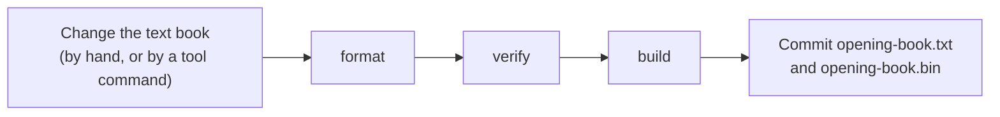
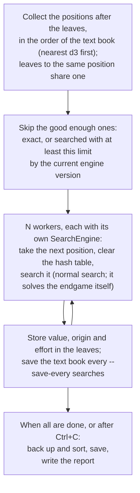

# 16 – Book tool

[Back to the index](README.md)

## In short

`Stello.BookTool` is a console program for keeping the master opening book ([chapter 11](11-opening-book.md)). It imports the C++ book, keeps the text book in its normal form, builds the binary book that the apps use, checks the book, and prints statistics. It also **recalculates** the book: it searches every leaf again with the current engine, on several engines at once, and then plays the old and the new book against each other in a **match**, to see whether the new book is stronger. It uses the book code in `Stello.Engine`, so the tool and the apps always agree on the format.

## Running it

From the repository root:

```text
dotnet run -c Release --project Stello.Net/tools/Stello.BookTool -- <command> [arguments]
```

| Command | Does |
|---|---|
| `import <OPENING> <book.txt>` | Reads the C++ book file and writes the text book (origins as in chapter 11) |
| `format <book.txt>` | Reads the text book and writes it again in its normal form, e.g. after editing it by hand |
| `build <book.txt> <book.bin>` | Builds the binary book for the apps from the text book |
| `verify <book.txt> [<book.bin>]` | Checks the text book and, if given, that the binary book holds the same book |
| `stats <book>` | Statistics for a book in any of the three formats |
| `recalc <book.txt> [--time-s 60 \| --depth N] [--workers N] [--save-every 10] [--hash-bits 19]` | Searches the leaves again, backs up and sorts, and writes `<book>.report.txt` |
| `compare <old book> <new book> [--out <report.txt>]` | Reports the values and first moves that changed |
| `match <book A> <book B> (--starts <report.txt> \| --starts-ply N) [--max-starts N] [--depth 10 \| --time-s S] [--workers N] [--hash-bits 19]` | Plays the two books against each other |

Files are written to a temporary file first and then renamed, so a failed run never leaves half a book. A file that cannot be read gives the error and exit code 1. `--workers` is the number of engines that search at the same time; the default is half the number of logical processors (the physical cores with hyper-threading). Each engine has two hash tables of $2^{\text{hash-bits}}$ slots (48 MiB at 19, chapter 08). Ctrl+C stops `recalc` and `match` cleanly; they then exit with code 2.

## Updating the master book



```text
dotnet run -c Release --project Stello.Net/tools/Stello.BookTool -- format Stello.Net/Book/opening-book.txt
dotnet run -c Release --project Stello.Net/tools/Stello.BookTool -- build Stello.Net/Book/opening-book.txt Stello.Net/Book/opening-book.bin
dotnet run -c Release --project Stello.Net/tools/Stello.BookTool -- verify Stello.Net/Book/opening-book.txt Stello.Net/Book/opening-book.bin
```

Two engine tests guard the files: `ShippedBinaryBook_HoldsTheTextBook` fails if the binary book was not built again, and `TextBook_IsInNormalForm` fails if the text book was not formatted.

## What `verify` checks

- **Errors** (the book cannot be used): reading the text book fails (an illegal move, a position or a move given twice, a position that cannot be reached from d3, a malformed line; the message has the line number), or the binary book holds another book.
- **Warnings** (the book can be used, but book learning would change it):
  - the file is not in the normal form;
  - a book move whose value is not minus the best value of the position after it;
  - a position whose moves are not sorted best first.

The imported master book has 104 moves that are not backed up and 18 positions that are not sorted:

```text
Stello.Net/Book/opening-book.txt: 11,200 positions, 22,878 moves, every move legal and every position reached from d3.
Warning: moves whose value is not backed up from the position after them: 104, e.g.
  d3c3c4c5b3f3 b4
  d3c5d6c3c4e3 f4
  ...
Warning: positions whose moves are not sorted best first: 18, e.g.
  d3e3f4c3f5g5g4
  d3c3c4c5b3f3b4e3
  ...
Stello.Net/Book/opening-book.bin holds the same book.
```

They come from positions that the C++ tree stored more than once: each copy had its own values, and the import joined them. The import does not back up or sort, so the computer plays the same book moves as before (chapter 11). `recalc`, or Evaluate Book in the app, backs up and sorts the whole book.

## Recalculating the leaves: `recalc`

A **leaf** is a book move whose position after it is not in the book; its value comes from a search, not from the book. `recalc` (`BookRecalculator`) searches the leaves again:



- **The search** is the one used in a game (`SearchEngine.Search` through `BookSearch.PositionValue`, chapter 07): with 60 s per move it deepens the midgame search and switches to the endgame solver when it gets near enough to the end (chapter 09). The kind of result gives the origin: `Heuristic`, `WinLossDraw` or `Exact`. A position with a single legal move is searched too; for a position where the player must pass, the opponent's position is searched; a finished game gets its disc count.
- **A proven result is kept.** If a leaf was `WinLossDraw` and the new search could not solve the position, the old value stays, with the new effort.
- **The same result with any number of workers.** Each search starts with a clean hash table, so a value does not depend on which searches the worker did before.
- **Stop and continue.** The text book is the checkpoint: it is saved every `--save-every` searches (default 10) and when the run stops. Running `recalc` again skips what is already done, because those leaves now have the effort of this run.
- **The end.** The values are backed up and sorted (`BookMinimax`, as in Evaluate Book), so `verify` gives no more warnings, and `<book>.report.txt` is written (see `compare`). Then run `build`.

| Option | Default | Meaning |
|---|---|---|
| `--time-s S` | 60 | Time per move for each position (the soft limit is two thirds of it, chapter 10) |
| `--depth N` | | A fixed depth instead of a time |
| `--workers N` | physical cores | Engines searching at the same time |
| `--save-every N` | 10 | Save the book after every N searches |
| `--hash-bits N` | 19 | Hash table size of each engine |

Each search prints a line with the count, the ply and line of the leaf position, the new value, origin and depth, the time it took, and an estimate of the time left (the average search time so far, times the searches left, divided by the workers). The first lines of a run on the master book:

```text
11,613 leaf positions; 10,522 to search, 1,091 already good enough. 60 s per position, 12 workers. Ctrl+C stops and saves; run again to continue.
[     1/10,522] ply  5 d3c3c4c5b5    -67 Heuristic d18 (47.9 s), ...
[     2/10,522] ply  3 d3e3f3    -30 Heuristic d18 (48.0 s), ...
[     5/10,522] ply  5 d3c5d6c3f4    -37 Heuristic d18 (60.0 s), ...
[     6/10,522] ply  5 d3c5e6f3c4     49 Heuristic d17 (60.0 s), ...
```

The master book has 10 522 leaf positions to search (the 1 091 exact ones are kept). In the opening a search takes 48–60 s and reaches depth 17–18 (60 s is the hard limit, chapter 10); near the end it is much faster. With 12 workers the whole run takes up to about 14 hours.

## Comparing two books: `compare`

`compare` (`BookComparison`) compares the book moves the two books have in common, and the move each book plays first in each position. The report (also written by `recalc`) looks like this, here after a quick test run with `--depth 4`:

```text
# Recalculated new.txt with depth 4 per position (2026-10-07 18:29)
# Positions: 11,200 (before 11,200); book moves: 22,878 (before 22,878)
# Values changed: 14,358
# Origin before -> after: book moves (values changed)
#   Unknown     -> Heuristic        15 (15)
#   Heuristic   -> Heuristic     7,132 (7,108)
#   WinLossDraw -> WinLossDraw   3,384 (0)
#   Exact       -> Exact         1,091 (0)
#   BackedUp    -> BackedUp     11,256 (7,235)
# Positions whose first book move changed: 1,997
# <line> <old move>:<old value> <new move>:<new value>
d3c5 f6:39 d6:38
...
```

Everything except the changed positions is a comment, so the report can be given to `match` as its list of start positions.

## Playing the books against each other: `match`

`match` (`BookMatch`) plays book A against book B with the same engine and the same search limits, so only the books differ.

- **Start positions:** the lines in a file (`--starts`, normally the report: the positions where the first book move changed, the only places where the books can play differently), or every book position at a ply (`--starts-ply`). `--max-starts` takes the first N.
- **A pair of games** is played from each start position: first book A plays the side to move and book B the other side, then the other way round. Each side is a `ComputerPlayer` with its own `SearchEngine` (with a cleared hash table) and its own book, used as in a real game. The games are played to the end.
- **No repeated games:** with a fixed depth, the engine and the book always choose the same moves, so the variety comes from the start positions. If both books agree all the way, the pair scores 1–1 and cancels out.
- **Result:** points for book B (win 1, draw ½), its share of the points with a 95 % interval over the pairs ($\bar{s} \pm 1.96\, \sigma / \sqrt{n}$, where $s$ is a pair's share), and the average disc difference. B is stronger if the whole interval is above 50 %. At the end the pairs where book B lost points are listed, to look at by hand.
- **Fixed depth by default** (`--depth 10`), so the result does not depend on the machine's load.

```text
Finished after 0m 01s: 40 pairs. Book B scored 43 of 80 (53.7 %, 95 % interval 44.5 % to 63.0 %), +0.7 discs per game.
No significant difference.

Pairs where book B lost points (8):
  d3c3c4c5b4e3 B 0.0
  ...
```

(A quick test: the old book against the book recalculated at depth 4, depth 6 per move, the first 40 changed positions.)

## Recalculating the master book

```text
dotnet run -c Release --project Stello.Net/tools/Stello.BookTool -- recalc Stello.Net/Book/opening-book.txt
```

Stop it with Ctrl+C and run the same command again to continue. When it has finished:

```text
git show HEAD:Stello.Net/Book/opening-book.txt > old-book.txt
dotnet run -c Release --project Stello.Net/tools/Stello.BookTool -- compare old-book.txt Stello.Net/Book/opening-book.txt --out book-report.txt
dotnet run -c Release --project Stello.Net/tools/Stello.BookTool -- match old-book.txt Stello.Net/Book/opening-book.txt --starts book-report.txt
dotnet run -c Release --project Stello.Net/tools/Stello.BookTool -- build Stello.Net/Book/opening-book.txt Stello.Net/Book/opening-book.bin
dotnet run -c Release --project Stello.Net/tools/Stello.BookTool -- verify Stello.Net/Book/opening-book.txt Stello.Net/Book/opening-book.bin
```

The report that `recalc` writes compares with the book at the start of the last run; after a run that was stopped and continued, `compare` against the book in git gives the report of the whole recalculation. Commit the text and the binary book if the match does not show that the old book is stronger.

## Worked example: `stats`

`stats Stello.Net/Book/opening-book.bin` (shortened):

```text
Positions:    11,200
Moves:        22,878
Leaf moves:   11,622
Passes:       4
Longest line: 57 plies
Replies to d3: c5 (-39, BackedUp), c3 (-40, BackedUp), e3 (-110, BackedUp)

Origin of the values:
  Unknown            15
  Heuristic       7,132
  WinLossDraw     3,384
  Exact           1,091
  BackedUp       11,256

Search limit of the searched values:
  unknown        11,607

Ply  Positions  Leaf moves   (d3 is ply 1; a position counts at its shortest line)
  1          1           0
  2          3           0
  3          5           3
...
 55         26           2
```

All searched values come from the C++ book, so their search limit is unknown; `recalc` gives them a known effort.

## Design notes

- **A separate tool.** Long book jobs do not belong in the game app, and a console program can run for hours, be stopped and started again.
- **The binary book is committed.** Building it on every build of the apps would need the tool to run inside MSBuild for both the WPF and the web project (also in the GitHub workflow); the tests catch a binary book that was not built again instead.
- **Internals of the engine.** The tool uses the internal book types of `Stello.Engine` through `InternalsVisibleTo`, so the apps only see `OpeningBook`.
- **The engine's own endgame switch.** `recalc` does not decide when to solve exactly; the normal search does that, as in a game, within the time limit.
- **The book is the checkpoint.** Unlike the Checkers book tool, there is no separate `.partial` file: the effort stored with each value tells what is done.
- **Workers instead of a parallel search.** The engine searches on one thread; running one engine per core on different positions uses all cores without changing the search.
- **Only the leaves.** The values of the other book moves follow from the leaves by back-up. New moves are not added (that is dropout expansion, chapter 12, and the planned drop-out expansion of the book tool).

## Where in the code

| File | Main members |
|---|---|
| [Program.cs](../../Stello.Net/tools/Stello.BookTool/Program.cs) | `Main`, `Import` (also `format`), `Build`, `Verify`, `Stats`, `Compare`, `WriteText` |
| [SearchCommands.cs](../../Stello.Net/tools/Stello.BookTool/SearchCommands.cs) | `Recalc`, `Match`, `Cancellable` (Ctrl+C) |
| [Options.cs](../../Stello.Net/tools/Stello.BookTool/Options.cs) | `Parse`, `Allow`, `Number`, `Limits` |
| [BookRecalculator.cs](../../Stello.Net/Stello.Engine/BookRecalculator.cs) | `LeafPositions`, `ToSearch`, `Run` |
| [BookComparison.cs](../../Stello.Net/Stello.Engine/BookComparison.cs) | `Of`, `Write` |
| [BookMatch.cs](../../Stello.Net/Stello.Engine/BookMatch.cs) | `Play`, `ReadStarts`, `StartsAtPly`, `MatchSummary.Of` |
| [BookSearch.cs](../../Stello.Net/Stello.Engine/BookSearch.cs), [BookMinimax.cs](../../Stello.Net/Stello.Engine/BookMinimax.cs) | `PositionValue`, `Search`; `Run` (shared with book learning) |
| [ParallelWork.cs](../../Stello.Net/Stello.Engine/ParallelWork.cs) | `Run` (the worker threads) |
| [BookAnalysis.cs](../../Stello.Net/Stello.Engine/BookAnalysis.cs) | `Statistics`, `Consistency` |
| [BookTextFormat.cs](../../Stello.Net/Stello.Engine/BookTextFormat.cs) | `Read`, `Write`, `Lines`, `Replay` |
| [BookBinaryFormat.cs](../../Stello.Net/Stello.Engine/BookBinaryFormat.cs) | `Read`, `Write` |

## Tests

The tool itself has no tests; the code it calls is tested in [OpeningBookTests.cs](../../Stello.Net/Stello.Engine.Tests/OpeningBookTests.cs) (chapter 11), including the two tests on the shipped files above, and in [BookRecalculatorTests.cs](../../Stello.Net/Stello.Engine.Tests/BookRecalculatorTests.cs):

- `recalc` searches only the leaves that are not good enough, searches a transposed leaf once, keeps a proven result the search cannot solve, gives the same book with 1 and 4 workers (and a consistent book after back-up), and continues where a stopped run stopped, with checkpoints;
- `compare` reports the changed values and first moves, and its report gives the start positions;
- `match` with the same book on both sides scores exactly 50 % with the colours swapped and finished, legal games; an illegal start position is rejected; the summary and its interval; reading start positions.

---

Previous: [15 References](15-references.md) · Next: [Index](README.md)
