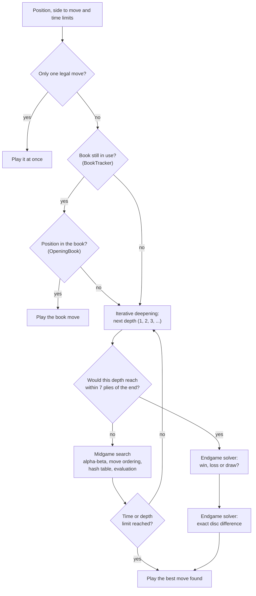

# The Stello brain

Stello is an Othello program. Its "brain" is the engine library `Stello.Engine`, which decides the computer's move. The brain consists of:

- **the board and rules**: bitboards and fast move generation;
- **the evaluation**: edge tables, corners, mobility;
- **the search**: alpha-beta with a hash table, move ordering and selective search;
- **the endgame solver**: perfect play near the end of the game;
- **the opening book**: the known opening positions, which can learn from games.

These documents explain how the parts work and how they fit together. They describe the current C# code in [Stello.Net](../../Stello.Net). How the C++ original was ported is described in [Stello porting documentation.md](../../Stello%20porting%20documentation.md).

## The brain on one page

This is how the computer finds a move, from the position to the move that is played. Each box is explained in a chapter.

The time limit can stop the search at any point; the best move found so far is then played. After a draw the exact pass is not needed. The app handles passes before it asks the brain for a move.

## Chapters

| # | Chapter | Content |
|---|---|---|
| 01 | [Overview](01-overview.md) | Projects, main types, the life of one computer move, design principles |
| 02 | [Board and squares](02-board-and-squares.md) | Bitboards, square numbering, the start position |
| 03 | [Rules and move generation](03-rules-and-move-generation.md) | Legal moves with shift-and-mask, flips, pass, game over, perft |
| 04 | [Game record](04-game-record.md) | Move history, undo/redo, the text file format |
| 05 | [Evaluation](05-evaluation.md) | Edge tables, corners, stability, mobility |
| 06 | [Move ordering](06-move-ordering.md) | Square values, the response table, the hash move |
| 07 | [Midgame search](07-midgame-search.md) | Negamax alpha-beta, iterative deepening, PVS, selective search |
| 08 | [Transposition table](08-transposition-table.md) | Two-entry slots, bounds, replacement |
| 09 | [Endgame solver](09-endgame-solver.md) | Win/loss/draw and exact passes, fastest-first, parity, enhanced transposition cutoff |
| 10 | [Time control](10-time-control.md) | Time modes, time per move, "Move Now" |
| 11 | [Opening book](11-opening-book.md) | Positions in canonical form, the text and binary files, the import of the C++ book, `BookTracker` |
| 12 | [Book learning](12-book-learning.md) | Adding games, dropout expansion, minimax, self-play |
| 13 | [App integration](13-app-integration.md) | The game loop, threading, settings, book files |
| 14 | [Glossary](14-glossary.md) | The terms used in these documents |
| 15 | [References](15-references.md) | Articles, papers and source code on the internet |
| 16 | [Book tool](16-book-tool.md) | The console tool for the master book: import, build, verify, statistics, recalculating the leaves, comparing and matching books |

## Reading paths

- **Everything:** read the chapters in order.
- **Just the search:** 01, 02, 05, 06, 07, 08, 09.
- **Just the opening book:** 01, 02 (square numbers), 11, 12, 16.
- **Tuning the engine:** 05, 06, 07, 08, 09, 10, and phase 8 in [Stello porting documentation.md](../../Stello%20porting%20documentation.md#phase-8--performance-tuning-rounds-1-and-2-paused) for what has already been tried, with measurements, and the remaining ideas.
- **Changing the app:** 01, 10, 13.

## How to view these documents

- **On GitHub:** diagrams and formulas are shown directly.
- **In VS Code:** open the Markdown preview (Ctrl+Shift+V). Formulas are shown by the built-in preview. The diagrams need the extension *Markdown Preview Mermaid Support* (`bierner.markdown-mermaid`).

The diagrams are written in [Mermaid](https://mermaid.js.org/), the formulas in LaTeX math, and the pictures are SVG files in the `images` folder.
